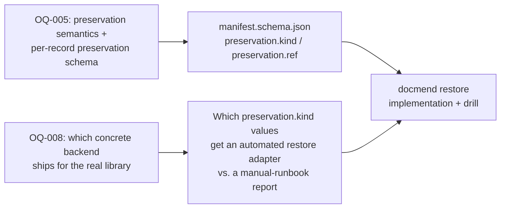

# Restore-from-Manifest Command Design and Automated Restore Drill

**Date:** 2026-07-05

**Related:** GAP-33 · OQ-005 (apply safety-gate and preservation semantics) · OQ-008 (library version control and backup posture) · OQ-003 (resume model) · OQ-006 (verify semantics) · OQ-012 (in-place mutation) · OQ-014 (`--write` opt-in) · `docs/specs/docmend.md` §7.1 FR-006, §7.4 DR-004, §12.3 (Rollback/Recovery), §17.2 (Operations test-strategy row), §18.6 (Backup and Disaster Recovery), §18.7 (restore-from-manifest runbook deliverable) · `docs/research/append-safe-manifest-format.md` (manifest on-disk format this restore design reads) · `docs/research/atomic-write-filesystem-semantics.md` (Writer primitive restore must reuse) · `docs/research/path-containment-toctou.md` (containment check restore must reuse) · `docs/research/stable-document-id-scheme.md` (`docmend.id` mirrored into manifest entries).

**Gap it fills:** The spec already promises that "every mutation is reversible via manifest and backups" (§10.1), names an automated "restore-from-manifest drill" as required test coverage (§17.2 Operations row) and as a pre-first-real-run gate (§18.4), and lists a "restore-from-manifest procedure" runbook as a documentation deliverable (§18.7) — but nowhere does the spec, `docs/open-questions.md`, or any existing research report specify the restore command's CLI contract, which manifest fields it actually reads, what the automated drill concretely asserts beyond the word "restore," or how restore work can proceed while OQ-005 (what a preservation strategy legally is) and OQ-008 (which concrete backend the owner picks) are both still open. This report closes that gap: it proposes a restore CLI/IR contract symmetric to `apply`, a concrete manifest-field extension that lets restore work today under `tool_backup` without blocking on OQ-008's eventual choice, eight automatable drill assertions grounded in how mature backup tools (restic, Borg) and migration tools (Alembic) already test exactly this class of guarantee, and an explicit dependency ordering between this design and OQ-005/OQ-008.

---

## Bottom line

1. **`docmend restore` must inherit every apply-layer safety mechanism, not a lighter version of it.** It mutates the library exactly as dangerously as `apply` does (it overwrites `original_path` with recovered bytes), so it reuses the same atomic-replace writer primitive (D-004/NFR-002, `docs/research/atomic-write-filesystem-semantics.md`), the same output-path containment check (`docs/research/path-containment-toctou.md`), and the same dry-run-default / explicit-`--write`-opt-in contract OQ-014 already settled for `apply`. Treating restore as a "simpler, trusted" code path is the single biggest way a restore tool becomes the thing that corrupts data during the one moment it is needed most.
2. **Restore can be implemented and drilled today, without waiting on OQ-008,** provided OQ-005 first pins one small manifest-schema addition: a per-record `preservation.kind` / `preservation.ref` pair recording _which_ backend actually covered that specific mutation. Scoping v1's automated restore to the `tool_backup` backend (fully specified today by DR-004 + `write.backup_dir`) lets the drill run in CI now; `git`/`external_backup` records get a printed manual-restore report instead of an automated write path, until OQ-008 settles which of those v1 actually supports end to end.
3. **Manifest entries must be undone in reverse-chronological order per path (LIFO), not independently.** A file renamed in one run and content-rewritten in a later run has two manifest records for the same lineage; restoring only the more recent one and stopping is a documented class of bug in every tool that has this problem — database migration tools solve it by applying "down" migrations in strict reverse order relative to how "up" migrations were applied, and docmend's manifest needs the identical discipline. [official](https://alembic.sqlalchemy.org/en/latest/tutorial.html)
4. **The drill is not "restore ran and exited 0."** It is: byte-for-byte hash equality of every restored file (not size/mtime), every manifest entry individually reversible in isolation, idempotent re-restore, refusal on a corrupted backup rather than silent overwrite, safe partial-failure/kill-resume, and reuse of the path-containment check against a manifest whose paths cannot be assumed trustworthy. Backup-tool maturity culture states this bluntly: "you can't say you have a backup until you successfully restore it," and mature tools (restic, Borg) both ship an explicit post-restore verification step rather than trusting the write to have succeeded silently. [blog](https://pgentili.com/blog/borg-restore-backup) [official](https://restic.readthedocs.io/en/latest/050_restore.html)

---

## 1. Restore CLI / IR contract

Recommend a single `docmend restore` command for v1 (Option A below), not a separate `restore plan` / `restore apply` pair, to avoid doubling the command surface before the underlying `plan`/`apply` split has even shipped. Keep the artifact-emission door open for a future split if OQ-003's resume work later needs it.

```text
docmend restore [PATH...] [OPTIONS]
```

| Element | Contract | Rationale |
| --- | --- | --- |
| `PATH...` (positional, optional glob/paths) | Selects which source-relative paths to restore; omitted means "every path any selected manifest touches." | Mirrors FR-012's include/exclude filter consistency requirement — restore should not be the one command exempt from scopeable selection. |
| `--manifest-dir DIR` (default: the run's configured artifact directory) | Directory of per-run NDJSON manifest files (`manifest-<run_id>.jsonl`) to search. | Matches the per-run-file convention `docs/research/append-safe-manifest-format.md` already recommends for DR-004. |
| `--run RUN_ID` (repeatable) | Restrict the search to specific run(s); default is "every run that ever touched a selected path." | Lets an operator undo one specific bad run without also asking "how far back," while still defaulting to full-history for the common "undo everything" case. |
| `--to {original,run:<run_id>}` (default `original`) | Restore each selected file to its state before docmend ever touched it (`original`), or to its state immediately after a named run (useful for undoing only the _last_ of several runs on a lineage). | Full rollback and partial rollback are both real operator needs (§18.4's staged-rollout language implies "widen, then retreat if wrong" is a supported workflow, not just forward-only). |
| `--dry-run` (default) / `--write` | Dry-run by default; `--write` is the explicit, positive opt-in to mutate. | Exact parity with OQ-014's settled `apply` contract — an operator who has internalized "`apply` needs `--write`" must not be surprised that `restore` doesn't. |
| `--verify` (default) / `--no-verify` | After each restore, re-hash the restored file and assert it equals the manifest's recorded hash for the chosen `--to` target; refuse to report success otherwise. | Directly modeled on restic's `restore --verify`, which re-hashes restored files against the snapshot's recorded content rather than trusting the write. [official/community](https://forum.restic.net/t/what-does-restic-restore-verify-do/1676) |
| `--force` | Proceeds past a failed pre-restore backup-integrity check (§"Drill assertion 5"); default is refuse. | Matches the project's skip-and-report/refuse-by-default posture (FR-015, NFR-004) rather than ever silently overwriting a possibly-good current file with corrupted backup bytes. |
| `--include` / `--exclude` | Reuses FR-012's glob-pattern filter semantics. | Consistency across every command that walks the library, per FR-012's own acceptance criterion. |
| `--report FILE` | Machine-readable restore report: a sibling of DR-003's report shape with an `operation: "restore"` discriminator and per-file outcomes (`restored`, `skipped-already-correct`, `refused-backup-mismatch`, `failed`). | Reuses the artifact discipline (FR-018) rather than inventing a bespoke restore-only reporting format. |
| Exit codes: `0` clean · `1` findings (some files skipped/refused, run otherwise completed) · `2` invocation/config error (manifest unreadable, unknown `--run`, unknown path) · `3` safety refusal (pre-restore hash-mismatched backup without `--force`, or a path-containment violation) | Small, stable, script-friendly taxonomy. | Mirrors the shape OQ-006's agent notes already propose for `verify`, and matches restic's own documented exit-code discipline (`0`/`1`/`2`/`3`/`10`/`11`/`12`/`130`, explicitly warned to be treated as failure if unrecognized) — a corroborated, not invented, pattern for this class of tool. [official](https://restic.readthedocs.io/en/latest/075_scripting.html) |

**Why not a `restore plan` / `restore apply` split (Option B, deferred):** it would be the more architecturally consistent choice (matching D-006's plan-file discipline exactly), and is worth revisiting once OQ-003's resume model and a `restore-plan.schema.json` artifact are wanted for review-before-execute workflows on very large restores. For v1, `--dry-run`'s console/`--report` output already serves the "review before touching anything" need without a second artifact format; recommend an `OQ-` capturing this as a deferred (not rejected) design choice (see [Open Questions Surfaced](#open-questions-surfaced)).

---

## 2. Manifest fields restore requires

Baseline, already implied by DR-004 and pinned concretely by `docs/research/append-safe-manifest-format.md`'s NDJSON, one-record-per-mutation design:

| Field | Source | Why restore needs it |
| --- | --- | --- |
| `docmend.id` | Spec §9; mirrored into every manifest entry per `docs/research/stable-document-id-scheme.md` | The only trustworthy way to chain multiple manifest records across runs into one lineage for `--to original` full rollback (filenames and paths are exactly what OQ-002 already disqualifies as identity). |
| `run_id` | Spec §9 natural key (timestamp + source root) | Determines reverse-chronological ordering per lineage (§4 below) and scopes `--run`. |
| `original_path`, `target_path` | DR-004 | The rename half of any reversible operation. |
| `operation_type` | DR-004 | Distinguishes `rename` / `rewrite` / `rename+rewrite` / `skip`, each with a different undo procedure. |
| `before_hash` (`source.hash`), `after_hash` (`output.hash`) | DR-004, §9 | The two states restore must be able to prove it reached — `before_hash` is what a full rollback must reproduce; `after_hash` is what a partial (`--to run:<id>`) rollback must reproduce, and what `--verify` checks against. |
| `backup_path` | DR-004 | Where to read recovered bytes from, for the `tool_backup` preservation kind. |
| `result_status` | DR-004 | Restore only considers `applied` records; `skipped`/`failed` records never mutated the file and have nothing to undo. |

**New field this report recommends adding to `manifest.schema.json` (feeds OQ-004 and OQ-005 directly):**

```json
"preservation": {
  "kind": "tool_backup | git | external_backup | none",
  "ref": "string | null"
}
```

- `kind: "tool_backup"`, `ref`: identical to `backup_path` (kept as a distinct field for git/external clarity, or `backup_path` could be deprecated in favor of `preservation.ref` — an OQ-004 wording decision, not a semantic one).
- `kind: "git"`, `ref`: the commit hash (and, if useful, the blob hash) that held the pre-mutation content.
- `kind: "external_backup"`, `ref`: an operator-meaningful identifier (Borg archive name, restic snapshot ID, filesystem-snapshot name) — deliberately opaque to docmend, since docmend does not own that tool.
- `kind: "none"`: **must never appear on a record whose `operation_type` involves a content rewrite** — this is exactly the invariant OQ-005's agent notes already state in prose ("a manifest alone can reverse a rename only if the original bytes remain in place; it cannot restore bytes after rewrite"); making it a structurally-checkable per-record field turns that prose rule into something `verify` and the safety gate can assert mechanically rather than merely document.

Recording `preservation.kind` **per record** rather than as one global run-level or project-level setting is the load-bearing design choice here: it means a mid-project change of OQ-008's answer (e.g., starting with `tool_backup`, later adopting a self-hosted Git posture) never requires rewriting historical manifest records or breaking restore for runs that happened under the old backend — each record is self-describing.

---

## 3. Backend-dependency ordering: what OQ-005 and OQ-008 must settle first



- **OQ-005 is the hard blocker for starting restore implementation at all.** Its agent notes already establish the load-bearing rule ("manifest alone is not preservation for content rewrites"); this report's contribution is turning that into the concrete per-record schema fields above, which OQ-005's resolution should adopt so the manifest itself enforces the rule instead of leaving it as an implementer convention. Until this lands, `docmend restore`'s core algorithm literally cannot know, from a manifest record alone, whether recoverable bytes exist anywhere.
- **OQ-008 does not have to be fully settled before restore ships**, provided v1 scopes its _automated write path_ to `preservation.kind: "tool_backup"` only — the one backend already fully specified by existing spec text (`write.backup_dir`, §18.2) with no new dependency, no new OQ, and no waiting on the owner's storage-platform decision. For any other `preservation.kind`, `docmend restore` should still succeed at identifying _which_ files are affected and _what reference_ (commit hash, snapshot ID) would restore them, printed as an actionable manual-restore report — this keeps restore useful and testable today while leaving room for `git`/`external_backup` automated adapters once OQ-008 lands.
- **Consequence for the drill:** the automated CI restore drill (§5 below) only needs `tool_backup` fixtures to be fully meaningful today. A `git`-backend or `external_backup`-backend drill variant should be added once OQ-008 picks one of those, not blocked on writing this report's `tool_backup` drill first.

---

## 4. Restore algorithm: reverse-chronological replay

For a selected `docmend.id`, gather every `applied` manifest record across every eligible run (respecting `--run` if given), sorted by `run_id` **descending** (most recent first). Walk that list, undoing each record in turn, until either:

- `--to original` and the list is exhausted (every record undone — the file is back to its pre-docmend state), or
- `--to run:<run_id>` and the walk reaches the record whose `run_id` matches the target (stop _after_ undoing everything strictly newer than it, leaving the file exactly as that run left it).

Per record, the undo action depends on `operation_type`:

| `operation_type` | Undo action |
| --- | --- |
| `rename` only | `os.replace(target_path, original_path)` — pure rename reversal, no backup needed (this is the one case a manifest genuinely can reverse unaided, since no bytes were rewritten — consistent with OQ-005's own carve-out). |
| `rewrite` (content changed, path unchanged) | Verify `preservation.ref` (§"Drill assertion 5"), then atomically write the verified backup bytes back to `original_path` using the same Writer primitive apply uses (D-004/NFR-002 — temp file, `fsync`, `os.replace`, parent `fsync` where practical). |
| `rename+rewrite` | Same as `rewrite`, targeting `original_path` (which may differ from the record's `target_path` if an intervening run renamed it further) — this is exactly the case that makes reverse-chronological, `docmend.id`-keyed replay necessary instead of naive per-record independent restores. |

**Why reverse order, concretely (a worked example):** a file starts as `notes.txt`. Run 1 renames it to `notes.md` (operation `rename`). Run 2 content-rewrites `notes.md` in place (operation `rewrite`, with a backup of the pre-rewrite `notes.md` bytes). A `--to original` restore must first undo run 2 (write the backed-up `notes.md` bytes back), _then_ undo run 1 (rename `notes.md` back to `notes.txt`) — undoing run 1 first would rename the _rewritten_ content to `notes.txt`, silently losing the fact that a rewrite ever needs undoing, and restoring "run 1 only" without processing run 2 at all would leave the corpus in an undocumented intermediate state. This is structurally identical to why database migration tools apply "down" migrations in strict reverse order relative to their "up" application, never independently or out of order. [official](https://alembic.sqlalchemy.org/en/latest/tutorial.html)

**Containment reuse:** before acting on any record's `original_path`, `target_path`, or `preservation.ref` (when it is a filesystem path), restore must run the exact same path-containment check `docs/research/path-containment-toctou.md` specifies for `apply` — a manifest is docmend's own trusted artifact under normal operation, but restore is precisely the code path an operator reaches for _after_ something has already gone wrong, which is exactly the scenario in which "trust the artifact unconditionally" is the wrong default. Treat manifest paths as inputs to validate, not as pre-cleared.

---

## 5. Concrete drill assertions

The drill is the automated test suite item `docs/specs/docmend.md` §17.2's "Operations" row already requires ("Backup-and-restore drill from manifest... The §18.6 restore test, automated"). These eight assertions are what should make that row concretely checkable rather than a one-line aspiration:

1. **Full-corpus byte-for-byte round trip.** `scan → plan → apply --write` (with `tool_backup` enabled) over a synthetic corpus, then `docmend restore --write --to original` over every touched path, then assert `sha256(original_bytes) == sha256(restored_bytes)` **for every single file**, not a sampled subset, and not a size/mtime proxy comparison — mirrors restic's own `restore --verify` behavior of re-hashing restored content against recorded values rather than trusting a completed write. [official/community](https://forum.restic.net/t/what-does-restic-restore-verify-do/1676)
2. **Every manifest entry is individually reversible.** For each `applied` manifest record in isolation (not just the full-corpus round trip), assert that undoing that one record reproduces its `before_hash` — the file-manifest analog of asserting every generated "up" migration has a working, actually-tested "down," a discipline that is easy to state and, per the DB-migration ecosystem's own experience, easy to let silently rot if nothing ever executes it outside a real incident. Recommend docmend do what most migration tooling does _not_ enforce by default: run this per-record assertion in ordinary CI, not only during an incident. [official](https://alembic.sqlalchemy.org/en/latest/tutorial.html)
3. **Partial-failure / kill-resume safety.** Kill the restore process after N of M files (same technique as the existing FR-013 kill-and-resume test), then assert: (a) no file is left partially written — this reduces to the writer's existing atomicity guarantee (NFR-002) applied to restore's writes, so "every file is either fully-old or fully-restored, never a fragment"; (b) re-invoking `docmend restore` completes the remainder without reprocessing already-restored files; (c) the corpus after a resumed restore is byte-for-byte identical to the corpus after an uninterrupted restore.
4. **Idempotent re-restore.** Running `docmend restore --write` twice in a row over an already-fully-restored corpus produces zero further writes and reports zero changes — the restore-side mirror of FR-017's idempotent-apply requirement.
5. **Backup-corruption refusal.** Seed a bit-flipped or truncated backup file (or a `preservation.ref` whose recomputed hash does not match the manifest's recorded pre-mutation hash), run restore without `--force`, and assert it refuses that specific file with a classified finding (exit code `3`) rather than silently overwriting the current file with corrupted bytes — the per-file generalization of restic's `check --read-data` / "verify the backup before trusting it" discipline. [official](https://safjan.com/verify-backups-restic-example) [official](https://borgbackup.readthedocs.io/en/stable/usage/extract.html)
6. **Reverse-chronological correctness on multi-run chains.** Build the two-run rename-then-rewrite fixture from §4, and assert `docmend restore --write --to original` reproduces the true pre-run-1 state only when both records are undone in reverse order; assert `--to run:1` leaves the corpus in the documented, reported (not silent) intermediate state.
7. **Path-containment safety under a hostile manifest.** Feed restore a manifest record whose `original_path` has been doctored to point outside `source_root` (simulating either a bug or a tampered artifact) and assert restore refuses it via the same containment check `apply` uses, rather than following it.
8. **Exit-code taxonomy coverage.** Exercise each of restore's four exit codes (`0`, `1`, `2`, `3`) with a dedicated fixture and assert the documented code, mirroring both OQ-006's proposed `verify` taxonomy and restic's own precedent for small, stable, script-consumable exit-code sets. [official](https://restic.readthedocs.io/en/latest/075_scripting.html)

None of these require anything beyond the `tool_backup` preservation kind to be meaningful today (§3) — the drill can be written and passing in CI well before OQ-008 is settled.

---

## Existing tools and patterns

| Tool / pattern | Maintenance | Link | Relevance to docmend restore |
| --- | --- | --- | --- |
| restic `restore --verify` | Actively maintained; exit-code table versioned since 0.17.0 (late 2024) | [docs](https://restic.readthedocs.io/en/latest/050_restore.html) / [scripting reference](https://restic.readthedocs.io/en/latest/075_scripting.html) | Direct model for `--verify`'s post-restore re-hash behavior and for a small, stable, documented exit-code contract. |
| restic `check --read-data` | Same project | [safjan.com walkthrough](https://safjan.com/verify-backups-restic-example) | Model for drill assertion 5 (verify backup integrity _before_ trusting it for restore, not just after). |
| Borg `extract --dry-run` | Actively maintained | [docs](https://borgbackup.readthedocs.io/en/stable/usage/extract.html) | Direct precedent for a restore-time dry-run mode that exercises the extraction logic without writing, matching this report's `--dry-run` default. |
| Borg community guidance ("you can't say you have a backup until you restore it") | N/A (practitioner writing) | [blog](https://pgentili.com/blog/borg-restore-backup) | The cultural argument for why the drill must be automated and continuous, not a one-time manual check before the first real-library run. |
| Alembic `downgrade` | Actively maintained (SQLAlchemy project) | [tutorial](https://alembic.sqlalchemy.org/en/latest/tutorial.html) | Direct precedent for reverse-chronological-order undo across a chain of recorded changes — the exact discipline §4's rename+rewrite example needs. |
| Python `os.replace` / `hashlib` | Standard library | [os.replace](https://docs.python.org/3/library/os.html#os.replace) / [hashlib](https://docs.python.org/3/library/hashlib.html) | The primitives restore reuses unchanged from the Writer layer (atomic replace) and from hashing (`hashlib.sha256`, chunked or via `hashlib.file_digest` for large files) — no new dependency required. |

---

## Security and compatibility

- **TOCTOU class is identical to apply's, and restore is the higher-stakes instance of it.** `docs/research/path-containment-toctou.md` already establishes that docmend's threat model (solo user, offline, no privilege boundary) does not warrant heavyweight adversarial hardening, but does warrant the check→act discipline it specifies. Restore inherits that conclusion unchanged; it should not re-litigate or relax it. [internal] `docs/research/path-containment-toctou.md`
- **Hash algorithm consistency:** the spec's own example frontmatter already uses `sha256:...`-prefixed hashes (§9); restore should use the identical algorithm for `before_hash`/`after_hash` comparison so a hash computed during `apply` and a hash re-verified during `restore` are directly comparable without a conversion step. Python's `hashlib` documents both the chunked-`update()` pattern for constant-memory hashing of large files and the newer `hashlib.file_digest()` convenience function; either is suitable at this project's per-file scale (NFR-001's bounded-memory requirement applies equally to restore's re-hashing pass). [official](https://docs.python.org/3/library/hashlib.html)
- **No new external dependency required for the `tool_backup` restore path** — it reuses `shutil`/`os`/`hashlib` primitives already implied by the Writer layer. A future `git`-backend restore adapter would need to shell out to (or bind) `git`, which is a new implicit dependency requiring its own `OQ-` per §8.6's dependency policy — flagged here so it is not introduced silently if/when OQ-008 picks a Git-based posture.
- No CVEs or security advisories were found against restic, Borg, or Alembic's restore/downgrade mechanisms as of this research date; none of the guidance above depends on a currently-unpatched issue in any cited tool.

---

## Recent changes worth tracking

- **restic's exit-code table gained new codes in 0.17.0 and 0.17.1** (`10` repository-missing, `11` lock-failure, `12` wrong-password, replacing an undifferentiated `1` in older versions) — cited here as the concrete, dated example behind this report's "small, stable, versioned exit-code taxonomy" recommendation; the project's own restore exit codes should be documented with the same explicit "unknown code = treat as failure" forward-compatibility note restic uses. [official](https://restic.readthedocs.io/en/latest/075_scripting.html)
- **Python's `hashlib.file_digest()` convenience function** (added 3.11, still current in 3.14) is available for restore's re-hash step without hand-rolling the chunked-`update()` loop, though either approach is correct and the chunked pattern remains necessary if hashing a file-like object that isn't a real OS file. [official](https://docs.python.org/3/library/hashlib.html)
- **Single-writer manifest discipline under Python 3.14's free-threaded build** (already flagged in `docs/research/append-safe-manifest-format.md`) applies identically to restore's own manifest appends (§2, "restore records itself") — if restore parallelizes across files, its own audit-trail writes must still funnel through one owning writer component, for the same reason apply's do.

---

## Open Questions Surfaced

| # | Question | Why unresolved |
| --- | --- | --- |
| 1 | Should the restore command ship as a single `docmend restore [--dry-run\|--write]` (Option A, this report's recommendation) or as a `restore plan` / `restore apply` pair mirroring the main pipeline (Option B, deferred)? | Consistency-vs-scope tradeoff for the owner; both are defensible, and Option B can be added later without breaking Option A's CLI surface. |
| 2 | Exact wording and location of the `preservation.kind`/`preservation.ref` manifest fields (fold into OQ-004's `manifest.schema.json` work, or resolve as part of OQ-005 directly)? | Both OQs currently own adjacent pieces of the manifest schema; needs one owner decision on where this specific addition is recorded to avoid the two OQs drifting out of sync with each other. |
| 3 | Numbering for any new `OQ-` this report's findings feed into. | As of this research session, **`OQ-015` is already independently proposed by at least four other concurrent research reports** (`python-314-wheel-readiness.md`, `atomic-write-filesystem-semantics.md`, `unicode-normalization-policy.md`, `property-based-testing-hypothesis.md`) for four unrelated topics. This report does not claim a number for that reason; recommend the owner do a single consolidated numbering pass across all pending proposed `OQ-` entries before merging any of them, rather than each research report guessing independently. |

---

## Reconciliation notes

Fold this report's findings back into:

- **`docs/specs/docmend.md` §7.4 DR-004** — add the `preservation.kind`/`preservation.ref` per-record fields (§2 above) to the manifest's field list, and note the invariant that `kind: "none"` is illegal on any content-rewriting record.
- **`docs/specs/docmend.md` §7.3 (Interface Requirements)** — add an `IR-` row for `docmend restore` alongside IR-001–IR-007, using §1's CLI contract table as the starting draft.
- **`docs/specs/docmend.md` §12.3 / §18.6 / §18.7** — this report is the concrete design behind the restore-from-manifest procedure §18.7 already lists as a documentation deliverable and the automated drill §17.2 already lists as required coverage; both can now cite this report instead of remaining aspirational one-liners.
- **`docs/open-questions.md` OQ-005** — adopt the per-record `preservation.kind`/`preservation.ref` schema as the mechanical enforcement of its existing "manifest alone is not preservation for rewrites" recommendation.
- **`docs/open-questions.md` OQ-008** — add this report's scoping recommendation (v1 automated restore covers `tool_backup` only; other backends get a manual-restore report) as an explicit note that OQ-008's final choice does not block restore implementation from starting.
- **A new `OQ-` for the restore CLI shape (Option A vs. B, §1)** — number TBD by the owner; see "Open Questions Surfaced" item 3 above for the numbering collision already observed across concurrent research in this session.

**Housekeeping aside (drift check requested by the calling task, not itself part of this research topic):** `docs/specs/docmend.md` §21's Open Questions table still stops at OQ-011 while `docs/open-questions.md` defines OQ-012, OQ-013, and OQ-014 — confirmed present as of this research pass and already independently flagged in `docs/research/append-safe-manifest-format.md`'s own housekeeping note, so this is not a new finding, only a confirmation. A **further, newly-observed instance of the same class of drift** was found during this pass: at least four other concurrent research reports in `docs/research/` each independently propose "a new `OQ-015`" for four different, unrelated decisions (dependency wheel-readiness CI, filesystem-durability classification, Unicode normalization scope, and property-based testing adoption), with no coordination between them — this is the identical "backlog and spec-of-record silently drift apart" pattern, just occurring at the open-questions-numbering layer instead of the spec-§21-table layer. Recommend the owner do one consolidated numbering/merge pass across all pending proposed `OQ-` entries from this research batch (including this report's own deferred CLI-shape question) rather than accepting them in file-write order.

---

## Sources

| URL | Title | Date | Authority |
| --- | --- | --- | --- |
| <https://restic.readthedocs.io/en/latest/075_scripting.html> | Scripting — restic documentation (exit codes, JSON restore fields) | 2026 (0.19.1-dev) | official |
| <https://restic.readthedocs.io/en/latest/050_restore.html> | Restoring from backup — restic documentation | 2026 (0.19.0-dev) | official |
| <https://forum.restic.net/t/what-does-restic-restore-verify-do/1676> | What does `restic restore --verify` do? | undated | community (maintainer-answered) |
| <https://safjan.com/verify-backups-restic-example> | Don't Just Create Backups, Verify Them — How Restic Can Help? | undated | blog |
| <https://borgbackup.readthedocs.io/en/stable/usage/extract.html> | `borg extract` — Borg documentation | 2026 (1.4.4) | official |
| <https://pgentili.com/blog/borg-restore-backup> | Borg list, mount, and extract | undated | blog |
| <https://alembic.sqlalchemy.org/en/latest/tutorial.html> | Tutorial — Alembic documentation (downgrading) | 2026 (1.18.5) | official |
| <https://docs.python.org/3/library/hashlib.html> | `hashlib` — Secure hashes and message digests | 2026 | official |
| <https://docs.python.org/3/library/os.html#os.replace> | `os.replace` — Python documentation | 2026 | official |
| `docs/research/append-safe-manifest-format.md` | Crash-Safe, Append-Safe On-Disk Manifest Representation (this repo) | 2026-07-05 | internal (repo research) |
| `docs/research/atomic-write-filesystem-semantics.md` | Atomic-Replace and Directory-Fsync Guarantees Across Filesystems (this repo) | 2026-07-05 | internal (repo research) |
| `docs/research/path-containment-toctou.md` | Path-Containment Algorithm and TOCTOU Symlink-Race Mitigation (this repo) | 2026-07-05 | internal (repo research) |
| `docs/research/stable-document-id-scheme.md` | Stable Document ID Scheme Surviving Renames and Full Rewrites (this repo) | 2026-07-05 | internal (repo research) |
| `docs/specs/docmend.md` | docmend — Specification (Full), SPEC-VHHB | 2026-07-05 | internal (spec of record) |
| `docs/open-questions.md` | Open Questions — `docs/specs/docmend.md` | 2026-07-05 | internal (decision backlog) |
