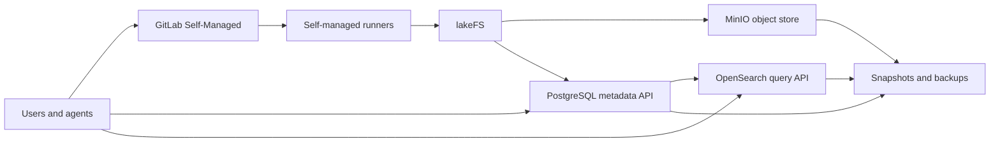
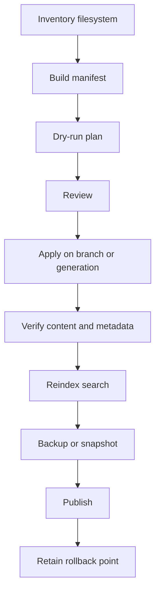

# Self-Hosted Storage Options for a Large Private Document Corpus

**Date:** July 5, 2026

## Executive Summary

For a private corpus of **1,000,000+ text, Markdown, and HTML documents** totaling **50+ GB**, the hard part is not raw storage capacity. The hard part is the operational shape: high file counts, repeated bulk rewrites, strict privacy, metadata enrichment, search, resumable transformations, and safe rollback.

The strongest default architecture is **not a Git repository as the primary corpus store**. Use Git for the toolchain, schemas, manifests, reviewable plans, and automation code. Store the corpus itself in an object/data platform designed for large server-side batches.

Recommended default:

1. **MinIO + lakeFS** for versioned corpus storage.
2. **PostgreSQL** for canonical metadata, manifests, job state, and audit records.
3. **OpenSearch** for full-text search and retrieval indexes.
4. **GitLab Self-Managed** for code, reviewed plans, CI runners, and operator workflows.
5. **ZFS/Btrfs plus restic/Borg or object-store backups** for disaster recovery.

If the corpus must live directly in Git, prefer **sharded repositories** over one monorepo. Use partial clone, sparse-checkout, worktrees, maintenance, and server-adjacent workers. Among Git platforms, **GitLab Self-Managed** is the best default, **Bitbucket Data Center** is the strongest commercial scale option, and **Gerrit** is useful when strict event-driven review workflow matters more than general forge UX.

## Decision

Use **non-Git storage as the system of record** unless there is a specific requirement for every document blob to participate in Git history.

Git remains valuable in this design. It should hold:

- `docmend` source code
- schemas and controlled vocabularies
- transform configuration
- manifests and dry-run plans
- reviewed migration plans
- generated reports small enough to review
- CI/CD definitions and runner scripts

The corpus store should hold:

- original document payloads
- normalized Markdown payloads
- object versions or lakeFS commits
- generated previews or derived artifacts
- large search/index export artifacts

## Recommended Architecture

This separates review and automation from bulk document storage. GitLab governs code and plans; lakeFS and MinIO hold the versioned corpus; PostgreSQL tracks metadata and transformation state; OpenSearch serves search; backup layers protect the whole system.

## Why Not Git First?

Git can handle very large repositories when engineered carefully. Git itself has large-repo features such as [partial clone](https://git-scm.com/docs/partial-clone), [sparse-checkout](https://git-scm.com/docs/git-sparse-checkout), [worktree](https://git-scm.com/docs/git-worktree), [maintenance](https://git-scm.com/docs/git-maintenance), [protocol v2](https://git-scm.com/docs/protocol-v2), [atomic push](https://git-scm.com/docs/git-push), and [transactional ref updates](https://git-scm.com/docs/git-update-ref).

The issue is the workload:

- One million tracked paths stress working-tree materialization, status/diff behavior, indexes, search, and tree walks.
- Repeated normalization passes create packfile churn and expensive maintenance windows.
- API-per-file edits are the wrong model for bulk cleanup.
- Cloning or checking out the whole corpus is unnecessary for many agent workflows.
- Large binary or generated artifacts should not live in core Git history.

GitLab’s [monorepo guidance](https://docs.gitlab.com/user/project/repository/monorepos/) and Bitbucket Data Center’s [scaling guidance](https://confluence.atlassian.com/bitbucketserver/scaling-bitbucket-data-center-776640073.html) both point to the same constraint: large repositories can work, but they need deliberate architecture. For this project, object/data storage gives better primitives for scan, plan, apply, verify, publish, and rollback.

## Recommended Shortlist

| Rank | Option | Role | Why It Fits |
| --- | --- | --- | --- |
| 1 | **lakeFS on MinIO** | Primary corpus versioning | Git-like branch, commit, merge, and rollback semantics over object storage. lakeFS documents [zero-copy branching](https://docs.lakefs.io/understand/faq/) and MinIO provides S3-compatible storage, [versioning](https://docs.min.io/aistor/administration/objects-and-versioning/), [object locking](https://docs.min.io/aistor/administration/object-locking-and-immutability/), and [batch jobs](https://docs.min.io/enterprise/aistor-object-store/administration/batch-framework/). |
| 2 | **PostgreSQL + object storage + OpenSearch** | Metadata, workflow, and search | PostgreSQL provides ACID metadata, [partitioning](https://www.postgresql.org/docs/current/ddl-partitioning.html), [logical replication](https://www.postgresql.org/docs/current/logical-replication.html), [full-text search](https://www.postgresql.org/docs/current/textsearch.html), and [PITR](https://www.postgresql.org/docs/current/continuous-archiving.html). OpenSearch provides [ingest pipelines](https://docs.opensearch.org/latest/ingest-pipelines/) and [snapshots](https://docs.opensearch.org/latest/tuning-your-cluster/availability-and-recovery/snapshots/index/). |
| 3 | **GitLab Self-Managed** | Git control plane | Best Git option for automation-heavy workflows: [REST](https://docs.gitlab.com/api/rest/), [GraphQL](https://docs.gitlab.com/api/graphql/), [CI runners](https://docs.gitlab.com/runner/), [system hooks](https://docs.gitlab.com/administration/system_hooks/), [webhooks](https://docs.gitlab.com/user/project/integrations/webhooks/), [object storage](https://docs.gitlab.com/administration/object_storage/), and [reference architectures](https://docs.gitlab.com/administration/reference_architectures/). |
| 4 | **Bitbucket Data Center** | Commercial Git alternative | Strong enterprise Git scale posture, especially [Bitbucket Mesh](https://confluence.atlassian.com/bitbucketserver/bitbucket-mesh-1128304351.html), [high availability](https://confluence.atlassian.com/bitbucketserver/high-availability-for-bitbucket-776640137.html), [audit logs](https://confluence.atlassian.com/spaces/BITBUCKETSERVER100/pages/1680279091/Audit%2Blog%2Bevents), and REST/plugin integrations. |
| 5 | **Gitea or Forgejo** | Lean Git forge | Good low-overhead Git hosting with REST APIs, webhooks, and object storage options. Use when operational simplicity matters more than GitLab’s automation breadth. |

## Git Platform Comparison

| Platform | Strengths | Weaknesses | Best Use |
| --- | --- | --- | --- |
| **GitLab Self-Managed** | Strongest open-source/self-managed automation surface: [REST](https://docs.gitlab.com/api/rest/), [GraphQL](https://docs.gitlab.com/api/graphql/), runners, hooks, webhooks, object storage, and documented large-instance architecture. | Operationally heavier than smaller forges. Large monorepos still need careful tuning. | Best Git control plane and best Git-first option if the corpus must be in Git. |
| **Gitea** | Simple deployment, good [API](https://docs.gitea.com/development/api-usage), [OAuth2](https://docs.gitea.com/development/oauth2-provider), [MFA](https://docs.gitea.com/usage/multi-factor-authentication), [backup](https://docs.gitea.com/administration/backup-and-restore), and [storage configuration](https://docs.gitea.com/administration/config-cheat-sheet). | Less published large-repo operational guidance than GitLab or Bitbucket. Open-source HA story is thinner. | Best simple self-hosted forge when Git is not the corpus system of record. |
| **Forgejo** | Community-led Gitea descendant with [API usage](https://forgejo.org/docs/latest/user/api-usage/), [webhooks](https://forgejo.org/docs/latest/user/webhooks/), [quotas](https://forgejo.org/docs/latest/admin/advanced/quota/), and [configuration](https://forgejo.org/docs/v15.0/admin/config-cheat-sheet/). | Less enterprise/HA depth than GitLab and Bitbucket. Some advanced auth/token details require close version review. | Good lightweight OSS forge for code, manifests, and plans. |
| **Bitbucket Data Center** | Enterprise clustering, [Mesh](https://confluence.atlassian.com/bitbucketserver/bitbucket-mesh-1128304351.html), [REST](https://developer.atlassian.com/server/bitbucket/how-tos/command-line-rest/), [hook scripts](https://confluence.atlassian.com/bitbucketserver/configuration-properties-776640155.html#Configurationproperties-feature.hook.scripts), audit logs, and Atlassian integration. | Commercial licensing and heavier stack. Bitbucket Server is end-of-support; current self-hosting means Data Center. | Best commercial Git option if Atlassian integration or Data Center posture matters. |
| **Gerrit** | Strong review automation with [REST](https://gerrit-review.googlesource.com/Documentation/rest-api.html), [stream-events](https://gerrit-review.googlesource.com/Documentation/cmd-stream-events.html), [plugins](https://www.gerritcodereview.com/plugins.html), and [replication](https://gerrit.googlesource.com/plugins/replication/). | Less natural as a browsable document-library UX. | Best when strict review/event workflows are more important than forge ergonomics. |
| **GitHub Enterprise Server** | Strong APIs and Actions ecosystem. GitHub documents [REST](https://docs.github.com/en/rest), [GraphQL](https://docs.github.com/en/graphql), and [self-hosted runners](https://docs.github.com/en/actions/reference/runners/self-hosted-runners). | GitHub’s own size guidance recommends repositories stay small; [large-file guidance](https://docs.github.com/en/repositories/working-with-files/managing-large-files/about-large-files-on-github) says under 5 GB is strongly recommended. | Good for code and workflows, weak fit for a 50+ GB corpus in Git history. |
| **SourceHut** | Script-first ergonomics and GraphQL-oriented APIs through [docs.sourcehut.org](https://docs.sourcehut.org/), [git.sr.ht](https://docs.sourcehut.org/git.sr.ht/), and [meta.sr.ht](https://docs.sourcehut.org/meta.sr.ht/). | Self-hosted enterprise/HA posture is less direct in the public docs. | Viable for teams already committed to SourceHut workflows. |
| **Gogs** | Lightweight and simple. Current docs include a [project introduction](https://gogs.io/getting-started/introduction) and [API reference](https://gogs.io/api-reference/introduction). | Thin automation and enterprise story for this scale. | Small/simple installs only. |
| **Phorge / Phabricator** | Phorge carries forward the Phabricator workflow family; docs include [Conduit](https://projects.clusterlabs.org/book/phorge/article/conduit_edit/). | Phabricator upstream is no longer active per [Phacility](https://www.phacility.com/phabricator/). Some repository automation docs remain prototype-era. | Consider only if the Phabricator-style workflow is a strong preference. |

## Non-Git Platform Comparison

| Option | Strengths | Weaknesses | Best Use |
| --- | --- | --- | --- |
| **lakeFS on MinIO** | Git-like data versioning over S3-compatible storage. lakeFS supports branch/commit/merge/revert workflows and hooks; MinIO provides object versioning, locking, erasure coding, IAM/PBAC, and batch jobs. | More moving parts than plain object storage. Requires designing repository/branch conventions. | Best overall corpus system of record. |
| **PostgreSQL + object storage + OpenSearch** | Excellent metadata integrity, workflow state, auditability, partitioning, full-text metadata search, PITR, object payload durability, and scalable search. | You must design publication semantics, object-key conventions, and index consistency checks. | Best when metadata and auditability dominate. |
| **MinIO-centered simpler stack** | S3-compatible API, object versioning, object lock, batch jobs, and broad SDK support. | Per-object versioning is not the same as multi-object commit/merge semantics. | Best simpler storage substrate if lakeFS branching is unnecessary. |
| **MongoDB / GridFS** | Flexible document metadata, sharding, change streams, and GridFS for large files. Docs cover [sharding](https://www.mongodb.com/docs/manual/sharding/), [transactions](https://www.mongodb.com/docs/manual/core/transactions/), [GridFS](https://www.mongodb.com/docs/manual/core/gridfs/), and [change streams](https://www.mongodb.com/docs/manual/changeStreams/). | GridFS does not support multi-document transactions; search story is weaker for this self-hosted text corpus than PostgreSQL + OpenSearch. | Viable but not a top recommendation. |
| **OpenSearch** | Strong indexing, search, ingest pipelines, security plugin, and snapshots. | Should not be the only canonical store for original documents. | Search and retrieval layer. |
| **Filesystem snapshots + restic/Borg** | Excellent protection primitives: [OpenZFS snapshots](https://openzfs.github.io/openzfs-docs/man/master/8/zfs-snapshot.8.html), [zfs send](https://openzfs.github.io/openzfs-docs/man/master/8/zfs-send.8.html), [Btrfs snapshots](https://btrfs.readthedocs.io/en/latest/Subvolumes.html), [restic](https://restic.readthedocs.io/en/latest/), and [Borg](https://borgbackup.readthedocs.io/en/stable/). | Backup/snapshot layer, not a collaboration or metadata platform. | Mandatory protection layer underneath the chosen system. |

## Safe Batch Workflow

Use a manifest-first workflow regardless of storage backend:

1. **Scan:** inventory files without mutation.
2. **Plan:** compute exact intended changes and risks.
3. **Apply:** run deterministic transforms close to the data.
4. **Verify:** validate content hashes, metadata rows, search counts, skipped files, and rollback records.
5. **Publish:** promote a lakeFS branch, flip a corpus generation pointer, or update a Git ref.
6. **Retain rollback:** keep branch, tag, generation, object versions, or snapshot until the next successful cycle.

For Git-first storage, use mirror clones and worktrees outside forge-managed internal repository storage. Do not mutate forge-managed repository directories directly. GitLab’s repository administration docs warn against manually running Git commands inside repositories that GitLab controls because housekeeping and repository internals are managed by the platform.

For lakeFS/object storage, write transformations into a branch or generation and publish only after verification. That gives agents a clean place to produce plans without making every exploratory step canonical.

## Recommended Implementation Pattern

### Control Plane

- GitLab Self-Managed repository for `docmend`, schemas, configs, and plans.
- Self-managed runners on storage-adjacent compute.
- Merge requests for reviewed transform logic and planned bulk operations.

### Corpus Plane

- MinIO buckets for original, normalized, derived, and backup objects.
- lakeFS repositories/branches for isolated transformation runs.
- PostgreSQL tables for file inventory, path mapping, hashes, metadata, transformation jobs, errors, and review decisions.
- OpenSearch indexes derived from PostgreSQL + object content.

### Safety Plane

- Object versioning and retention where appropriate.
- ZFS/Btrfs snapshots at the host/storage layer.
- restic or Borg for independent backup repositories.
- Periodic restore drills.

## Open Questions

- Sharding key: collection, year, hash prefix, document family, or privacy domain?
- Publication model: lakeFS merge, active-generation pointer, or Git ref update?
- Search consistency: synchronous indexing, delayed indexing, or explicit `verify-index` phase?
- Metadata authority: frontmatter, PostgreSQL, or bidirectional sync with conflict rules?
- Access model: one private corpus, multiple privacy tiers, or per-collection permissions?

## Sources

### Git Mechanics

- [Git partial clone](https://git-scm.com/docs/partial-clone)
- [Git sparse-checkout](https://git-scm.com/docs/git-sparse-checkout)
- [Git worktree](https://git-scm.com/docs/git-worktree)
- [Git maintenance](https://git-scm.com/docs/git-maintenance)
- [Git protocol v2](https://git-scm.com/docs/protocol-v2)
- [Git push](https://git-scm.com/docs/git-push)
- [Git update-ref](https://git-scm.com/docs/git-update-ref)
- [Git config](https://git-scm.com/docs/git-config)

### Git Platforms

- [GitLab monorepos](https://docs.gitlab.com/user/project/repository/monorepos/)
- [GitLab REST API](https://docs.gitlab.com/api/rest/)
- [GitLab GraphQL API](https://docs.gitlab.com/api/graphql/)
- [GitLab CI runners](https://docs.gitlab.com/runner/)
- [GitLab system hooks](https://docs.gitlab.com/administration/system_hooks/)
- [GitLab webhooks](https://docs.gitlab.com/user/project/integrations/webhooks/)
- [GitLab repository files API](https://docs.gitlab.com/api/repository_files/)
- [GitLab object storage](https://docs.gitlab.com/administration/object_storage/)
- [GitLab reference architectures](https://docs.gitlab.com/administration/reference_architectures/)
- [Bitbucket Data Center Mesh](https://confluence.atlassian.com/bitbucketserver/bitbucket-mesh-1128304351.html)
- [Bitbucket Data Center scaling](https://confluence.atlassian.com/bitbucketserver/scaling-bitbucket-data-center-776640073.html)
- [Bitbucket REST API](https://developer.atlassian.com/server/bitbucket/how-tos/command-line-rest/)
- [Bitbucket hook scripts](https://confluence.atlassian.com/bitbucketserver/configuration-properties-776640155.html#Configurationproperties-feature.hook.scripts)
- [Bitbucket audit logs](https://confluence.atlassian.com/spaces/BITBUCKETSERVER100/pages/1680279091/Audit%2Blog%2Bevents)
- [Bitbucket end-of-support announcements](https://confluence.atlassian.com/bitbucketserver/end-of-support-announcements-776640855.html)
- [Bitbucket high availability](https://confluence.atlassian.com/bitbucketserver/high-availability-for-bitbucket-776640137.html)
- [Gitea API usage](https://docs.gitea.com/development/api-usage)
- [Gitea OAuth2 provider](https://docs.gitea.com/development/oauth2-provider)
- [Gitea MFA](https://docs.gitea.com/usage/multi-factor-authentication)
- [Gitea backup and restore](https://docs.gitea.com/administration/backup-and-restore)
- [Gitea configuration](https://docs.gitea.com/administration/config-cheat-sheet)
- [Forgejo API usage](https://forgejo.org/docs/latest/user/api-usage/)
- [Forgejo webhooks](https://forgejo.org/docs/latest/user/webhooks/)
- [Forgejo quotas](https://forgejo.org/docs/latest/admin/advanced/quota/)
- [Forgejo configuration](https://forgejo.org/docs/v15.0/admin/config-cheat-sheet/)
- [Gerrit REST API](https://gerrit-review.googlesource.com/Documentation/rest-api.html)
- [Gerrit stream-events](https://gerrit-review.googlesource.com/Documentation/cmd-stream-events.html)
- [Gerrit plugins](https://www.gerritcodereview.com/plugins.html)
- [Gerrit replication plugin](https://gerrit.googlesource.com/plugins/replication/)
- [GitHub REST API](https://docs.github.com/en/rest)
- [GitHub GraphQL API](https://docs.github.com/en/graphql)
- [GitHub self-hosted runners](https://docs.github.com/en/actions/reference/runners/self-hosted-runners)
- [GitHub large-file guidance](https://docs.github.com/en/repositories/working-with-files/managing-large-files/about-large-files-on-github)
- [SourceHut documentation](https://docs.sourcehut.org/)
- [git.sr.ht API](https://docs.sourcehut.org/git.sr.ht/)
- [meta.sr.ht API](https://docs.sourcehut.org/meta.sr.ht/)
- [SourceHut installation](https://man.sr.ht/installation.md)
- [Gogs introduction](https://gogs.io/getting-started/introduction)
- [Gogs API reference](https://gogs.io/api-reference/introduction)
- [Phorge documentation index](https://projects.clusterlabs.org/book/phorge/)
- [Phorge Conduit](https://projects.clusterlabs.org/book/phorge/article/conduit_edit/)
- [Phabricator maintenance status](https://www.phacility.com/phabricator/)
- [Phabricator repository automation](https://secure.phabricator.com/book/phabricator/article/drydock_repository_automation/)

### Non-Git Storage And Search

- [lakeFS documentation](https://docs.lakefs.io/)
- [lakeFS zero-copy branching FAQ](https://docs.lakefs.io/understand/faq/)
- [lakeFS glossary](https://docs.lakefs.io/understand/glossary/)
- [MinIO objects and versioning](https://docs.min.io/aistor/administration/objects-and-versioning/)
- [MinIO object locking and immutability](https://docs.min.io/aistor/administration/object-locking-and-immutability/)
- [MinIO IAM](https://docs.min.io/aistor/administration/iam/)
- [MinIO erasure coding](https://docs.min.io/aistor/operations/core-concepts/erasure-coding/)
- [MinIO batch framework](https://docs.min.io/enterprise/aistor-object-store/administration/batch-framework/)
- [PostgreSQL partitioning](https://www.postgresql.org/docs/current/ddl-partitioning.html)
- [PostgreSQL logical replication](https://www.postgresql.org/docs/current/logical-replication.html)
- [PostgreSQL full-text search](https://www.postgresql.org/docs/current/textsearch.html)
- [PostgreSQL continuous archiving and PITR](https://www.postgresql.org/docs/current/continuous-archiving.html)
- [PostgreSQL limits](https://www.postgresql.org/about/)
- [MongoDB sharding](https://www.mongodb.com/docs/manual/sharding/)
- [MongoDB transactions](https://www.mongodb.com/docs/manual/core/transactions/)
- [MongoDB GridFS](https://www.mongodb.com/docs/manual/core/gridfs/)
- [MongoDB change streams](https://www.mongodb.com/docs/manual/changeStreams/)
- [OpenSearch APIs](https://docs.opensearch.org/latest/api-reference/)
- [OpenSearch ingest pipelines](https://docs.opensearch.org/latest/ingest-pipelines/)
- [OpenSearch security](https://docs.opensearch.org/latest/security/)
- [OpenSearch snapshots](https://docs.opensearch.org/latest/tuning-your-cluster/availability-and-recovery/snapshots/index/)
- [OpenZFS snapshots](https://openzfs.github.io/openzfs-docs/man/master/8/zfs-snapshot.8.html)
- [OpenZFS send](https://openzfs.github.io/openzfs-docs/man/master/8/zfs-send.8.html)
- [Btrfs subvolumes and snapshots](https://btrfs.readthedocs.io/en/latest/Subvolumes.html)
- [restic documentation](https://restic.readthedocs.io/en/latest/)
- [Borg documentation](https://borgbackup.readthedocs.io/en/stable/)
