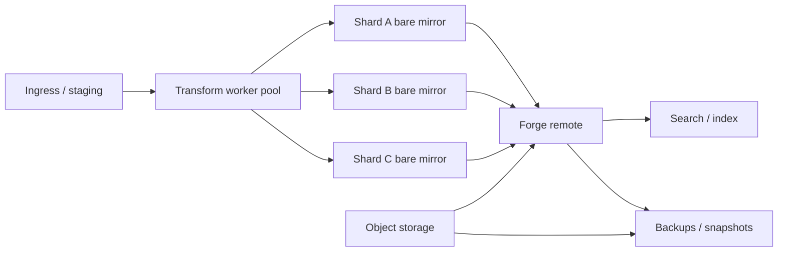
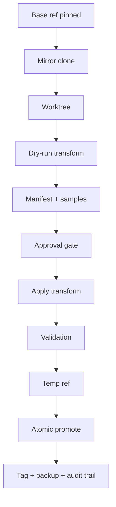

# Self-Hosted Git for a Million-Document Private Archive

**Date:** July 5, 2026

## Executive summary

A self-hosted Git forge **can** host a private corpus of at least **1,000,000 text/Markdown/HTML files** totaling **50+ GB**, but the deciding constraint is usually **Git object and tree behavior**, not raw byte count. Git itself is designed for “small to very large projects,” and modern Git features such as **partial clone**, **sparse-checkout**, **protocol v2**, **worktrees**, **maintenance**, and **atomic ref updates** exist specifically to keep large repositories operable. However, large monorepos still create real pressure on clone/fetch performance, server CPU, IOPS, index/search infrastructure, and branch maintenance. GitLab’s own monorepo guidance explicitly warns that large monorepos can significantly strain the environment, and Bitbucket Data Center warns that repositories larger than a few GB are likely to impact both client and server performance.

For this workload, the strongest overall choices are:

- **GitLab CE / Self-Managed** if you want the richest automation surface, the best documented monorepo guidance, mature REST + GraphQL APIs, system hooks, object-storage integration, and the deepest operational literature.
- **Gitea or Forgejo** if you want a much simpler operational footprint, strong REST/webhook automation, S3-compatible storage integration, and lower maintenance overhead than GitLab.
- **Bitbucket Data Center** if you already live in the Atlassian ecosystem and can justify enterprise licensing; it has the most explicit enterprise-scale storage story via **Bitbucket Mesh**, plus strong HA, audit, and SSO features.

The weakest fits for this specific problem are **Gogs**, **SourceHut**, and **legacy Phabricator**. Gogs is lightweight but comparatively thin for large-scale operational automation; SourceHut has powerful API ideas and excellent Unix ergonomics, but its self-hosting story is more fragmented and less enterprise-oriented in the sources reviewed; Phabricator is no longer actively maintained upstream, so only **Phorge** should be considered if you want that family of tools.

The most important architecture recommendation is **not** “pick the fanciest forge.” It is:

1. **Use sharded repositories unless you have a strong reason for a single monorepo.**
2. **Keep the write path Git-native** by doing transformations in a controlled worker using a **mirror clone + worktree**, then publishing via an **atomic ref update** or **atomic push**.
3. **Push large binary or generated artifacts out of core Git** and into **object storage / LFS / package storage**, even if your main corpus is text.
4. **Design plan/apply workflows with manifests, dry-run, backups, and rollback refs from day one.**

That pattern is more important than whether the front-end is GitLab, Gitea, Forgejo, or Bitbucket.

## Bottom line and recommendation

If I were designing this for a private, automation-heavy, million-document archive with LLM-agent interaction, I would choose one of these two patterns:

**Default recommendation: GitLab CE / Self-Managed, sharded repositories, object storage for non-core assets, sidecar bulk-transform workers.** GitLab has the best combination of documented monorepo practices, mature REST and GraphQL APIs, system hooks, storage controls, object deduplication concepts, and operational reference architectures. It is the most defensible choice if you expect the archive to grow, need strong integration points for agents, or want a platform with a deep bench of admin documentation. The cost is operational complexity.

**Operationally lean recommendation: Forgejo or Gitea, sharded repositories, PostgreSQL or MariaDB, MinIO/S3-compatible storage, external bulk-transform workers.** If simplicity, low RAM/CPU overhead, and maintainability matter more than maximum platform breadth, this is the better fit. Forgejo in particular adds quota concepts and continues to evolve independently; Gitea has a mature API and very straightforward storage configuration. The trade-off is a less expansive enterprise/HA story in the open-source edition and fewer platform-native features than GitLab or Bitbucket DC.

**When Bitbucket Data Center is the right answer:** only if you explicitly need its enterprise Data Center posture, Atlassian integration, SAML/rate-limiting/audit features, and especially **Bitbucket Mesh**. Note that **Bitbucket Server is end-of-support**; the current self-hosted product is effectively **Bitbucket Data Center**.

**What I would not choose first for this workload:** Gogs, SourceHut, or legacy Phabricator. Gogs’ own API documentation describes the REST API as still in an early stage. SourceHut has a serious GraphQL/API direction and good account security features, but the self-hosting/enterprise/HA side is less coherent in the reviewed material for a private million-file archive. Phabricator should be treated as legacy only; if you prefer that workflow family, use Phorge instead.

## What actually matters at this scale

The first mistake in these projects is to optimize for **repository bytes** instead of **repository shape**. A 50 GB corpus of mostly text is not outrageous by storage standards, but a million tracked paths creates pressure on tree objects, working-tree materialization, search indexing, status/diff behavior, and any server features that repeatedly walk the tree. Git’s large-repo features exist for exactly this reason: **partial clone** reduces object transfer, **sparse-checkout** avoids materializing the whole tree, **worktrees** let you stage transformations without recloning, **maintenance** continuously optimizes repo data, and **protocol v2** improves negotiation efficiency.

The second mistake is to assume the forge’s **file-edit API** is your bulk-edit mechanism. That is almost never the performant route. GitLab’s Repository Files API is fine for single-file workflows, but it has endpoint-specific limits, including rate limits for larger blobs; Gogs exposes paginated REST and calls its API early-stage; SourceHut’s GraphQL model is strong for automation, but the reviewed sources do not present a compelling case that API-level file mutation should be the primary rewrite mechanism at million-file scale. The right bulk-edit path is usually **server-adjacent Git operations**, not repeated HTTP file edits.

The third mistake is to mutate the forge’s internal repository storage directly. GitLab explicitly warns administrators **not** to manually execute Git commands inside repositories controlled by GitLab housekeeping, because that can cause corruption or data loss. The safe pattern is to use a **mirror clone or bare clone managed outside the forge’s internal repo directories**, perform transformations there, validate, then publish back through supported Git paths. That warning generalizes well to every serious forge.

From that, the architecture choice becomes clearer:

- **Monorepo** is appropriate only when cross-document atomicity, global search, shared ref history, and whole-library transformations outweigh the pain.
- **Sharded repos** are preferable when file counts, contributor concurrency, or category isolation dominate.
- **Object storage** is useful even in text-heavy systems for release artifacts, backups, archives, packages, LFS, and search/index side data.
- **LLM-agent interaction** benefits most from strong list/search/webhook/token APIs plus eventing, not from web file editors.

Those conclusions align well with GitLab’s monorepo guidance, Bitbucket’s warnings for very large repositories, and modern Git’s large-repo feature set.

## Candidate comparison

### Comparison table

| Candidate | Published limit / practical scale | API richness and agent fit | Server-side bulk ops posture | Security and enterprise posture | Scaling posture | Recommended use-case | Evidence |
| --- | --- | --- | --- | --- | --- | --- | --- |
| **GitLab CE / Self-Managed** | No hard published file-count cap in reviewed docs; self-managed repo size limit can be `0` (unlimited), but GitLab documents monorepo strain and tuning needs. | Strong: REST, GraphQL, project/group/system hooks. | Strong, but use external worker clones; do **not** mutate GitLab-managed repo storage directly. | Strong auth and admin controls; audit/eventing docs; object storage; advanced HA docs. | Best-documented open-source option for large Git operations. | Best default for high-automation private archives. | [Monorepos](https://docs.gitlab.com/user/project/repository/monorepos/), [REST](https://docs.gitlab.com/api/rest/), [GraphQL](https://docs.gitlab.com/api/graphql/), [system hooks](https://docs.gitlab.com/administration/system_hooks/), [object storage](https://docs.gitlab.com/administration/object_storage/), [reference architectures](https://docs.gitlab.com/administration/reference_architectures/) |
| **Forgejo** | No hard published file-count cap; quota system includes repository/LFS size subjects. | Strong REST/webhooks/OAuth2; practical for agents. | Good if bulk edits run outside the app against Git clones/worktrees. | Strong OSS auth story; quotas; storage abstraction; community-maintained. | Simpler than GitLab; lighter operationally. | Best low-overhead OSS alternative. | [API](https://forgejo.org/docs/latest/user/api-usage/), [webhooks](https://forgejo.org/docs/latest/user/webhooks/), [quotas](https://forgejo.org/docs/latest/admin/advanced/quota/), [configuration](https://forgejo.org/docs/v15.0/admin/config-cheat-sheet/) |
| **Gitea** | No hard published file-count cap in reviewed docs. | Strong REST/webhooks/OAuth2; good token model. | Good with external bulk workers and Git-native workflows. | MFA in OSS; enterprise adds audit log/SAML/mandatory 2FA. | Excellent single-node simplicity; HA story stronger in enterprise. | Best simple self-hosted forge for moderate ops teams. | [API](https://docs.gitea.com/development/api-usage), [OAuth2](https://docs.gitea.com/development/oauth2-provider), [MFA](https://docs.gitea.com/usage/multi-factor-authentication), [configuration](https://docs.gitea.com/administration/config-cheat-sheet), [backup](https://docs.gitea.com/administration/backup-and-restore) |
| **Bitbucket Data Center** | Docs warn repos larger than a few GB affect performance; Mesh adds distributed scalable Git storage. | Strong REST/plugin model; good for enterprise integrations. | Strongest enterprise server-side extensibility via hooks, hook scripts, Mesh, REST, plugins. | Very strong: audit logs, SAML/rate limiting/Data Center controls. | Best enterprise scaling posture, especially with Mesh. | Best if you already need Atlassian/DC. | [Scaling](https://confluence.atlassian.com/bitbucketserver/scaling-bitbucket-data-center-776640073.html), [Mesh](https://confluence.atlassian.com/bitbucketserver/bitbucket-mesh-1128304351.html), [REST](https://developer.atlassian.com/server/bitbucket/how-tos/command-line-rest/), [hook scripts](https://confluence.atlassian.com/bitbucketserver/configuration-properties-776640155.html#Configurationproperties-feature.hook.scripts), [audit](https://confluence.atlassian.com/spaces/BITBUCKETSERVER100/pages/1680279091/Audit%2Blog%2Bevents), [EoS](https://confluence.atlassian.com/bitbucketserver/end-of-support-announcements-776640855.html) |
| **Phorge** | No hard published file-count cap; clustering docs exist, but repository automation is still described as prototype in reviewed docs. | Conduit API is mature and scriptable. | Possible, but repository automation is prototype and more bespoke. | MFA, webhook, clustering, RBAC-style roles available. | Viable but niche, with more bespoke operational work. | Good only if you specifically want the Phabricator workflow model. | [Docs index](https://projects.clusterlabs.org/book/phorge/), [Conduit](https://projects.clusterlabs.org/book/phorge/article/conduit_edit/), [repository automation](https://secure.phabricator.com/book/phabricator/article/drydock_repository_automation/) |
| **Phabricator** | Legacy only. | Conduit remains scriptable, but upstream is discontinued. | Legacy only. | Upstream maintenance ended June 2021. | Not recommended for new deployments. | Migration candidate only. | [Phacility status](https://www.phacility.com/phabricator/), [repository automation](https://secure.phabricator.com/book/phabricator/article/drydock_repository_automation/) |
| **Gerrit** | No hard published file-count cap in reviewed docs; designed for serious code-review workflows and event streaming. | Strong REST, SSH event stream, large plugin ecosystem, replication plugin. | Very strong for programmatic workflows; less full-forge UX. | Strong auth/access/plugin model; mature for controlled enterprise flows. | Strong for review-centric scale, not ideal as a document library forge. | Best for highly controlled review pipelines, not for general document hosting UX. | [REST](https://gerrit-review.googlesource.com/Documentation/rest-api.html), [stream-events](https://gerrit-review.googlesource.com/Documentation/cmd-stream-events.html), [plugins](https://www.gerritcodereview.com/plugins.html), [replication plugin](https://gerrit.googlesource.com/plugins/replication/) |
| **SourceHut** | No hard published file-count cap in reviewed docs. | Strong GraphQL direction, webhook model, CLI/export; very automation-friendly in principle. | Viable, but enterprise/self-hosting posture is less explicit in reviewed docs. | 2FA, audit logs, OAuth controls advertised. | Technically credible, but not my first pick for this archive use-case. | Best for teams that already prefer SourceHut’s workflow philosophy. | [GraphQL docs](https://docs.sourcehut.org/), [git.sr.ht API](https://docs.sourcehut.org/git.sr.ht/), [meta.sr.ht API](https://docs.sourcehut.org/meta.sr.ht/), [installation](https://man.sr.ht/installation.md) |
| **Gogs** | No hard published file-count cap; very lightweight. | REST exists, but Gogs says its API is still early-stage. | Adequate for simple Git hosting; weak for this scale/problem profile. | Lightweight auth/config; fewer enterprise controls. | Easy to run, but not a strong million-file platform choice. | Small, simple installs only. | [Intro](https://gogs.io/getting-started/introduction), [API reference](https://gogs.io/api-reference/introduction) |

### Analytical assessment

**GitLab CE / Self-Managed** is the most balanced answer for this problem. It has the broadest automation surface of the open-source candidates in the reviewed material: mature REST, GraphQL with documented limits, system hooks for instance-wide events, project/group webhooks, object-storage support, LFS support, object deduplication via alternates/object pools, and detailed monorepo performance guidance. It also has documented reference architectures and Git storage components such as Gitaly and Praefect. The downside is complexity: it is the heaviest platform here operationally, and large monorepos can significantly strain Gitaly and the broader stack.

**Forgejo** is the strongest “lean but serious” open-source alternative. It inherits the Gitea-style administration model, exposes a stable API contract by major version, supports OAuth2 provider behavior, repository/org/system webhooks, and a storage abstraction that explicitly supports local storage or MinIO/S3-style backends. Its quota model is notable because it explicitly reasons about total Git size, repo size, and LFS size. That makes it attractive for disciplined archival deployments, especially if you want a platform that stays simpler than GitLab while still feeling modern and automation-friendly.

**Gitea** remains the best-known lightweight forge in this class. Its REST API, OAuth2 provider support, MFA support, token model, and MinIO/S3-compatible storage configuration are all solid for automation. It also has straightforward backup guidance and command-line administration. In open source, it is excellent for single-node or simple replication/mirroring patterns. Where it falls behind GitLab and Bitbucket DC is less API capability than GitLab GraphQL plus system hooks, and a less comprehensive open-source HA/enterprise-control story. Gitea Enterprise adds audit logs, SAML, and mandatory 2FA, which matters if the archive has compliance requirements.

**Bitbucket Data Center** deserves serious consideration if budget is not the first constraint. Its docs are unusually explicit about enterprise-scale Git hosting pressures and its answer is **Bitbucket Mesh**, a distributed, replicated, horizontally scalable Git storage subsystem intended to improve performance, scalability, and resilience. It also has a mature REST API, hook/plugin system, hook scripts, audit logging, SAML, and Data Center clustering. The main reasons not to choose it are licensing cost, heavier infrastructure, and the fact that the self-hosted Bitbucket future is Data Center only, since Server is end-of-support.

**Phorge** is viable, but niche. It gives you Diffusion, Conduit, webhooks, MFA, clustering docs, and a workflow model many engineers still like. But for this specific million-document archive problem, it is weaker than GitLab/Gitea/Forgejo/Bitbucket because the reviewed docs present some of the most relevant write-side automation as **prototype** territory, and the surrounding ecosystem is smaller. I would choose Phorge only if you already know you want the Phabricator-style model.

**Phabricator** should not be deployed new. Phacility states it is no longer actively maintained, and customers were encouraged to migrate away. Any evaluation today should treat it as a legacy migration source or historical comparison point, not a target platform.

**Gerrit** is technically stronger than many people realize if the priority is programmatic control and rigorous server-side workflows. It has a real REST API, SSH event streaming, extensive plugins, replication support, and strong access controls. If you wanted a tightly governed write pipeline with machine-triggered actions, Gerrit is a serious candidate. The reason it is not a top recommendation here is product fit: Gerrit is optimized for review-centric engineering workflows, not for acting as the most ergonomic “private million-document library forge.”

**SourceHut** is impressive conceptually for automation. The new docs site and GraphQL direction are real, the platform advertises OAuth controls, audit logs, 2FA, export tooling, and webhook support, and its ethos is excellent for script-first users. But for this exact use-case, the reviewed sources do not give me enough confidence in the self-hosted enterprise-operational side to rank it ahead of GitLab, Forgejo/Gitea, or Bitbucket DC. I see it as viable, but not first-line.

**Gogs** is still attractive in the “tiny and easy” category, but the problem you described is not a tiny-and-easy problem. Gogs emphasizes simplicity and low resource usage, and its API exists, but the documentation explicitly describes that API as still early-stage. That makes it the wrong default for a long-lived million-document platform with heavy automation ambitions.

## Recommended architecture patterns

### Repository topology

For **1M+ primarily text files**, I recommend **sharded repositories by stable domain boundary**, not a single giant tree, unless you absolutely require global atomic commits across the whole corpus.

A practical sharding scheme is:

- **By corpus family**: `docs-core`, `docs-archive`, `docs-generated`, `docs-private`, `docs-site-rendered`
- **Then by stable namespace** inside each repo: year, publisher, taxonomy, customer, or language
- **Keep generated outputs separate** from source text whenever possible
- **Prefer one search/index tier across shards** rather than one giant repo for search convenience

Why this pattern wins:

- Lower packfile churn per repo
- Smaller clone/fetch windows
- Easier lock isolation for bulk transformations
- Easier rollback boundaries
- Better fit for sparse-checkout and selective agent access
- Easier disaster recovery and backup subset restores

A **monorepo** still makes sense if your dominant workload is “rewrite all documents globally and atomically,” or if cross-tree ref integrity matters more than operational smoothness. GitLab’s monorepo docs and Bitbucket’s large-repo warnings both point to the costs you pay when you take that route.



### Storage strategy

Use **core Git storage for authoritative text content and history**, and **object storage** for everything that is not central to Git history:

- LFS, if you later introduce large binaries
- Release/archive artifacts
- Search indexes, if the platform supports externalization
- Backup bundles and snapshots
- Possibly generated HTML/site bundles if they do not need full source-history semantics

GitLab recommends object storage over NFS in larger setups, and both Gitea and Forgejo explicitly support S3-compatible storage abstractions. Bitbucket DC’s scale story centers on **Mesh** for Git storage and **OpenSearch** for code search in modern releases.

### Git mechanics that matter

These features should be enabled or used regardless of forge choice:

- **Protocol v2** for more efficient negotiation
- **Partial clone** for consumers that do not need all blobs immediately
- **Sparse-checkout** for workers that only operate on selected subtrees
- **git maintenance** on mirrors and heavy-write repos
- **worktrees** for plan/apply workflows
- **atomic ref updates** for promotion/rollback

That stack is what makes large-repo operation tolerable in practice.

## Safe bulk-transformation workflow and deployment examples

### Safe plan and apply workflow

The correct model for server-side bulk transformations is **plan first, apply second**:

1. **Mirror clone** the target repository or shard.
2. **Create a worktree** from the pinned base commit.
3. **Run a dry-run transform** that produces:
   - manifest of affected files
   - counts by operation
   - sample diffs
   - encoding / line-ending / whitespace stats
4. **Review and sign off** the manifest.
5. **Apply for real** in the worktree.
6. **Validate**:
   - no unexpected binary conversions
   - UTF-8 only
   - LF only
   - normalization invariants hold
   - changed-file count matches manifest
7. **Commit to a temporary ref**
8. **Promote atomically** to the target branch or via a pull request / protected-branch workflow
9. **Retain rollback refs and tag the run**

This is safer than API-level edits and safer than mutating platform-internal repo storage. It also maps cleanly to LLM-agent orchestration, because the agent can produce the plan, while the apply step is still deterministic and auditable.



### Minimal deployment example

For the lowest-ops serious deployment, use **Forgejo or Gitea**:

- 1 VM or LXC
- local SSD/NVMe for Git repos and database
- PostgreSQL or MariaDB
- MinIO or S3-compatible storage for artifacts/LFS/archives as needed
- sidecar transform worker service on the same host or adjacent host
- nightly snapshots plus repo-bundle exports

This gets you private Git hosting, solid APIs, webhooks, and low operational drag.

### HA deployment example

For higher availability and growth, use one of these patterns:

- **GitLab Self-Managed HA pattern**: load balancer, multiple app nodes, external PostgreSQL, Redis, dedicated Git storage nodes, object storage, and optional geographically distributed or clustered Git components where supported by your edition/tier.
- **Bitbucket Data Center pattern**: load balancer, multiple Bitbucket nodes, external DB, shared services, OpenSearch, and **Bitbucket Mesh** for horizontally scalable Git storage.
- **Gitea Enterprise HA pattern** exists, but in open-source Gitea/Forgejo the simplest answer is often active/passive plus database replication and external object storage rather than true horizontally scaled active/active Git serving.

### Tuning and configuration snippets

These snippets are intentionally **implementation-oriented examples**, not copy-paste guarantees. Use them on **worker mirrors or managed repo clones**, not by editing forge-internal repository storage directly on platforms that manage housekeeping themselves.

#### Git maintenance and pack tuning

```bash
# Run on a mirror or controlled bare repo used for bulk transformation work.
git config maintenance.strategy incremental
git maintenance start

# Conservative pack tuning for large text-heavy repos.
git config pack.windowMemory 256m
git config pack.packSizeLimit 2g
git config gc.writeCommitGraph true
git config fetch.writeCommitGraph true
git config core.commitGraph true

# Explicit maintenance run.
git maintenance run --task=commit-graph --task=incremental-repack
```

Git documents `git maintenance`, commit-graph maintenance, and pack-size controls; note that splitting packfiles can trade simplicity for somewhat slower repositories, so treat `pack.packSizeLimit` as a filesystem/operational knob, not a universal speed knob.

#### Partial clone and sparse-checkout

```bash
# Blobless clone for large repos
git clone --filter=blob:none ssh://git@example.com/archive.git archive
cd archive

# Sparse working tree targeting only a shard/path of interest
git sparse-checkout init --cone
git sparse-checkout set docs/2024 docs/2025
```

This reduces object transfer and avoids materializing most paths in the working tree.

#### GitLab object storage example

```ruby
# /etc/gitlab/gitlab.rb
gitlab_rails['object_store']['enabled'] = true
gitlab_rails['object_store']['connection'] = {
  'provider' => 'AWS',
  'region' => 'us-east-1',
  'aws_access_key_id' => ENV['AWS_ACCESS_KEY_ID'],
  'aws_secret_access_key' => ENV['AWS_SECRET_ACCESS_KEY']
}
# Then assign buckets per object type per current GitLab docs.
```

GitLab’s object-storage docs recommend object storage in larger setups and provide consolidated S3 examples.

#### Gitea or Forgejo S3-compatible storage example

```ini
[storage]
STORAGE_TYPE = minio
MINIO_ENDPOINT = s3.example.internal:9000
MINIO_ACCESS_KEY_ID = ${AWS_ACCESS_KEY_ID}
MINIO_SECRET_ACCESS_KEY = ${AWS_SECRET_ACCESS_KEY}
MINIO_BUCKET = forge-data
MINIO_LOCATION = us-east-1
MINIO_USE_SSL = true
SERVE_DIRECT = true

[lfs]
STORAGE_TYPE = minio
```

Gitea explicitly documents `STORAGE_TYPE = minio`, S3-compatible settings, and deriving LFS and related stores from the storage section. Forgejo documents the same storage abstraction concept and supports local or MinIO/S3-style storage.

#### Atomic local promotion with temp ref and worktree

```bash
#!/usr/bin/env bash
set -euo pipefail

REPO=/srv/git-mirrors/archive.git
RUN_ID="$(date +%Y%m%d-%H%M%S)"
BASE_REF=refs/heads/main
TMP_REF="refs/heads/bulk/${RUN_ID}"
WT="/srv/worktrees/archive-${RUN_ID}"

git -C "$REPO" fetch origin
BASE_SHA="$(git -C "$REPO" rev-parse "$BASE_REF")"

git -C "$REPO" worktree add "$WT" "$BASE_SHA"
trap 'git -C "$REPO" worktree remove --force "$WT" || true' EXIT

pushd "$WT" >/dev/null

python3 /opt/bulkfmt/plan_apply.py \
  --mode apply \
  --manifest "/var/tmp/${RUN_ID}.json"

git add -A
git commit -m "bulkfmt: ${RUN_ID}"

NEW_SHA="$(git rev-parse HEAD)"
git update-ref "$TMP_REF" "$NEW_SHA"

# Atomic local ref transaction:
printf '%s\n' \
  "verify $BASE_REF $BASE_SHA" \
  "update $BASE_REF $NEW_SHA $BASE_SHA" \
  "create refs/tags/bulk/${RUN_ID} $NEW_SHA" \
| git -C "$REPO" update-ref --stdin

popd >/dev/null
```

`git worktree` provides isolated working trees off one repository, and `git update-ref --stdin` performs the ref updates together as a transaction. If you need to publish to a remote instead of promoting inside a local bare repo, use `git push --atomic` where supported.

#### Remote atomic publish example

```bash
git push --atomic origin \
  "${NEW_SHA}:refs/heads/main" \
  "refs/tags/bulk/${RUN_ID}:refs/tags/bulk/${RUN_ID}"
```

Atomic push only guarantees atomicity within a single remote transport connection.

## Monitoring, backups, uncertainties, and prioritized sources

### Monitoring and backup strategy

For this class of system, monitor **Git operation latency, clone/fetch concurrency, webhook queue health, disk IOPS, packfile growth, ref count, repo size growth, worker queue depth, object-storage error rates, and backup restore success**. GitLab’s docs emphasize monitoring performance and health; Bitbucket DC documents audit logs and operational scaling concerns; Gitea Enterprise HA docs call out Prometheus-style monitoring, queue depth, HTTP error rates, and replication lag.

Backups should include:

- database-consistent backup
- repository data
- object storage buckets
- configuration/secrets
- manifests of bulk-transform runs
- rollback refs/tags
- routine restore tests

Gitea’s backup docs make an especially important point: because the DB, files, and repositories change together, **stopping the instance during backup is the only way to avoid certain race conditions** in its documented backup method. Bitbucket provides a DIY backup approach, and GitLab has formal backup/restore administration guidance.

### Open questions and limitations

A few points remain inherently uncertain without a hands-on benchmark on your exact dataset:

- None of the reviewed products publish a clean, official **“1,000,000 files supported”** hard cap. In practice, this is a **Git + storage + workload-shape** question more than a forge checkbox question.
- Exact **GitLab tier entitlements** for some advanced HA components can vary by edition/version; the docs describe the architectures, but licensing details should be checked against the version you actually deploy.
- SourceHut is viable in principle, but the public, easily accessible self-hosting and enterprise-operational material in the reviewed sources was not strong enough to rank it above GitLab, Forgejo/Gitea, or Bitbucket DC for this use-case.
- If the archive will be rewritten continuously by automation, benchmark **sharded repos vs monorepo** early. That decision matters more than brand choice.

### Sources

Highest-priority sources for an implementation decision:

- **Git core docs** for [partial clone](https://git-scm.com/docs/partial-clone), [sparse-checkout](https://git-scm.com/docs/git-sparse-checkout), [worktree](https://git-scm.com/docs/git-worktree), [maintenance](https://git-scm.com/docs/git-maintenance), [protocol v2](https://git-scm.com/docs/protocol-v2), [push](https://git-scm.com/docs/git-push), [update-ref](https://git-scm.com/docs/git-update-ref), and [configuration](https://git-scm.com/docs/git-config).
- **GitLab docs** for [monorepos](https://docs.gitlab.com/user/project/repository/monorepos/), [REST API](https://docs.gitlab.com/api/rest/), [GraphQL API](https://docs.gitlab.com/api/graphql/), [system hooks](https://docs.gitlab.com/administration/system_hooks/), [webhooks](https://docs.gitlab.com/user/project/integrations/webhooks/), [repository files API](https://docs.gitlab.com/api/repository_files/), [object storage](https://docs.gitlab.com/administration/object_storage/), and [reference architectures](https://docs.gitlab.com/administration/reference_architectures/).
- **Gitea and Forgejo docs** for Gitea [API usage](https://docs.gitea.com/development/api-usage), [OAuth2 provider](https://docs.gitea.com/development/oauth2-provider), [MFA](https://docs.gitea.com/usage/multi-factor-authentication), [backup](https://docs.gitea.com/administration/backup-and-restore), and [configuration/storage](https://docs.gitea.com/administration/config-cheat-sheet); plus Forgejo [API usage](https://forgejo.org/docs/latest/user/api-usage/), [webhooks](https://forgejo.org/docs/latest/user/webhooks/), [quotas](https://forgejo.org/docs/latest/admin/advanced/quota/), and [configuration/storage](https://forgejo.org/docs/v15.0/admin/config-cheat-sheet/).
- **Atlassian Bitbucket Data Center docs** for [Mesh](https://confluence.atlassian.com/bitbucketserver/bitbucket-mesh-1128304351.html), [scaling](https://confluence.atlassian.com/bitbucketserver/scaling-bitbucket-data-center-776640073.html), [REST API](https://developer.atlassian.com/server/bitbucket/how-tos/command-line-rest/), [hook scripts](https://confluence.atlassian.com/bitbucketserver/configuration-properties-776640155.html#Configurationproperties-feature.hook.scripts), [audit logs](https://confluence.atlassian.com/spaces/BITBUCKETSERVER100/pages/1680279091/Audit%2Blog%2Bevents), [end-of-support announcements](https://confluence.atlassian.com/bitbucketserver/end-of-support-announcements-776640855.html), and [high availability](https://confluence.atlassian.com/bitbucketserver/high-availability-for-bitbucket-776640137.html).
- **Phorge / Phabricator docs** for the [Phorge documentation index](https://projects.clusterlabs.org/book/phorge/), [Conduit edit endpoints](https://projects.clusterlabs.org/book/phorge/article/conduit_edit/), [Phabricator maintenance status](https://www.phacility.com/phabricator/), and [repository automation](https://secure.phabricator.com/book/phabricator/article/drydock_repository_automation/).
- **SourceHut and Gerrit docs** for SourceHut [GraphQL docs](https://docs.sourcehut.org/), [git.sr.ht API](https://docs.sourcehut.org/git.sr.ht/), [meta.sr.ht API](https://docs.sourcehut.org/meta.sr.ht/), and [installation](https://man.sr.ht/installation.md); plus Gerrit [REST API](https://gerrit-review.googlesource.com/Documentation/rest-api.html), [stream-events](https://gerrit-review.googlesource.com/Documentation/cmd-stream-events.html), [plugins](https://www.gerritcodereview.com/plugins.html), and [replication plugin](https://gerrit.googlesource.com/plugins/replication/).
- **Gogs docs** for the [project introduction](https://gogs.io/getting-started/introduction) and [API reference](https://gogs.io/api-reference/introduction).
