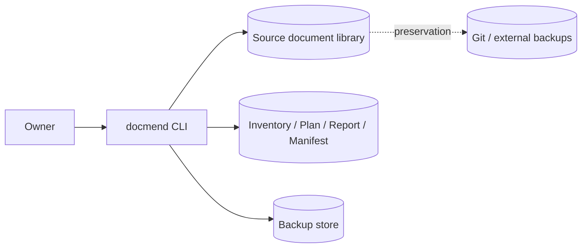
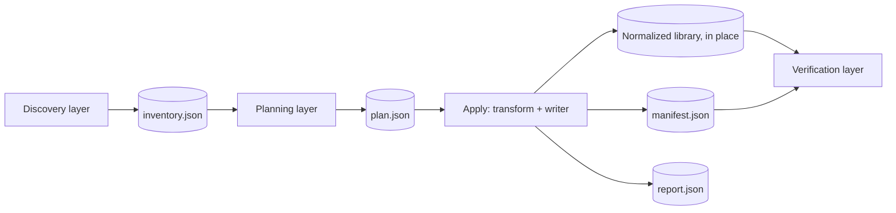
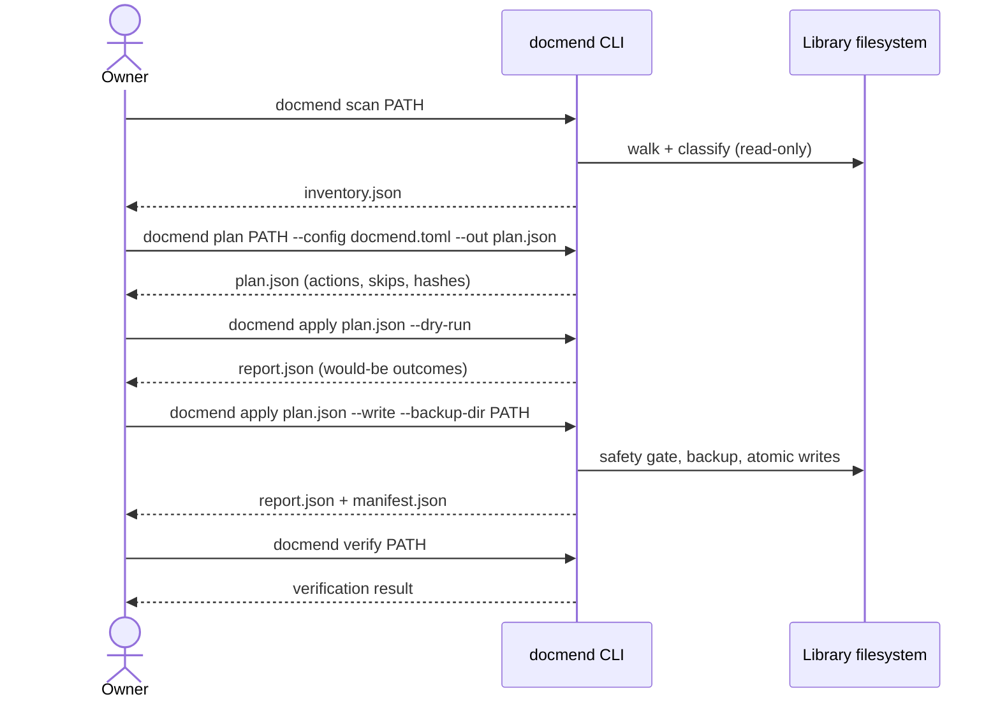
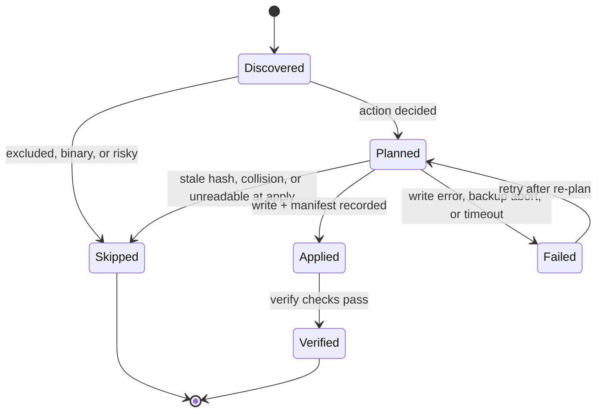

# `docmend` — Specification (Full)

---

## Revision History

| Version | Date | Author | Change |
| --- | --- | --- | --- |
| 0.38 | `2026-07-13` | `coding-agent` | **DMR-08 Task 8 implementation evidence sync** — records aggregate stage start, best-effort heartbeat, complete, and incomplete events at deterministic record boundaries, including the native-call silence limitation, plus apply-time capacity aggregation by actual filesystem with per-file allocation rounding, byte/inode margins, backup/staging/artifact allowances, and stable refusal ordering. Updates FR-019 and NFR-001 traceability evidence only; no requirement, decision, or deviation changes. |
| 0.37 | `2026-07-13` | `coding-agent` | **DMR-08 Tasks 6B-7 implementation evidence sync** — records the landed exact-HEAD installed-wheel orchestrator and replaces the historical opt-in tracemalloc test with the default 1,000-file source-tree full-pipeline guard. The new guard proves exact recipe-derived path dispositions, applied-outcome coverage, finding multiset, and per-class boundaries. Updates current-state and NFR-001 traceability evidence only; no requirement, decision, or deviation changes. |
| 0.36 | `2026-07-13` | `coding-agent` | **DMR-08 Task 6B runtime trust clarification** — makes OQ-041's installed-wheel claim conditional on exclusive same-user control of the candidate repository, bound interpreter, complete qualification workspace, and publication destinations from source inspection through acceptance; records the snapshot/reconciliation coverage and the same-UID ABA/open-inode/process-injection boundary. This is a non-blocking implementation assumption through the Task 9 owner approval boundary, not a claim that pathname-based Python imports are descriptor-bound or immutable. |
| 0.35 | `2026-07-13` | `coding-agent` | **DMR-08 Task 6A implementation evidence sync** — implements the reusable evidence/threshold 2.0, strict transport, schema-provenance, reference-observation, identity-held capacity, and ioctl-bound anonymous-btrfs member-traversal contracts under OQ-041; synchronizes NFR-001 traceability with landed Tasks 2-6A. No requirement, decision, or deviation changes; Task 6B orchestration and the Task 9 pilot/revision-two owner approval boundary remain pending. |
| 0.34 | `2026-07-13` | `coding-agent` | **DMR-08 Task 6 contract-completion amendment** — records non-blocking OQ-041 after three independent pre-implementation reviews found that the literal orchestrator could not truthfully retain early incomplete evidence, reconcile the private supervisor's nullable exit, derive a 1M ceiling from the existing largest-100k helper, or prove a range-resolved build backend. Splits Task 6 into contract completion (6A) and orchestration (6B) without reordering Tasks 7-12; advances the target scale-evidence and threshold contracts to 2.0 before any baseline acceptance; binds partial-stage/status semantics, immutable per-stage threshold context and exact 1M projection, the monotonic 43,200-second release verdict, exact `uv`/`uv_build` provenance, immutable-HEAD workspace execution, conservative SSD observation, warm-cache classification, provisional pre-pilot capacity coefficients, deterministic acceptance names, and process exits. Implementation continues on these Appendix B assumptions through the Task 9 owner approval boundary. |
| 0.33 | `2026-07-13` | `coding-agent` | **DMR-08 Task 5 streamed corpus and stage supervisor** — records non-blocking OQ-040 for the deterministic 40-bucket corpus mix, exact summary/materialization and inode semantics, private strict stage transport, owner-only no-follow files, tracing exclusion, one-child wait/rusage attribution, and unavailable swap behavior left open by the approved design and implementation plan; implements the stdlib-only streamed recipe source, descriptor-bound no-replace corpus publication, fixed-environment one-child supervisor, strict private request/result boundary, and nullable public child-swap reconciliation on the documented conservative assumption until the pilot revision-two approval boundary; advances scale-evidence schema 1.0 to 1.1 for explicit unavailable swap telemetry and synchronizes §17.3 with landed Tasks 2-5 evidence. |
| 0.32 | `2026-07-13` | `coding-agent` | **DMR-08 Task 4 resource preflight** — records non-blocking OQ-039 for exact per-filesystem margin arithmetic, reference-class equality, public mount-option projection, and unavailable child-swap telemetry left open by the approved design and implementation plan; implements Linux mount topology/classification, capacity, reference, and swap primitives plus the reconciled binding-margin evidence contract on the documented conservative assumption until the pilot revision-two approval boundary; synchronizes §17.3 with landed Tasks 2-4 evidence. |
| 0.31 | `2026-07-13` | `coding-agent` | **DMR-08 Task 3 qualification contracts** — records non-blocking OQ-038 for the exact nested public qualification records, finite artifact vocabularies, evidence-reference hashing, and rational threshold rounding left open by the approved design; implements the strict public evidence/reference/threshold schemas and executable threshold provenance on the documented aggregate-only/default assumption until the pilot revision-two approval boundary; synchronizes §17.3 with landed Tasks 2-3 evidence. |
| 0.30 | `2026-07-12` | owner + `coding-agent` | **DMR-08 million-file scale change control, revision one** — settles OQ-037 and adopts `adr-0022-sequential-million-file-scale-contract`; replaces the invalid corpus-independent/parallel NFR-001 claim with the one-through-1,000,000-file bounded-linear, sequential v2.0.0 contract; removes `parallel.*` from the target configuration; adopts plan schema 2.0 with pre-gate 1.x rejection; defines the installed-wheel external-RSS evidence/reference/threshold contracts, tiered qualification, 12-hour concurrency trigger, aggregate heartbeat, capacity preflight, and pilot-gated numeric-threshold revision. NFR-001 regresses to Partial until accepted evidence exists. |
| 0.29 | `2026-07-11` | `coding-agent` | **§17.3 traceability sync for landed safety-core Plan D** — FR-014/IR-004 evidence and status plus IR-007 verify-report evidence; no requirement, decision, or deviation changes. |
| 0.28 | `2026-07-11` | `coding-agent` | **§17.3 traceability sync for the landed safety-core plans A–C** — evidence and status columns only, no requirement changes (plan-review finding cr-009). |
| 0.1 | `2026-07-05` | `coding-agent` | Initial draft, migrated from the pre-standard `docmend-spec-draft` |
| 0.2 | `2026-07-05` | `coding-agent` | Incorporated `docs/research/` findings: frontmatter validation gotchas (C-006, FR-016, DR-005, §9), OQ-008 storage-scale caveat, OQ-011 added, §18.6 backup-tooling example |
| 0.3 | `2026-07-05` | `coding-agent` | Reconciled §21 with `docs/open-questions.md`: added OQ-012..OQ-014 (defined in open-questions but missing from §21) and OQ-015..OQ-020 from the gap analysis (`docs/gap-analysis.md`, 22 new `docs/research/` reports) |
| 0.4 | `2026-07-05` | `coding-agent` | Added OQ-021 (`pydantic` v2 internal models) and OQ-022 (frontmatter YAML codec) from `docs/research/python-library-research.md`; §8.6 dependency-policy rewrite pending OQ-017/018/019/021/022 |
| 0.5 | `2026-07-05` | `coding-agent` | Owner settled OQ-007/011/012/013/014/016/017/018/019/021/022 (recorded in `docs/resolved-questions.md`); set §21 statuses Resolved; rewrote §8.6 into Runtime vs Dev/Test tables, resolving the conditional validator row (`jsonschema`) and adding `structlog`/`pydantic`/`ruamel.yaml` runtime + `hypothesis`/`pyfakefs`/`pytest-xdist` dev rows. Blocking OQs now 1 (OQ-015) |
| 0.7 | `2026-07-05` | `coding-agent` | **Spec/ADR consistency audit** (multi-agent: dimensional finders → adversarial verify → classify). Reconciled 8 distinct stale-prose defects to already-settled decisions — zero RQ downgrades: §21 OQ-001 "seven"→"six" mechanical transforms; added the `--write` opt-in to §10.1 and IR-003 (OQ-014); reworded IR-007 to JSON + NDJSON manifest (OQ-004); removed stray "output root" language from §8.5/§13.2 for in-place mutation (OQ-012); fixed the §9 `docmend.id` example to UUIDv7 (OQ-002); refreshed the §9 "once OQ-013 settles" note (OQ-013); added the `parallel.*` config surface to §18.2 with sequential-until-profiled defaults + IR-006 domain list (OQ-016). ADR 0001 found internally consistent and consistent with the spec. |
| 0.6 | `2026-07-05` | `coding-agent` | Owner settled the last two open questions → **OQ-015/OQ-023** (`docs/resolved-questions.md`); §21 OQ-015/OQ-023 set Resolved. **OQ-015** (encoding): reworded FR-007 to `charset-normalizer`-sole + `1.0 − chaos` confidence (no `.confidence` API) + dual skip gate with a non-ASCII byte-count floor (default 20, family-aware/ratio deferred behind the OQ-020 seam) and gate ordering; added `encoding.non_ascii_floor` to §18.2; broadened A-003/FR-015/AW-003/R-001; fixed the §8.6 charset-normalizer RQ mislink; added the floor fixture recipe to §17.2/§17.3. **OQ-023** (review-artifact exposure): NG-001 boundary reframed to public-repo/tool surface vs operator screen in §2.2/§11, with metadata-only-artifact + external-render rows added to §13.4/§13.5. **Blocking OQs now 0; backlog fully settled (OQ-001..023).** |
| 0.8 | `2026-07-06` | owner + `coding-agent` | **Tool-first reframing.** Owner rewrote §1: the product is the scale-flexible tool; the >100k-file library pipeline is the impetus use case, not the product. Downstream (OQ-024, amending OQ-020's principle-only resolution): mission statement rewritten tool-first; added G-006 (scale flexibility), NFR-006 (small-scale floor), WH-008 (one-shot command, deferred); single-file `PATH` semantics stated in §7.3; §3.2/§5/§14 corpus-vs-tool clarifications; §17.2/§17.3 and §20 coverage rows; §1 "total loss" mapped to skip-and-report (FR-015), no new triage FR; the seam design (`adr-0010-pluggable-policy-seams`) reviewed, stands. TOC re-nested (editor regen), tabs converted to spaces. |
| 0.9 | `2026-07-06` | `coding-agent` | **Gap-register sweep, Batch A** — synced spec prose to already-settled ADR decisions and closed mechanical gaps from `docs/gap-analysis.md`, no new decisions: IR-002 plan-consumes-inventory (gap-13, OQ-004); IR-004 verify artifact flags + read-only (gap-12, OQ-006); IR-005 `--version` + verbosity contract (gap-14/17, OQ-017); IR-006 strict config validation (gap-15, OQ-021); DR-002 per-action ID + §9 identity fields (gap-27/28, OQ-004); §8.5 backup-outside-target + disk preflight (gap-36/38, OQ-005); §8.6 `allpairspy` + §17.2 pairwise gate tests (gap-39, OQ-005); ERR-007/ERR-008 (gap-18); scan/plan re-run posture (gap-25, OQ-003); EC-009 zero-byte (gap-48); §17.1 coverage gate (gap-51); §17.3 IR-/DR- rows (gap-53); §18.5 console-summary note (gap-21, OQ-017); `docs/handoff/` pointers (gap-66). |
| 0.10 | `2026-07-06` | owner + `coding-agent` | **Gap-register sweep, Batch B** — owner settled the nine decision-bearing gaps as **OQ-025..033** (all Resolved; recorded in `docs/resolved-questions.md` as OQ-025..033): HTML mechanical-only include (OQ-025: §2.1, §18.2 defaults); UTF-16/32 BOM-before-NUL policy + `utf16-suspect` skip reason (OQ-026: FR-007, FR-015, EC-010; `adr-0009-encoding-detection-dual-skip-gate` amendment); parent single-writer + run-level lock (OQ-027: §8.5, AW-005; `adr-0007-concurrency-primitive-process-pool` amendment); per-file watchdog + size guard (OQ-028: FR-019, ERR-009, R-007, `limits.*`); config precedence/replace-lists/auto-discovery (OQ-029: §18.2 intro); EC-005 non-whitespace invariant + `safety.shrink_ratio` (OQ-030); `normalize_tabs` leading-only semantics + `tab_width` (OQ-031: FR-009, §18.2); two-corpus synthetic strategy + anonymization procedure (OQ-032: §17.2, MS-5, `faker` dev dep); layered NFR-005 purity enforcement (OQ-033: NFR-005, MS-0, `import-linter` dev dep). |
| 0.11 | `2026-07-06` | `coding-agent` | **Second ADR review pass** (over OQ-024..033): authored `adr-0014-tool-first-product-scope` (OQ-024), `adr-0015-test-corpus-and-anonymization` (OQ-032), `adr-0016-mechanical-transform-boundary` (consolidated OQ-025/030/031); amended `adr-0013-v1-dependency-selection` (three Batch-B dev deps), `adr-0002-layered-pipeline-isolated-writer` (OQ-033 enforcement), `adr-0007-concurrency-primitive-process-pool` (OQ-028 process-based watchdog constraint); recorded deliberate skips (OQ-028/029 and OQ-026/027/033-as-own-ADR) in `docs/adr/adr-backlog.md`. Spec changes: §21 status cells gain canonical-ADR stems for OQ-024/025/030/031/032; frontmatter `related.adrs` extended to 0014–0016. |
| 0.14 | `2026-07-06` | `coding-agent` | **MS-1 Core workflow implemented** (§19 items 1–4). Spec-side changes: §17.3 rows FR-001/IR-001 Complete, FR-012/IR-007/DR-001/NFR-006 Partial, each with named tests; §21 gains OQ-034 (default artifact/log location — Open, non-blocking, proceeding on the `.docmend/` assumption); §18.2 `paths.exclude` default gains `.docmend/`; §3.1 current-state refreshed; §9 records the OQ-004 schema location. Code side (for context): the four artifact JSON Schemas pinned in `src/docmend/schemas/` per `adr-0005-durable-artifact-schema-contract` (plan/report/manifest as v1.0 contracts for MS-2/MS-3), `docmend scan` (discovery layer: read-only walk, FR-012 filters via pathspec, single-pass classification — BOM/strict-UTF-8/ASCII rungs of FR-007, newline census, hard-link groups EC-011, symlink records EC-008, ERR-007 skips), inventory pydantic models + validated atomic artifact IO (`jsonschema` Draft 2020-12 with format assertion, OQ-018); runtime deps pathspec/jsonschema and dev deps hypothesis/pyfakefs/pytest-xdist added per §8.6 (license record extended). |
| 0.13 | `2026-07-06` | `coding-agent` | **MS-0 Foundation implemented** (§19 items 1–6). Spec-side changes only: §16 license checkbox ticked (record: `docs/dependency-licenses.md`); §17.3 rows IR-005/IR-006/NFR-003/NFR-005 moved to Complete/Partial with named tests; §3.1 current-state sentence refreshed; §17.3 intro no longer claims implementation has not started. Code side (for context, not spec content): `docmend` CLI entry point + IR-005 global flags, §18.2 config loading (strict pydantic models), OQ-017 logging framework + run-ID convention, OQ-033 purity enforcement (import-linter contract + transform-test fixture), runtime deps typer/pydantic/structlog/rich and dev deps import-linter/allpairspy/faker added per §8.6. |
| 0.12 | `2026-07-06` | `coding-agent` | **Third consistency/drift audit** (multi-agent detect → adversarial-verify → classify, ground-truthed against `validate-specs`). Brought `validate-specs`, `spec lint`, markdownlint, and `check_traceability` all green. Standard conformance: bare uppercase decision tokens in the spec body that tripped `SV-ID-*` are gone — `RQ-`→`OQ-`, bare `adr-00NN` uppercase → lowercase `adr-00NN-…` stems, `gap-NN` cross-refs lowercased; ToC dead anchor via `fix_spec_toc.py` + reindent. Owner decisions: qualified G-002 / §20 Reliability for the FR-005 low-risk no-backup opt-in (reconciling `adr-0014-tool-first-product-scope`); adopted the gap-32 hard-link policy — EC-011, DR-001 shared-inode alias group, §21 OQ-004, `adr-0005-durable-artifact-schema-contract` amendment. Mechanical syncs: §10.4 Failed/Skipped entry conditions widened to ERR-004/ERR-005/ERR-009; §14 concurrency, §18.5 four-code exit taxonomy, and §17.2 ERR-001–ERR-008 range aligned to settled OQ-016/OQ-027 decisions and `adr-0012-verify-semantics-exit-code-taxonomy`; encoding family-aware table single-homed in `adr-0009-encoding-detection-dual-skip-gate`; FR-009 / §18.2 blank-line default de-duplicated; `cleaner.toml`→`docmend.toml`. |
| 0.15 | `2026-07-06` | `coding-agent` | **MS-2 Domain logic implemented** (§19 items 1–4). Spec-side changes: §17.3 rows FR-002/FR-008/FR-009/FR-015/NFR-005/DR-001/DR-002/IR-002 Complete, FR-007/FR-010/FR-011/FR-012/FR-017/FR-019/NFR-006/IR-007 Partial, each with named tests; §3.1 current-state refreshed (scan **and plan** live; apply/verify land per §19). Code side (for context): the planning layer + `docmend plan` (FR-002, FR-015, DR-002, IR-002) — fact-gate ladder (filters, hard-link, oversize, encoding gates), content pass (decode checks, transform prediction, EC-005 shrink-invariant guard, collisions, C.4 decision provenance, per-action IDs with UUIDv7 identities); pure transforms (FR-007–FR-009) behind the `adr-0016` file-class dispatch and canonical execution order; the `charset-normalizer` legacy detection rung populating the inventory at scan (DR-001, `adr-0009-encoding-detection-dual-skip-gate`); an initial weird-document corpus and regression harness (§17.2), including the three-axis encoding-floor boundary matrix; the OQ-015 MS-2 calibration checkpoint executed — floor stays 20 (`adr-0009` amendment note; full 60-cell tabulation in `docs/handoff/sessions/2026-07.md`); and a pre-implementation plan-schema amendment (still v1.0) adding the `changed-since-scan` skip reason. Deviations audit: the ten design decisions locked by the MS-2 implementation plan were checked against the landed code; none diverged from spec text, so no new `DEV-` row was needed. |
| 0.16 | `2026-07-06` | `coding-agent` | **MS-3 User and admin experience implemented** (§19 items 1–3). Spec-side changes: §17.3 rows FR-003/FR-004/FR-005/FR-006/FR-011/FR-018/NFR-002/NFR-004/IR-003/IR-008/DR-003/DR-004 Complete, FR-007/FR-010/FR-012/NFR-006/IR-005/IR-007 advanced, each with named tests; §3.1 refreshed (apply/restore live; verify lands MS-4); §21 gains OQ-035 (FR-005 CLI surface + risk tiers) and OQ-036 (run-lock location) — both Open, non-blocking, proceeding on recorded assumptions. Code side (for context): the writer layer (atomic same-dir replace + parent fsync, link-based no-clobber renames, verify-then-mutate backups, fsync-per-record NDJSON manifest with AOF read rule), the adr-0004 pure-predicate safety gate (pairwise-tested), `docmend apply` (dry-run default, snapshot-driven, per-file FR-003 hash guard, console summary mirroring the DR-003 counts per §18.5), `docmend restore` (LIFO replay, IR-008) with the automated §18.6 drill, the OQ-027 run lock, and the two MS-2 final-review inputs: inventory 1.1 detection provenance (cross-config binary-suspect fix) and artifact path-containment hardening (inventory/plan 1.1 patterns + model validators). Manifest schema 1.1 adds the overwrite-preservation fields; plan schema 1.1 adds optional `source_root`. |
| 0.17 | `2026-07-07` | `coding-agent` | **MS-4 Unattended operation — in progress.** Spec-side changes: §17.3 rows IR-004 Complete and FR-014 Partial, each with named tests; §3.1 current-state refreshed (verify now runs content + reconciliation checks). Code side (for context): the OQ-036 lock-key gap closed — manifest schema 1.1→**1.2** adds a writer-stamped `source_root` and `docmend restore` keys its run-lock on it (falls back to `commonpath` for pre-1.2 manifests), so a restore contends with a concurrent apply even when mutated files nest below the source root (AW-005); and `docmend verify` (FR-014, IR-004, `adr-0012-verify-semantics-exit-code-taxonomy`) — read-only UTF-8-decodability + LF-only content checks over PATH (reusing scan's facts) plus manifest after-hash reconciliation, input via `--manifest`/`--run-id` sidecar, the 0/1/2 exit taxonomy, proven read-only. Frontmatter validation (FR-016) and report/manifest count reconciliation remain deferred with the frontmatter feature (FR-016; MS-4/MS-5). Resume (FR-013), idempotency (FR-017), and the single-file verify journey (NFR-006) are the remaining MS-4 work. |
| 0.18 | `2026-07-07` | `coding-agent` | **MS-4 Unattended operation complete** (§19 items 1–3). Spec-side changes: §17.3 rows FR-013/FR-017/NFR-006 Complete and FR-003 extended (duplicate-run/stale-plan shapes), each with named tests; §3.1 current-state refreshed (MS-4 complete; MS-5 remains). Code side (for context): resume (FR-013, `adr-0006-resume-and-recovery-model`) — `docmend apply --resume-run-id/--resume-manifest` (both repeatable for multiply-interrupted runs) reconciles plan actions against prior manifest records before execution: recorded-applied actions whose live output matches `after_sha256` skip as `already-applied` (a new internal skip reason, NOT counted as an exit-1 finding so unattended re-invocation converges; the schema's `skip_reason` is free-string, no bump), changed/missing outputs fail ERR-002, unrecorded actions execute normally behind the FR-003 hash guard; a wrong-tree resume manifest refuses exit 2 via the 1.2 `source_root` cross-check. Kill-and-resume e2e proves corpus + union-of-manifests identical to an uninterrupted control. Idempotency (FR-017) covered in all three duplicate shapes; the NFR-006 journey now runs scan → plan → apply `--write` → verify over one file. |
| 0.20 | `2026-07-07` | `coding-agent` | **MS-5 Production readiness complete — v1.0.0.** Spec-side changes: §17.3 rows NFR-001 (100k seeded scale test, bounded-memory assertion), FR-019 (per-file watchdog at scan + plan; new `timeout` skip reasons — inventory schema 1.1→1.2, plan schema 1.1→1.2, both additive), NFR-003 (log-content integration test), and FR-012 (stale status label) all Complete — the §17.3 matrix now has no Partial or Not Started rows; Deviations Log gains DEV-002 (FR-019's process-level watchdog realized as an in-process SIGALRM alarm for the sequential v1 engine — no worker process exists to terminate under the adr-0007 sequential-until-profiled posture; the writer is never wrapped; process-level termination rides the deferred pool); §18.7 documentation checklist fully ticked (README command/config/safety docs, restore + resume runbooks, config reference cross-checked drift-free); §3.1 refreshed. Code side (for context): `watchdog.py` (SIGALRM `per_file_watchdog`, main-thread-only, always restores handler/itimer), wired at discovery classification and the planning content pass with ERR-009 logging; `tests/test_scale.py` (measured: 100,000 files in ~358 s, peak tracemalloc 477 MiB ≈ 4.9 KiB/file, ceiling 64 MiB + 10 KiB/file; opt-in via `DOCMEND_SCALE=1`, slow-marked); `.github/workflows/release.yml` (tag → `uv build` → wheel smoke-test → GitHub Release, adr-0017); version 1.0.0; CHANGELOG.md added. |
| 0.21 | `2026-07-07` | owner + `coding-agent` | **Post-release owner sign-off.** §21 rows OQ-034/OQ-035/OQ-036 → Resolved (implemented assumptions adopted as-is; registers updated — the three settled entries moved to `resolved-questions.md`, `open-questions.md` now empty); Deviations Log DEV-001 and DEV-002 → Approved; §17.1 Definition of Done fully ticked; §13.6 hardening checklist boxes ticked (each item's resolution was already recorded inline). No requirement text changed. |
| 0.22 | `2026-07-07` | `coding-agent` | **Post-release fix for the partial-undo trap** (GitHub issue #15, found integrating v1.0.0 externally): when the FR-005 gate passes without tool backups, the run's manifest records content mutations as hashes only, so `docmend restore` can undo renames but not rewrites — previously discovered only via restore-time skips. v1.0.1 surfaces it three ways, no schema change: (1) apply-time stderr warning on write runs with content rewrites and no `--backup-dir`; (2) `restore` prints an up-front "restore capability: renames-only" line derived from the manifest (applied non-rename record with null `backup_path`), usable by wrapper scripts; (3) the no-backup skip detail names the declared preservation as the recovery path. Journaled originals (issue suggestion 3) deferred as **WH-009** (§2.3). Console text only — FR-005/IR-008 semantics unchanged. |
| 0.23 | `2026-07-07` | owner | **Spec approved.** `status: draft` → `approved` (owner decision, post-v1.0.1): the §17.1 Definition of Done is fully satisfied, the §17.3 matrix is Complete, the §21 register holds no open questions, and the Deviations Log is owner-accepted. The document is now **change-controlled** per the lifecycle note above — post-approval edits require a new revision row, and scope-affecting changes require owner re-approval. |
| 0.24 | `2026-07-07` | `coding-agent` | **Cross-repo alignment safety hardening** (2026-07-07 review of `docmend` + `doc-proc-scripts`; boundary recorded in `adr-0018-doc-processing-repository-boundary`, proposed). Spec-side changes: FR-011 statement/acceptance gain the same-run claim invariant (a plan-internal conflict — two actions claiming one target — is never resolvable by `overwrite`; G-005); DR-004 gains the write-ahead **intent** record for multi-step mutations (`adr-0006` amendment); §17.3 rows FR-011/FR-012/FR-013 extended with the new test sets. Code side (for context): planning splits collision classes (claimed-target hits always skip; inventory/live-target hits obey policy); manifest schema 1.2→**1.3** adds `result: "intent"` — appended fsync'd before a `rename_and_rewrite`'s first step; resume reconciles a dangling intent from disk state (complete the unlink / adopt the finished mutation + append the missing applied record / re-execute when the publish never happened / ERR-002 on external interference), with the record's absolute paths held to §13.5 containment against the plan's source root before any read or unlink (PR #18 review), restore + verify unchanged (they act on `applied` records only); discovery prunes excluded directories from the walk (`dirnames` mutation; selection identical under pathspec dir-prefix semantics, per-file `excluded` skip records now only for file-pattern excludes; matches gitignore's parent-directory-exclusion rule); `release.yml` `setup-uv` SHA-pinned like `check.yml`; README/AGENTS v1.0.1 status-drift fixed. |
| 0.27 | `2026-07-10` | `coding-agent` | **IR-007 guard containment made two-candidate (owner-approved)**, from the Plan A implementation-plan review (F3/F6): a destination is refused when either the lexical directory entry publication would replace or its fully resolved referent lies inside the corpus root (an `os.replace` swaps directory entries, so resolved-only containment let an in-corpus symlink pointing outward have its corpus-owned entry silently replaced), and the `.docmend/` carve-out is licensed per destination against the effective excludes (gitignore negation can re-include a single path). `adr-0021` amended to match. JSON-artifact file modes stay umask-derived and undecided — permission policy remains deferred to the observability sub-project. |
| 0.26 | `2026-07-10` | `coding-agent` | **Safety-core recontract (owner-approved)** from the 2026-07-10 comprehensive review's confirmed rollout blockers DMR-01..07 and the five-round-reviewed design `docs/superpowers/specs/2026-07-10-safety-core-remediation-design.md`; targets **v2.0.0** (clean manifest/backup format break — no real-library runs exist). New ADRs 0019 (manifest 2.0 recovery model, **supersedes adr-0006**), 0020 (commit-boundary object identity), 0021 (artifact destination guard); ADRs 0004/0005/0012 amended. Spec-side: FR-005 gains the sealed `WriteSafetyContext` engine boundary; FR-006 the write-once run/action/role BackupStore; FR-011 the action-time overwrite invariant (`collision-unpreserved`); FR-013 journal-every-mutation with durable identities and chain lineage; FR-014 the false-clean closure set + binding `verify --plan`; IR-004 verify's required Report input; IR-007 the destination guard + `O_EXCL` staging; IR-008 ManifestSet-validated restore (selector miss exits 1); DR-003 attempt lineage + `not-attempted`; DR-004 manifest 2.0; §9 fifth artifact (`verify-report`); §12.2/§12.3 adjudication-based recovery; §18.4 rollout paused behind this recontract; §18.5 classification notes (scan/plan timeout skips exit 1). §17.3 rows for the recontracted requirements regress to Partial (v1 contract evidence retained) pending v2 implementation. |
| 0.25 | `2026-07-07` | `coding-agent` | **Pre-v1.0.2 drift sweep** (two-agent doc-vs-code audit; no requirement text changed). §3.1 current-state gains the post-release sentence (v1.0.1, rev 0.22 console surfaces; rev 0.24 alignment hardening + adr-0018) — the section previously stopped at v1.0.0. Frontmatter `related.adrs` gains the long-missing `adr-0017` (rev 0.11 extended the list only to 0016) and now runs 0001–0018 complete. Repo side (for context): `src/docmend/schemas/README.md` manifest row 1.2→1.3; `docs/adr/adr-backlog.md` gains the 0018 status row; `docs/open-questions.md` stale OQ-001..033 comment → 001..036; restore runbook's "a restore is itself undoable" claim qualified to renames-only (inverse records carry no backup bytes). README/runbooks/CHANGELOG otherwise verified claim-by-claim against the code — clean. |
| 0.19 | `2026-07-07` | `coding-agent` | **MS-5 items: frontmatter contract + FR-014 closure.** Spec-side changes: §17.3 rows FR-014/FR-016/DR-005 Complete (FR-016 for v1 scope — emission-side validation rides the deferred OQ-009 seam), each with named tests; §9 schema-location sentence updated to the pinned `src/docmend/schemas/frontmatter.schema.json` and the null-heavy worked example rewritten to the OQ-013 minimal shape (required mechanical fields non-null; optional fields omitted, never null; gap-56 closed). Code side (for context): `schemas/frontmatter.schema.json` 1.0 pinned per `adr-0011-frontmatter-optional-minimal-split` (strict, versioned under `docmend.schema_version` — a product document has no run_id); `frontmatter.py` codec (`ruamel.yaml` safe loader per OQ-022 — duplicate keys rejected at parse time (C-006), timestamp scalars preserved as strings so `format: date-time` assertions fire); `verify` validates frontmatter WHERE PRESENT over `.md` files (absent = legal) and gains `--report` + run-ID report-sidecar discovery for the FR-014 report↔manifest accounting reconciliation (applied outcomes ↔ applied records, both directions + duplicate detection). `ruamel.yaml` moved from pre-cleared to installed in the §16 license record. |

**Spec lifecycle:** This document is **living until `approved`**, then **change-controlled**: post-approval edits require a new revision row and, for scope-affecting changes, re-approval by the owner. Implementation deviations are recorded in the [Deviations Log](#deviations-log), not silently patched into requirements. When replaced, set `status: superseded` and `superseded_by:` in the frontmatter.

---

- [Revision History](#revision-history)
- [1. Purpose \& Background](#1-purpose--background)
- [2. Scope](#2-scope)
  - [2.1 In Scope](#21-in-scope)
  - [2.2 Out of Scope (Non-Goals — never)](#22-out-of-scope-non-goals--never)
  - [2.3 Won't Have in v1 (deferred — not never)](#23-wont-have-in-v1-deferred--not-never)
  - [2.4 Boundaries](#24-boundaries)
- [3. Context](#3-context)
  - [3.1 Current State](#31-current-state)
  - [3.2 Target State](#32-target-state)
  - [3.3 Assumptions](#33-assumptions)
  - [3.4 Constraints](#34-constraints)
- [4. Goals](#4-goals)
- [5. Stakeholders and Users](#5-stakeholders-and-users)
- [6. Glossary](#6-glossary)
- [7. Requirements](#7-requirements)
  - [7.1 Functional Requirements](#71-functional-requirements)
  - [7.2 Non-Functional Requirements](#72-non-functional-requirements)
  - [7.3 Interface Requirements](#73-interface-requirements)
  - [7.4 Data Requirements](#74-data-requirements)
- [8. Architecture and Design](#8-architecture-and-design)
  - [8.1 Architecture Summary](#81-architecture-summary)
  - [8.2 Architecture Views](#82-architecture-views)
    - [8.2.1 Context View](#821-context-view)
    - [8.2.2 Container / Deployment View](#822-container--deployment-view)
    - [8.2.3 Component View](#823-component-view)
  - [8.3 Design Decisions](#83-design-decisions)
  - [8.4 Solution Alternatives Considered](#84-solution-alternatives-considered)
  - [8.5 Design Constraints](#85-design-constraints)
  - [8.6 Dependency Policy](#86-dependency-policy)
- [9. Data Model](#9-data-model)
- [10. Behavior and Workflows](#10-behavior-and-workflows)
  - [10.1 Primary Workflow](#101-primary-workflow)
  - [10.2 Alternate Workflows](#102-alternate-workflows)
  - [10.3 Edge Cases](#103-edge-cases)
  - [10.4 State Transitions](#104-state-transitions)
- [11. UI Pages / API Endpoints](#11-ui-pages--api-endpoints)
- [12. Error Handling and Recovery](#12-error-handling-and-recovery)
  - [12.1 Expected Failures](#121-expected-failures)
  - [12.2 Retry and Idempotency](#122-retry-and-idempotency)
  - [12.3 Rollback / Recovery](#123-rollback--recovery)
- [13. Security and Privacy](#13-security-and-privacy)
  - [13.1 Authentication](#131-authentication)
  - [13.2 Authorization](#132-authorization)
  - [13.3 Secrets](#133-secrets)
  - [13.4 Sensitive Data](#134-sensitive-data)
  - [13.5 Threats and Mitigations](#135-threats-and-mitigations)
  - [13.6 Hardening Checklist](#136-hardening-checklist)
- [14. Capacity and Scale Assumptions](#14-capacity-and-scale-assumptions)
- [15. Risks](#15-risks)
- [16. Compliance, Licensing, and Data Rights](#16-compliance-licensing-and-data-rights)
- [17. Testing and Acceptance](#17-testing-and-acceptance)
  - [17.1 Definition of Done](#171-definition-of-done)
  - [17.2 Test Strategy](#172-test-strategy)
  - [17.3 Requirement-to-Test Traceability](#173-requirement-to-test-traceability)
- [18. Deployment and Operations](#18-deployment-and-operations)
  - [18.1 Runtime Environment](#181-runtime-environment)
  - [18.2 Configuration](#182-configuration)
  - [18.3 Deployment Flow](#183-deployment-flow)
  - [18.4 Rollout Controls](#184-rollout-controls)
  - [18.5 Observability](#185-observability)
  - [18.6 Backup and Disaster Recovery](#186-backup-and-disaster-recovery)
  - [18.7 Documentation Deliverables](#187-documentation-deliverables)
- [19. Implementation Plan](#19-implementation-plan)
  - [Waves](#waves)
  - [MS-0 — Foundation](#ms-0--foundation)
  - [MS-1 — Core workflow](#ms-1--core-workflow)
  - [MS-2 — Domain logic](#ms-2--domain-logic)
  - [MS-3 — User and admin experience](#ms-3--user-and-admin-experience)
  - [MS-4 — Automation / notifications / external actions](#ms-4--automation--notifications--external-actions)
  - [MS-5 — Hardening and production readiness](#ms-5--hardening-and-production-readiness)
  - [Post-v1 DMR-08 — Million-file scale qualification](#post-v1-dmr-08--million-file-scale-qualification)
  - [Milestone Summary](#milestone-summary)
- [20. Success Evaluation](#20-success-evaluation)
- [21. Open Questions and Decisions](#21-open-questions-and-decisions)
- [Deviations Log](#deviations-log)
- [References](#references)
  - [Standards](#standards)
  - [Project References](#project-references)
- [Appendix A: ID Conventions](#appendix-a-id-conventions)
- [Appendix B: Agent Implementation Contract](#appendix-b-agent-implementation-contract)
  - [B.1 Implementation Rules](#b1-implementation-rules)
  - [B.2 Prohibited Behaviors](#b2-prohibited-behaviors)
  - [B.3 Required Completion Report (verification gate)](#b3-required-completion-report-verification-gate)
  - [B.4 Session Handoff](#b4-session-handoff)
- [Appendix C: Optional Modules](#appendix-c-optional-modules)
  - [C.1 External Data Integration](#c1-external-data-integration)
  - [C.2 Scheduled Work, Throttling, and Circuit Breaker](#c2-scheduled-work-throttling-and-circuit-breaker)
  - [C.3 Identity / Entity Resolution](#c3-identity--entity-resolution)
  - [C.4 Scoring / Ranking / Decision Logic](#c4-scoring--ranking--decision-logic)
  - [C.5 Relational Schema Examples](#c5-relational-schema-examples)
- [Appendix D: Tailoring Guide](#appendix-d-tailoring-guide)

---

## 1. Purpose & Background

`docmend` is a Python CLI tool for converting, repairing, restructuring, classifying, managing, and maintaining text-based documents on scales of individual files to entire libraries. It helps its user clean up, modernize, and convert poorly formatted, broken, mangled, corrupted, and other structurally deficient text and HTML documents into well-structured Markdown files.

The impetus of the project was to address the needs of the owner, who has a large personal library (more than 100,000 files) of poorly formatted `.txt` and HTML (`.html`, `.htm`, and similar) documents collected over three decades that need to be modernized, harmonized, and converted to Markdown (`.md`).

`docmend` needs to be able to handle a variety of issues including, but not limited to:

- Poor and broken formatting: inconsistent headings, spacing, and indentation.
- A mix of encodings (UTF-8, ISO-8859-1, Windows-1252, and others), character sets (ASCII, Latin-1), and end-of-line conventions (LF, CRLF, CR) that need to be normalized to UTF-8 and LF.
- Minimal to no file naming conventions and organization.
- Inconsistent and broken line and paragraph breaking, missing whitespace (words merged together, paragraphs no longer separated), and tab/indentation inconsistencies, and a variety of hardcoded word wrapping styles.
- Poor spelling, grammar, and punctuation.
- Files appearing corrupted, broken, or mangled that need repair or, where repair is not safely possible, an explicit skip-and-report verdict (FR-015) rather than a silent guess or quiet discard.
- Garbled and garbage text, stray HTML tags, and other "ASCII pollution."
- Duplicates and near-duplicates that evade existing tools due to noisy text and decades of drift.

No existing single tool handles this combination safely at the scale required, and manual correction is impractical and unrealistic, which is why safety mechanisms (backups, dry-run, resumability, detailed logging) are core requirements rather than conveniences.

Though the tool is designed from the ground up to handle enormous libraries, docmend is also intended to be perfectly functional for small-scale and individual document manipulation tasks. It is extensible and modular so that additional functionality can be added where needed but not required for basic functionality. Users must not be effectively locked out of the tool if they do not have substantial software and hardware resources.

Though useful at small scale, docmend offers a greatly expanded set of capabilities for large-scale library normalization, safe and secure handling, and comprehensive auditing. After successful implementation, the library is a normalized corpus: UTF-8, LF-terminated, Pandoc-flavored Markdown with strict, schema-validated YAML frontmatter, produced by a pipeline whose every mutation is planned, reviewable, reversible, and logged. The first release deliberately optimizes for the **safe migration substrate** (mechanical, conservative transformations with full auditability); semantic cleanup (meaningful renames, reconstruction, spelling/grammar repair, deduplication) builds on that substrate later and must remain possible, but is not required for the first working version.

> This project delivers `docmend`: a safe, resumable, auditable document-normalization tool, fully functional from a single file to an entire library (G-006, OQ-024). Its first proving ground is the owner's >100k-file legacy text/HTML library, which the tool's pipeline workflow converts into clean, well-structured Markdown without risking silent data loss or requiring manual review of individual results.

---

## 2. Scope

### 2.1 In Scope

- Scanning files without modifying them, producing a structured inventory.
- Producing a reviewable, machine-readable plan of intended changes.
- Applying only conservative, mechanical transformations: extension rename (`.txt` → `.md`), encoding normalization to UTF-8 (without BOM), newline normalization to LF, trailing-whitespace trimming, final-newline enforcement, and blank-line collapsing. For HTML/markup files (`.html`, `.htm`), mechanical scope is encoding and newline normalization only — whitespace transforms and renames never apply to markup in v1 (OQ-025); structural conversion remains WH-004.
- Skipping ambiguous or risky files, with the reason reported.
- Writing reports and manifests for every run.
- Dry-run, backup, resume, and verify flows.

### 2.2 Out of Scope (Non-Goals — never)

Things this system is **intentionally never** going to do. The reason column prevents relitigating the exclusion later.

| ID | Non-Goal | Reason |
| --- | --- | --- |
| NG-001 | Hosting, serving, or providing a reading/browsing interface for the library. | docmend produces artifacts (Markdown files, reports, manifests) that other tools consume; search and reading surfaces are separate systems. |
| NG-002 | Rendering final publication formats (HTML, EPUB, DOCX, PDF) itself. | The canonical stored artifact is Markdown; frontmatter preserves enough standard Pandoc metadata that `pandoc` performs those exports downstream (see D-001). |
| NG-003 | Editing or "improving" document meaning — summarizing, rewriting, or abridging body content. | The tool repairs form (encoding, whitespace, structure, spelling), never authorial content; content changes would be unreviewable at this scale. |

The first-version non-goal boundary is settled — see OQ-001 (NG-001–NG-003 stand). NG-001's confidentiality line is drawn at the public-repo / official-tool boundary, not the operator's screen: showing document contents to the operator as part of docmend's own output and process flow is acceptable, and NG-001 forbids docmend from becoming a reading/search/browsing product or persisting confidential content into public or committed surfaces — it does not forbid the operator seeing their own text during a run (OQ-023). Any headless review workflow (WH-002, WH-005) records decisions as metadata-only artifacts; external tools render text.

### 2.3 Won't Have in v1 (deferred — not never)

Things that are goals eventually but **excluded from this release** to control scope. Distinct from Non-Goals: these have a revisit trigger.

| ID | Deferred Capability | Why Deferred | Revisit When |
| --- | --- | --- | --- |
| WH-001 | Meaningful (semantic) file renaming based on document content. | Requires title inference and a settled naming policy (OQ-002); v1 renames extensions only. | Safe migration substrate (MS-0–MS-5) is proven on the real library. |
| WH-002 | Spelling, grammar, and punctuation correction. | Semantic cleanup; risks altering content without review. | Substrate proven; review workflow for semantic edits designed. |
| WH-003 | Broken-paragraph and corrupted-document reconstruction. | Requires heuristics with uncertain failure modes; unsafe before skip-and-report is proven. | Substrate proven; weird-document test corpus (§17.2) mature. |
| WH-004 | HTML-to-Markdown structural conversion quality (beyond mechanical normalization). | Structural conversion is a different problem from extension renaming (see FR-010). | Substrate proven; conversion fidelity test fixtures exist. |
| WH-005 | Duplicate/near-duplicate detection and consolidation. | Noisy, drifted text defeats existing tools; needs the entity-resolution ladder in C.3. | Normalized corpus exists (normalization materially improves matching). |
| WH-006 | Frontmatter semantic enrichment (inferred titles, authors, summaries, classifications). | Depends on inference/external assistance; mechanical metadata comes first (see §9). | Frontmatter schema (DR-005) stable and validated in production use. |
| WH-007 | Search/index integration. | Downstream consumer concern; frontmatter is designed to feed it, but integration is separate. | Corpus conversion is substantially complete. |
| WH-008 | Low-ceremony one-shot command (e.g. `docmend fix PATH`) collapsing plan + apply for quick single-file / small-batch jobs. | The reviewable plan file is the v1 safety artifact (D-006); a flow that makes it implicit needs its own safety-gate design and must not weaken the FR-004/FR-005 posture (OQ-024). | Single-file pipeline flow (NFR-006) proven in real use; demand for lower ceremony demonstrated. |
| WH-009 | Opt-in reversible manifests (e.g. `--journal-originals`): store pre-mutation bytes (size-capped, compressed, under `.docmend/`) even when the FR-005 gate is satisfied by an external preservation declaration, restoring full-undo capability per run. | Requested from real integration use (GitHub issue #15): under `--preserved-by external` a manifest records hashes only, so `restore` is renames-only for that run. v1 mitigates with an apply-time warning, an up-front restore-capability line, and recovery-pointing skip details; journaling originals is a storage/size-policy design of its own. | Demand beyond the v1 mitigations demonstrated; size/retention policy designed (relates FR-005/FR-006, OQ-008). |

### 2.4 Boundaries

| Boundary | Description |
| --- | --- |
| System owns | The conversion pipeline; the inventory, plan, report, and manifest artifacts; generated backups; the frontmatter schema for converted documents. |
| System depends on | The source document library on a local filesystem; the user's chosen preservation strategy (Git, external backups, or tool-written backups); Python 3.14 runtime. |
| System does not own | The library's storage/hosting (including any self-hosted Git service), downstream search or reading tools, and Pandoc export pipelines. |

---

## 3. Context

### 3.1 Current State

The library is a directory tree of more than 100,000 `.txt` and HTML files accumulated over decades, exhibiting every condition listed in §1: mixed encodings and newline styles, broken formatting, garbage text, corruption, non-descriptive names, and undetected near-duplicates. There is no inventory, no metadata, and no naming convention. Existing duplicate-detection tools fail because of noise and drift in the text. The released v1.0.2 pipeline implements scan, plan, apply, restore, resume, and verify; the post-v1 safety-core Plans A-D add write-once backup ownership, guarded artifact destinations, manifest/report 2.0 lineage and recovery, descriptor-bound commit authority, and plan-aware exactly-once verification. The 2026-07-10 review also found that the historical NFR-001 evidence is invalid for the intended release contract: the test stops at 100,000 files, measures traced Python allocations inside one process, omits installed-CLI and `verify --plan` paths, and permits linear memory growth despite prose requiring corpus-size independence; meanwhile `parallel.*` is parsed but has no runtime consumer. Revision 0.30 therefore starts DMR-08 change control: v2.0.0 targets sequential qualification through 1,000,000 files with bounded-linear whole-run metadata, plan schema 2.0, and pilot-derived external-RSS thresholds (OQ-037, `adr-0022-sequential-million-file-scale-contract`). The historical test is now replaced on `dev` by an always-on 1,000-file source-tree full-pipeline guard; installed-wheel pilot, threshold, and release evidence remain pending. The staged real-library write rollout remains paused until DMR-08, DMR-09, and the v2.0.0 release gates close.

### 3.2 Target State

A normalized corpus in which every in-scope document is UTF-8 (no BOM), LF-terminated, Pandoc-flavored Markdown — CommonMark-ish body, strict schema-validated YAML frontmatter (§9) — with every mutation traceable through plan, report, and manifest artifacts, and every original recoverable. Files the tool could not confidently process are skipped and reported, not guessed at. (This subsection describes the impetus corpus; the tool itself remains corpus-agnostic and scale-flexible per G-006.)

### 3.3 Assumptions

| ID | Assumption | Impact if False |
| --- | --- | --- |
| A-001 | The source library resides on a local POSIX filesystem accessible to the tool. | Discovery and atomic-write design (§8) would need remote/object-storage adapters; out of scope for v1. |
| A-002 | At least one byte-preserving strategy (library in Git, external backups, or tool-written backups) can be enabled before any content-changing apply run; a reversible manifest is always recorded but does not by itself satisfy preservation for a content rewrite (FR-005). | The apply safety gate (FR-005) would block content-changing writes; the tool remains scan/plan-only until a risk-appropriate strategy is provided. |
| A-003 | Encoding detection yields both usable decode confidence and sufficient non-ASCII evidence for the large majority of files; the remainder that fails either gate is small enough to skip and report. | The skip pile would dominate; detection strategy or thresholds (§18.2) would need rework before conversion could proceed. |
| A-004 | The library (GBs of text) is processable sequentially on one qualifying local machine; no distributed processing is required. | Failure to meet the 12-hour 1M bound reopens the approved concurrency-design path in adr-0022; resumability (FR-013) remains critical. |

### 3.4 Constraints

| ID | Constraint | Source |
| --- | --- | --- |
| C-001 | Python 3.14+ with the repository's locked tooling stack: uv, Ruff, BasedPyright (strict), pytest + coverage, pip-audit. | Repository Python Tooling SSOT standard (`AGENTS.md`). |
| C-002 | This repository is public: no real library documents, real library paths, or personal/identifying content in code, fixtures, or docs — synthetic or public-domain test fixtures only. | Repository sensitive-data policy (`AGENTS.md`). |
| C-003 | The file volume precludes manual review of results; safety must be mechanical (backups, dry-run, gates, reports), never "check it by hand." | Library scale (§1); owner requirement. |
| C-004 | Generated documents must remain Pandoc-compatible: one YAML metadata block, first in the file, `---` delimited. | Pandoc CommonMark-family reader requirements (see References). |
| C-005 | The product frontmatter schema is governed by this spec alone — never validated or reformatted by the repository's markdownlint/Prettier tooling. | ADR 0001 (Markdown Frontmatter Standard deliberately not adopted). |
| C-006 | Generated frontmatter scalar values are plain data, never authored Markdown formatting — Pandoc parses YAML metadata leaf scalars as Markdown even for CommonMark-family readers, so unconstrained formatting in fields like `description` would blur metadata and body semantics. | `docs/research/managing-pandoc-markdown-and-strict-yaml-frontmatter.md`. |

---

## 4. Goals

Goals are outcomes; requirements (§7) are behaviors. A goal should be traceable to the requirements that achieve it.

| ID | Goal | Success Signal | Achieved By |
| --- | --- | --- | --- |
| G-001 | Convert the legacy library into normalized UTF-8/LF Pandoc Markdown. | Every in-scope file is either converted or explicitly skipped with a recorded reason. | FR-001, FR-002, FR-003, FR-007, FR-008, FR-009, FR-010 |
| G-002 | Zero irreversible loss of original content, except where the operator explicitly opts a low-risk single-file run out of preservation (FR-005). | Every mutation is preceded by a satisfied preservation strategy — or an explicit low-risk no-backup opt-in — and recorded in a reversible manifest. | FR-005, FR-006, NFR-002, DR-004 |
| G-003 | Unattended batch operation at library scale. | A full-library run survives interruption and resumes without redoing or corrupting completed work. | FR-013, NFR-001, NFR-002, NFR-003 |
| G-004 | Machine-validated document metadata. | Generated frontmatter validates against the canonical schema during plan, apply, and verify. | FR-016, DR-005 |
| G-005 | Trustworthy automation: the tool never silently guesses on ambiguous input. | Risky files (low-confidence encoding, apparent binary, collisions) are skipped and reported, never rewritten. | FR-011, FR-015, NFR-004, ERR-002 |
| G-006 | Scale-flexible tool: fully functional from a single file through a qualified 1,000,000-file library, with no heavyweight setup for small jobs (OQ-024, OQ-037). | The complete scan → plan → apply → verify workflow succeeds on a single file with default configuration and only the FR-005 low-risk opt-in, while the installed `scan -> plan -> apply --write -> verify --plan` workflow satisfies NFR-001 at 1,000,000 files on the accepted reference environment. | FR-005, NFR-001, NFR-006 |

---

## 5. Stakeholders and Users

Solo, single-user project: the owner is simultaneously the end user, operator, and approver; implementation is by a coding agent under Appendix B. A stakeholder matrix would repeat one name in every row, so per the template's tailoring guidance this section records that fact and nothing more.

The repository is public and the tool is intended to be generally useful beyond this library (G-006, OQ-024): external users are an anticipated secondary audience, but they hold no approval role in this spec — requirements serve them through the scale-flexibility goal rather than through stakeholder rows.

---

## 6. Glossary

Define every domain term an implementer could misread. Ambiguous terminology is a top source of requirement misinterpretation — by coding agents especially.

| Term | Definition | Notes / Not to be confused with |
| --- | --- | --- |
| Safe migration substrate | The v1 capability set: inventory, planning, backups, reversible writes, encoding/newline normalization, mechanical renames, reporting, resume, verification. | Semantic cleanup — the later, interpretation-dependent work (WH-001–WH-006). |
| Inventory | The structured, machine-readable output of `scan`: per-file records plus scan configuration and aggregates (DR-001). | The plan — an inventory records what exists; a plan records what would change. |
| Plan | The reviewable artifact produced by `plan`: intended per-file actions, skip decisions, and the source hashes they were based on (DR-002). | The apply report, which records what actually happened. |
| Preservation strategy | A byte-preserving option: library under Git, external backups, or tool-written backups. At least one risk-appropriate strategy must hold before a content-changing apply (FR-005). | A dry run, which writes nothing and therefore needs no preservation; and the reversible manifest, which is always recorded as rollback metadata but is not itself a preservation strategy for content rewrites. |
| Manifest | The reversible operation record written during apply: original path, target path, backup path, before/after hashes (DR-004). | The apply report (summary/outcomes); the manifest exists specifically to make operations undoable. |
| Extension rename | Changing a file's suffix (`.txt` → `.md`) without touching its content structure. | Structural conversion — actually transforming document structure into Markdown. These are different problems (FR-010). |
| Mechanical metadata | Frontmatter fields generated deterministically from the source file or conversion process; regenerated by the tool, never hand-edited. | Semantic metadata — fields requiring interpretation, heuristics, review, or external assistance (§9). |
| Controlled vocabulary | A closed, documented value set for a frontmatter field (`genre`, `status`, `story_type`, `rating`, `lang`). | Freeform `tags`, which are deliberately open-ended. |
| Skip-and-report | The mandated behavior for risky files: leave the file untouched and record the reason, rather than guess and rewrite (FR-015). | Failure — a skip is a successful, deliberate outcome. |
| Canonical document | The designated surviving representative of a duplicate/near-duplicate cluster (deferred, WH-005). | — |
| Idempotent apply | Re-running the same operation produces the same result: applying to an already-converted corpus changes nothing (FR-017). | — |

---

## 7. Requirements

> **Quality rule:** Each requirement is one testable statement with a stable ID, a rationale, an acceptance criterion, and a priority. Priorities: **Must** (release-blocking), **Should** (important, briefly deferrable), **Could** (nice-to-have, must not delay release). Anything "Won't" belongs in §2.3, not here.

### 7.1 Functional Requirements

| ID | Requirement | Rationale | Acceptance Criteria | Priority |
| --- | --- | --- | --- | --- |
| FR-001 | The system shall scan a directory tree and produce a structured inventory (DR-001) without modifying any file. | Discovery must be provably read-only before anything else is trusted. | Scan a synthetic corpus; assert inventory contents and that no file mtime/hash changed. | Must |
| FR-002 | The system shall produce a machine-readable plan (DR-002) from an inventory and configuration, recording per-file actions, skip decisions, and the source hashes used. | The plan is where dangerous cases are caught before any file is touched. | Plan over a corpus containing each §10.3 edge case; assert expected actions and skips with reasons. | Must |
| FR-003 | The system shall apply only actions recorded in a valid plan, and shall refuse a plan whose recorded source hashes no longer match the files. | Prevents acting on stale decisions after the library has changed. | Modify a file after planning; apply skips it, reports the hash mismatch (ERR-002), and exits non-zero. | Must |
| FR-004 | The system shall support `--dry-run`, and apply shall default to dry-run unless the user explicitly opts into writes. | Previewing changes must be the default posture for bulk destructive edits. | Apply without the opt-in flag writes nothing; report shows would-be outcomes; corpus hashes unchanged. | Must |
| FR-005 | The system shall gate every writing apply run behind a preservation check whose required strength scales with the operation's risk: a content-changing rewrite shall refuse to proceed unless a byte-preserving strategy is active (library in Git, external backups declared, or tool-written backups enabled), while a low-risk single-file operation may proceed under an explicit operator opt-in that accepts reduced or no rollback. A reversible manifest is always recorded but does not by itself satisfy preservation for a content rewrite. Write-capable engine entrypoints shall be constructible only through a sealed context that has acquired the run lock and passed this gate (restore: its manifest preflight), held through manifest close and report publication; read-only previews require no such ceremony (rev 0.26, adr-0004 amendment). | Original-data preservation is non-negotiable at a scale that precludes manual review (§1); but docmend is a general-purpose processing tool (OQ-020, OQ-024) that must not force heavyweight backup setup onto quick, low-risk, single-file work, and the manifest records how to undo a change, not the original bytes (OQ-005/OQ-008). Public write-capable engine functions that bypass lock and gate coordination were a confirmed review finding. | A content-rewrite apply with no byte-preserving strategy exits non-zero with an explanatory message and writes nothing; a single-file run with the explicit low-risk opt-in proceeds and records a manifest entry; a manifest-only configuration does not satisfy preservation for a content rewrite; the mutation engines are not invocable without the sealed context while previews remain invocable without it. | Must |
| FR-006 | The system shall, when backups are enabled, copy each original to the configured backup location and verify that backup (fsync, re-read, re-hash, and compare to the plan's recorded source hash) before mutating the original, and shall always record a reversible manifest entry (DR-004) for every mutation. Backups shall be stored under write-once keys namespaced by run, action, and role (`{backup_root}/{run_id}/{action_seq}/{role}/{relative_path}`, `role` ∈ `source`/`overwritten`, `O_EXCL`; a second write to a key is ERR-004), and planning shall reserve every action's effective output path — in-place and rename alike — so no two actions in one plan can share an output or a backup key (rev 0.26, DMR-01). | Rename/write operations are painful to undo without a manifest; verifying the backup before touching the original closes the window where a silently corrupted or short backup would leave no recoverable copy (OQ-005); the review reproduced one plan overwriting its own recovery backup when an in-place rewrite and a rename shared a target path under the old relative-path-only key. | After an apply run, every changed file has a manifest entry with before/after hashes and a verified backup reference; a backup whose re-hash does not match the plan's source hash aborts the mutation (ERR-004) before the original is touched; restoring from manifest+backups reproduces the original corpus; the DMR-01 collision plan (dirty `a.md` + `a.txt` → `a.md`, overwrite policy) applies and then restores byte-identically. | Must |
| FR-007 | The system shall detect source encodings with `charset-normalizer` as the sole detector, resolving each file in fixed order — BOM sniff (authoritative for UTF-8, UTF-16, and UTF-32 BOMs, evaluated before any NUL-byte risky classification; BOM'd UTF-16/32 files decode per their BOM — OQ-026), then strict full-file UTF-8 validity, then ASCII-only content treated as ASCII/UTF-8 (never detected as legacy) — convert content to UTF-8 without BOM, and skip a file that fails either of two independent gates: decode confidence (computed as 1.0 minus `CharsetMatch.chaos`; charset-normalizer 3.x exposes no `.confidence`) below the configured threshold (default 0.80), or, for a non-BOM, non-valid-UTF-8 file, fewer non-ASCII bytes than the configured floor (default 20). | Encoding detection is imperfect (UTF-8/Windows-1252/ISO-8859-1 ambiguity); low-confidence files must never be silently "fixed." A single confidence scalar cannot catch a short low-entropy false-accept — e.g. a 38-byte mostly-ASCII string mis-detected as Big5 at `chaos=0.0` (maximum confidence, wrong) — so a non-ASCII byte-count floor gates the legacy guess independently; skip-and-report is the safe failure for this `.txt`-heavy English corpus. | Fixtures in UTF-8, UTF-8-BOM, Windows-1252, and ISO-8859-1 convert correctly; an ambiguous fixture below the confidence threshold is skipped with reason; a short non-ASCII fixture below the non-ASCII floor is skipped with reason. | Must |
| FR-008 | The system shall normalize all line endings (CRLF, CR, mixed) to LF. | Target corpus is LF-only (D-002). | Fixtures with CRLF, CR, and mixed endings all produce LF-only output. | Must |
| FR-009 | The system shall support the mechanical whitespace transformations: trim trailing whitespace, ensure exactly one final newline, and collapse runs of blank lines beyond the configured `whitespace.collapse_blank_lines` maximum (§18.2), plus the optional, off-by-default leading-tab-to-space conversion (`whitespace.normalize_tabs`, additional to the OQ-001 six default transforms; OQ-031). | Core mechanical cleanup that is safe without interpretation. | Property/fixture tests per transformation; each is individually configurable (§18.2). | Must |
| FR-010 | The system shall treat extension rename (`.txt` → `.md`) and structural conversion to Markdown as distinct operations, and shall never claim structural conversion when only renaming. | Renaming a file to `.md` does not make it Markdown; conflating the two misrepresents the corpus. | Rename actions are typed distinctly from conversion actions in plan and report artifacts. | Must |
| FR-011 | The system shall detect target-path collisions and resolve them per the configured policy: `skip` (default), `fail`, or `overwrite`. A plan-internal conflict — two actions in the same run claiming one target — is never resolvable by `overwrite`: the later action skips with reason under every policy. Overwrite preservation is an action-time invariant (rev 0.26, DMR-07): any target present at the commit instant — regardless of gate-time state — must have a verified preservation outcome (an overwritten-role backup taken at commit, or a declared external strategy); under `overwrite` with no active strategy a late-appearing target skips `collision-unpreserved`, and a target absent at the pre-publish check is published no-clobber so a race loser skips rather than clobbers. | `foo.txt` → `foo.md` where `foo.md` exists must be an explicit decision, not an accident; no policy may let one planned action silently destroy another action's output (G-005); and the review reproduced a target created after the gate being replaced without preservation. | Collision fixture under each policy yields skip-with-reason, non-zero abort, or manifest-recorded overwrite respectively; a same-run claim fixture (`a.TXT` + `a.txt` → `a.md`) yields one action + one collision skip under all three policies; a hook-driven target-appears-after-gate fixture skips `collision-unpreserved` with the target intact. | Must |
| FR-012 | The system shall support include/exclude filters over paths (glob patterns) applied consistently at scan, plan, and apply. | Processing must be scopeable (subsets, excluding `.git/`, archives, binaries by pattern). | Filter fixtures confirm identical selection behavior across all three commands. | Must |
| FR-013 | The system shall resume an interrupted apply run without redoing completed work and without corrupting partially processed files. Every mutation — rewrite, rename, rename_and_rewrite, and each restore inverse — shall journal a fsync'd intent record (carrying the pre-mutation source/target object identities and the staged output's expected published identity) before any corpus document is mutated and a terminal record after; resume, restore, and verify shall consume one validated manifest chain (header envelope, hash links, attempt lineage) through one lifecycle reducer, adjudicating dangling intents from disk state against the intent's persisted hashes and identities via the complete per-step crash-state table (rev 0.26, adr-0019; supersedes adr-0006). | Batch operations over 100k+ files will be interrupted; losing progress is unacceptable; the review confirmed pure rewrites/renames completing with no durable record, non-convergent interrupted restores, and three consumers holding divergent lifecycle interpretations. | Kill an apply run mid-batch; re-invoking completes the remainder; final corpus and manifest are identical to an uninterrupted run; one deterministic kill-after-step fault-injection test per adjudication-table row (including both-names intermediate states and same-bytes/different-inode substitution in both pre- and post-publish windows); an interrupted restore converges on re-run. | Must |
| FR-014 | The system shall provide a `verify` command that checks converted output: UTF-8 decodability, LF-only endings, frontmatter schema validity (where present), and manifest/hash consistency — plus, per rev 0.26 (DMR-05): backup existence and byte integrity for both backup roles, zero-checked-files detection, discovery `unreadable`/`timeout` skip surfacing, manifest-root/verified-root agreement, dangling-intent (nonterminal lifecycle) detection, and plan-coverage accounting via the binding `verify --plan` interface, in which every plan action maps to exactly one terminal outcome (`applied`/`failed`/`skipped`/`not-attempted`) with the validated manifest chain as mutation authority and `already-applied` a nonterminal confirmation. Verify may write a durable `verify-report` artifact. | Verification is the only substitute for manual review at this scale; the review reproduced verify exiting 0 with missing backups, zero readable files, aborted-plan trailing actions unreported, wrong-root manifests, and dangling intents. | Verify passes on a correctly converted corpus; each seeded defect class (bad encoding, CRLF, invalid frontmatter, hash mismatch) is individually caught; each rev 0.26 false-clean class individually yields a finding (exit 1); `verify --plan` proves the exactly-once partition across single-run, resume-chain, dry-run-only, and missing-report cases. | Must |
| FR-015 | The system shall skip and report — never guess and rewrite — files that are risky: apparent binary content, NUL bytes in files not claimed by a UTF-16/32 BOM (FR-007, OQ-026; a BOM-less interleaved-NUL pattern is skipped with the specific `utf16-suspect` reason, never as generic binary), decode-only-with-replacement-characters, low detection confidence, or too few non-ASCII bytes to trust a legacy detection (FR-007). | Conservatism is the core safety posture for corrupted/ambiguous input (G-005). | Each risky-file class in the weird-document corpus (§17.2) is skipped with a classified reason; none is modified. | Must |
| FR-016 | The system shall, for runs that emit frontmatter, validate the generated frontmatter against the canonical schema (DR-005) during plan, apply, and verify, rejecting duplicate frontmatter keys at YAML-parse time (before schema validation runs) and asserting (not merely annotating) `format`-typed fields such as dates. Frontmatter emission is an optional feature (OQ-009); a run that emits none has no frontmatter to validate, which is legal. | Bad metadata must not quietly poison the corpus or downstream indexes; a permissive YAML parser silently collapses duplicate keys before schema validation ever sees them, and JSON Schema `format` is annotation-only by default — both are real, documented gaps that would otherwise let invalid metadata through undetected. | When frontmatter is emitted, an output with schema-violating frontmatter fails validation at each of the three stages in tests, a fixture with duplicate frontmatter keys is rejected at parse time, and a fixture with a malformed `format`-typed value (e.g. an invalid date string) is rejected, proving format assertion is enabled; a run configured to emit no frontmatter completes without a frontmatter-validation step. | Must |
| FR-017 | The system shall be idempotent: applying the same plan (or re-planning and applying over already-converted output) shall produce zero further changes. | Re-runs are inevitable in batch workflows; they must be safe. | Second apply over a converted corpus reports zero mutations; corpus hashes unchanged. | Must |
| FR-018 | The system shall emit a machine-readable report (DR-003) for every plan and apply run, including per-file outcomes, errors, skip reasons, and summary counts. | Reports are the review surface replacing per-file manual inspection. | Report schema assertions in tests; counts reconcile with corpus state after the run. | Must |
| FR-019 | The system shall bound per-file work: the v2.0.0 sequential engine retains a cooperative main-thread SIGALRM watchdog scoped to Python-level discovery, detection, and transform work — never the writer — and planning skips files larger than `limits.max_file_size_mib`; both outcomes are recorded with reason. The watchdog may interrupt Python work but does not claim hard termination of a native call that does not return control to the interpreter. | One adversarial or pathological file must not silently stall an unattended library run, but the shipped sequential boundary must be described honestly (R-007, OQ-028, OQ-037). | A cooperative fixture exceeding the timeout is interrupted and recorded (ERR-009) while the batch continues; an oversize fixture is skipped at plan time with reason; docs and liveness signals state the native-call limitation. | Should |

### 7.2 Non-Functional Requirements

Quality attributes: performance, reliability, maintainability, usability, observability, portability, compatibility, scalability.

| ID | Category | Requirement | Measurement / Acceptance Criteria | Priority |
| --- | --- | --- | --- | --- |
| NFR-001 | Scalability | docmend shall qualify the installed `scan -> plan -> apply --write -> verify --plan` workflow at 1,000,000 files on one accepted Linux/POSIX reference environment. Whole-run artifact metadata may grow linearly with file count; per-file body content shall not accumulate. v2.0.0 executes sequentially. The numeric RSS ceiling and slope remain provisional until the specified external, uninstrumented 100,000-file pilot is accepted in revision two. | The 1,000-file source-tree guard passes in the default gate; accepted installed-wheel 100,000- and 1,000,000-file evidence validates exact corpus conservation and expected findings, separate-process external peak RSS, the revision-two absolute/slope/linearity thresholds, reference-environment identity, and completion of the 1M workflow within 12 hours (OQ-037). | Must |
| NFR-002 | Reliability | The system shall write atomically (temp file + fsync + `os.replace` in the same directory) so that no file is ever left in a partially written state. | Kill-during-write test: every file is either the intact original or the complete output; never a fragment. | Must |
| NFR-003 | Observability | The system shall log per-file processing detail and per-run summaries (changes made, errors, skips, statistics) sufficient to diagnose issues mid-batch without re-running. | Log assertions in integration tests; every non-default outcome carries a reason and file path. | Must |
| NFR-004 | Safety | The system shall be conservative by default: every destructive capability is opt-in (dry-run default, backups gate, `skip` collision default, confidence threshold). | Config-default audit test: out-of-the-box invocation of apply cannot mutate anything. | Must |
| NFR-005 | Testability | Transformations shall be pure functions (text in, text out) with filesystem effects isolated in the writer layer (§8). | Transform unit tests run with no filesystem access; writer tests are the only ones touching disk. Enforced mechanically: an import-linter forbidden contract in CI plus an autouse fixture blocking `open`/`os.open`/`io.FileIO` in `tests/unit/transform/` (OQ-033). | Must |
| NFR-006 | Usability / Portability | The system shall be fully functional at small scale: every `PATH`-accepting command shall accept a single file as well as a directory tree, and a single-file or small-batch run shall require no configuration file, no parallelism, and no preservation infrastructure beyond the FR-005 low-risk opt-in — the pipeline ceremony scales down; it is never waived (G-006, OQ-024). | Single-file end-to-end test: scan → plan → apply `--write` (low-risk opt-in) → verify over one file with default configuration completes correctly with no additional setup; resource usage is proportional to the input, not to library-scale assumptions. | Must |

### 7.3 Interface Requirements

APIs, CLIs, UIs, files, databases, queues, protocols, external systems, hardware.

| ID | Interface | Requirement | Contract / Format | Acceptance Criteria |
| --- | --- | --- | --- | --- |
| IR-001 | CLI | The system shall expose `docmend scan PATH` producing an inventory. | `docmend scan PATH [--report FILE]` | Command exists, exits 0 on success, writes DR-001 artifact. |
| IR-002 | CLI | The system shall expose `docmend plan` consuming an inventory artifact and config, producing a plan file — `plan` reads the inventory (OQ-004); a raw `PATH` argument is shorthand that performs the scan first and records the produced inventory reference in the plan. | `docmend plan [PATH \| --inventory FILE] --config docmend.toml --out plan.json` | Command produces DR-002 artifact referencing its inventory; exits non-zero on config errors. |
| IR-003 | CLI | The system shall expose `docmend apply` consuming a plan file, honoring an explicit real-write opt-in, dry-run, and backup options. | `docmend apply plan.json [--write \| --dry-run] [--backup-dir PATH]` (`--write` opts into real mutation per OQ-014; `--write` and `--dry-run` are mutually exclusive; apply dry-runs by default when neither is given) | Behaviors per FR-003–FR-006; exits non-zero when the safety gate refuses. |
| IR-004 | CLI | The system shall expose `docmend verify PATH` running the FR-014 checks, read-only, locating its input artifacts via explicit flags or the run-ID-keyed sidecar-discovery convention (OQ-006). Per rev 0.26, plan-coverage verification (`verify --plan`) additionally requires the apply Report(s): plan hash, report `plan_ref`, and manifest-header `plan_sha256` must agree, report and manifest bind per run, and the report/manifest attempt lineage orders multi-attempt chains; a missing report after mutation is the `coverage unprovable` finding, never silence. | `docmend verify PATH [--manifest FILE] [--report FILE] [--plan FILE]` (flags repeatable for chains) | Exit 0 iff all checks pass; findings enumerated in output/report; proven read-only by test (no mutation, no manifest write); coverage cases per FR-014 acceptance. |
| IR-005 | CLI | The system shall support the global flags `--help`/`-h`, `--version`/`-V`, `--dry-run`/`-n`, `--verbose`/`-v`, and `--quiet`/`-q`. | Standard CLI conventions. `--version` prints the package version and exits 0. `--verbose` raises console detail and `--quiet` limits the console to errors and critical messages; the two are mutually exclusive, and neither affects the DEBUG-floored file log sink (OQ-017). | Each flag's behavior asserted by CLI tests, including the `--verbose`/`--quiet` exclusivity error. |
| IR-006 | Config file | The system shall read configuration from a TOML file covering paths, rename, encoding, newline, whitespace, write, limits, and safety settings. v2.0.0 removes `parallel.*`; any legacy `[parallel]` table is rejected before scanning with an exit-2 migration message explaining that parallel execution never shipped and the table must be removed. | TOML; reference table in §18.2; parsed with stdlib `tomllib` into strict internal models (`extra='forbid'`, OQ-021, OQ-037). | Default construction and an empty file remain valid; unknown keys, wrong types, out-of-range values, invalid enum values, and every legacy parallel-table shape are rejected clearly; defaults per §18.2 when file omitted. |
| IR-007 | Artifacts | The system shall read and write its durable artifacts as JSON: a single JSON document for inventory, plan, report, and verify-report; JSON Lines (NDJSON) for the append-only manifest (a single JSON document cannot be appended crash-safely; OQ-004). Every CLI artifact write shall pass the destination guard before the pipeline runs (adr-0021, rev 0.26/0.27): a destination is refused (exit 3) when either the lexical directory entry publication would replace (resolved parent plus final name, final component not followed) or its fully resolved referent lies inside the corpus root — except destinations under the canonical `.docmend/` root whose own corpus-relative path the effective excludes still cover (licensed per destination, so a negation re-including one path withdraws that path's license); destinations aliasing an invocation input or naming a non-regular file are refused; staging uses `O_EXCL` randomized temp names everywhere. | JSON; shapes per §9 (exact schemas tracked in OQ-004). | Inventory/plan/report round-trip (write → read → identical model); manifest round-trips per record (each NDJSON line parses to an identical record model) in tests; the artifact-clobber matrix (scan/plan/apply dry-run/refused write) fails closed while `scan .`/`plan .` default paths keep working. |
| IR-008 | CLI | The system shall expose `docmend restore`, replaying manifest records per `docmend.id` in LIFO order to return mutated files to their pre-apply state (canonical decision: `adr-0004-apply-safety-gate-and-preservation`, OQ-005). Per rev 0.26: restore consumes only a validated manifest chain (adr-0019 — header, lifecycle, containment, and BackupStore-key checks precede any path access, and containment is re-checked at the mutation boundary), keys its run lock on the header's `source_root`, journals every inverse mutation intent-then-terminal so an interrupted restore converges on re-run, and exits 1 when `--id` selects zero records. | `docmend restore [--manifest FILE \| --run-id ID] [--id DOCMEND_ID ...] [--write \| --dry-run]` (reads the DR-004 manifest; restores each record's original from its backup/preservation ref; dry-run previews by default, mirroring `apply`'s opt-in). | Restored bytes match the manifest's pre-apply `source.hash`; the tool-wide exit-code taxonomy (§18.5) applies (0 clean, 1 findings, 2 input error, 3 safety refusal); crafted out-of-root and off-BackupStore manifests are refused before any read or mutation; an interrupted restore re-run converges; a zero-match `--id` selection exits 1; drilled in §18.6. |

Selection and transformation options (e.g. `--include`/`--exclude` patterns, `--rename-txt-to-md`, `--detect-encoding`, `--normalize-newlines lf`, `--trim-trailing-whitespace`, `--ensure-final-newline`, `--collapse-blank-lines N`, `--fail-on-low-confidence-encoding`, `--backup-dir PATH`, `--report FILE`) mirror the configuration surface in §18.2; the config file is authoritative and flags override it.

In every command, `PATH` may be a single file or a directory tree; single-file invocation is a first-class flow (NFR-006, G-006), not a degenerate case of library processing.

### 7.4 Data Requirements

| ID | Data Entity | Requirement | Validation Rules | Ownership |
| --- | --- | --- | --- | --- |
| DR-001 | Inventory | The system shall persist scan results: source root, scan configuration, timestamp, per-file records (path, size, suffix, newline style, detected encoding, UTF-8 status, and — where `st_nlink > 1` — the shared-inode hard-link alias group, EC-011), skipped files with reasons, aggregate counts. | JSON schema (OQ-004); counts must reconcile with per-file records. | docmend |
| DR-002 | Plan | The system shall persist plans: inventory reference, supported effective-config snapshot, planned actions, skip decisions, risk/conflict decisions, and source hashes validating that inputs have not changed. Plan schema 2.0 removes the legacy `parallel` snapshot; v2 rejects every 1.x plan before gate evaluation or mutation with regeneration guidance, while a supported inventory may be reused to create a fresh plan. | JSON schema (OQ-004, OQ-037); every planned action carries the source hash it was decided on and a stable per-action ID (correlated with the run-ID) for resume and manifest correlation. | docmend |
| DR-003 | Apply report | The system shall persist apply results: plan reference, dry-run flag, start/completion timestamps, per-file outcomes, before/after hashes, errors, skips, summary counts — plus, per rev 0.26: the explicit `not-attempted` outcome for actions never reached after a `fail`-policy abort, and the attempt-lineage fields (`prior_attempt` — the predecessor attempt's run ID with its report hash or, when that report never published, its closed-manifest hash — and `manifest_sha256`), persisted redundantly with the manifest header so the lineage edge survives whichever artifact an interruption erases. | JSON schema (OQ-004); summary counts must equal per-file outcome totals, `not_attempted` included; when an attempt produces both report and manifest their `prior_attempt` and run ID must be identical. | docmend |
| DR-004 | Backup/rename manifest | The system shall persist, per manifest 2.0 (rev 0.26, adr-0019): a line-1 header record owning run-level facts (run ID, kind `apply`/`restore`, resolved source and backup roots, plan hash, `prior_manifest_sha256` subchain link, `prior_attempt` lineage edge), then one intent record before **every** mutation of every kind — carrying paths, before/expected-after hashes, both backup references, and the durable object identities (`source_identity`, `target_identity`, `expected_published_identity`) — and one terminal record after, immutable-field-matched to its intent; restore records carry `undoes_action_id`/`undoes_run_id`. Any 1.x manifest is rejected with an operator message naming docmend 1.0.2 as the restore path (recorded clean break). | JSON schema (OQ-004); manifest 2.0; a set/chain is validated as a whole (header, version, run, `seq` contiguity, two-scope lifecycle legality, chain coherence, path containment, BackupStore-key reconstruction) before any consumer touches a referenced path; sufficient to mechanically restore the pre-apply state. | docmend |
| DR-005 | Frontmatter schema | The system shall maintain a canonical, versioned frontmatter schema in the repository (e.g. `schemas/frontmatter.schema.json`) and validate generated frontmatter against it (FR-016). | JSON Schema; required fields, generated fields, and structure per §9; schema version in `docmend.schema_version`; duplicate YAML keys rejected at the parser (not left to schema validation, which only sees already-collapsed input); JSON Schema `format` assertions (e.g. `date`, `date-time`) explicitly enabled in the validator rather than left as Draft 2020-12's annotation-only default. | docmend |

Retention: artifacts and backups are retained until the user explicitly purges them; the tool never deletes its own manifests or backups (see §18.6).

---

## 8. Architecture and Design

### 8.1 Architecture Summary

docmend is a layered, sequential pipeline in which each layer has one responsibility and only the writer is dangerous. The whole-run inventory, plan, report, manifest, and verification records are durable per-file evidence and may grow linearly; file bodies flow one at a time and never accumulate across records (NFR-001, OQ-037):

1. **Discovery** walks directories and classifies candidate files without modifying anything — collecting path, size, suffix, newline style, detected encoding, and apparent content type into the inventory, while ignoring binaries and configured excludes (`.git/`, `node_modules/`, archives, images, PDFs).
2. **Planning** decides what _would_ happen, given the inventory and configuration: rename, rewrite encoding, rewrite newlines, normalize whitespace, or skip (binary, unknown encoding, conflicting target path). This is where dangerous cases are caught before any file is touched — collisions, files that appear binary despite a `.txt` suffix, low-confidence encodings, decode-only-with-replacement, NUL bytes, or output that would be empty or drastically smaller than input.
3. **Transform** is a set of small, pure, individually testable functions (text in, text out) — e.g. newline normalization is a two-replace one-liner. Filesystem writes are handled elsewhere (NFR-005).
4. **Writer** is the isolated dangerous layer: atomic replace (read original → transform in memory → write temp file in the same directory → fsync → `os.replace` → fsync parent directory where practical), permission preservation where reasonable, optional backups, refuse-to-overwrite unless allowed, UTF-8/LF-only output, before/after hash recording, and machine-readable reporting. Atomic replace over in-place mutation is deliberate: overkill for casual use, correct for bulk destructive edits (D-004).
5. **Verification** independently checks outcomes against the artifacts (FR-014).

Scale qualification drives the same installed CLI through all five layers, with `scan`, `plan`, `apply --write`, and `verify --plan` each running in a fresh uninstrumented subprocess. The harness builds and hashes the candidate wheel, passes real durable artifacts between stages, observes binding peak RSS externally, and keeps Python allocation tracing in a separate diagnostic lane. v2.0.0 has no worker pool; `adr-0022-sequential-million-file-scale-contract` supersedes the unimplemented process-pool design.

The three decisions that most shaped this design: the explicit plan-file workflow separating decision from execution (D-006), atomic-replace writing (D-004), and the mechanical/semantic metadata split (D-007).

### 8.2 Architecture Views

#### 8.2.1 Context View



#### 8.2.2 Container / Deployment View

One sequential local process per CLI stage; the "containers" are pipeline layers and on-disk artifact stores.



#### 8.2.3 Component View

| Component | Responsibility | Interfaces | Notes |
| --- | --- | --- | --- |
| CLI shell | Argument/config parsing, command dispatch, exit codes, output verbosity. | CLI (IR-001–IR-005), TOML config (IR-006). | Thin; no domain logic. |
| Discovery | Directory walking, file classification, metadata collection. | Filesystem (read-only); emits inventory (DR-001). | Must be provably read-only (FR-001). |
| Planning | Per-file action/skip decisions from inventory + config; risk detection. | Consumes DR-001; emits DR-002. | All danger detection happens here, before any write. |
| Transform | Pure text transformations (encoding decode, newline, whitespace). | In-memory text only. | No filesystem access (NFR-005); each transform individually configurable. |
| Writer | Atomic writes, backups, manifest recording, overwrite refusal. | Filesystem (write); emits DR-003, DR-004. | The only component that mutates the library; gated by FR-005. |
| Verifier | Post-hoc checks of encoding, newlines, frontmatter validity, hash/manifest consistency. | Filesystem (read-only); consumes DR-003/DR-004. | Independent of the writer's own bookkeeping so it can catch writer bugs. |

Guidance: keep domain logic separate from CLI glue; make the encoding-detection dependency replaceable behind an interface; document any intentionally accepted coupling.

### 8.3 Design Decisions

| ID | Decision | Rationale | Alternatives Considered | ADR |
| --- | --- | --- | --- | --- |
| D-001 | Output is Pandoc-flavored Markdown: CommonMark-ish body, strict YAML frontmatter. Body boring and portable; frontmatter rich and machine-validated. | CommonMark is the stable baseline for readable Markdown; Pandoc explicitly supports YAML metadata blocks and onward conversion to HTML, EPUB, DOCX, PDF (see References). | Plain CommonMark (no standard metadata story); reStructuredText/AsciiDoc (weaker ecosystem fit for a Markdown target library). | `adr-0011-frontmatter-optional-minimal-split` |
| D-002 | Normalize everything to UTF-8 (no BOM) and LF, regardless of source encoding or newline style. | One canonical encoding/EOL removes a whole class of downstream ambiguity. | Preserve source encodings (perpetuates the mess); UTF-8 with BOM (breaks tooling expectations). | `adr-0009-encoding-detection-dual-skip-gate` |
| D-003 | Layered pipeline with strict separation: discovery / planning / transform / writer / verification. | Isolates the dangerous layer (writer); makes transforms pure and testable; lets planning catch danger before writes. | Monolithic convert-in-place script (untestable, unauditable at this scale). | `adr-0002-layered-pipeline-isolated-writer` |
| D-004 | Atomic replace for all writes: temp file in same directory, fsync, `os.replace`, fsync parent where practical. | No partial-write states under crash/interruption; prerequisite for safe resume. | In-place mutation (corruptible mid-write); write-then-rename without fsync (loses durability guarantees). | `adr-0003-in-place-mutation-output-model` |
| D-005 | Configuration is TOML, read with stdlib `tomllib`. | Fits Python projects; easy for agents to edit; read-only stdlib parsing needs no dependency. | YAML (heavier, ambiguity-prone for config); JSON (no comments); INI (poor nesting). | — |
| D-006 | Explicit plan-file workflow: `plan` emits a reviewable artifact that `apply` executes and re-validates against source hashes. | Separates decision from execution; the plan is the human/agent review surface and the stale-input guard (FR-003). | Direct scan-and-apply (no review point, no stale-input protection). | `adr-0002-layered-pipeline-isolated-writer` |
| D-007 | Frontmatter separates mechanical from semantic metadata: Pandoc-recognized fields at the root, docmend-owned data under namespaced objects (`docmend`, `source`, `output`). | Mechanical fields are regenerable and trustworthy; semantic fields carry known/inferred/unknown status so low-confidence inference never masquerades as user-confirmed truth. | Flat schema (mixes regenerable and hand-curated data); fully namespaced (breaks Pandoc export compatibility). | `adr-0011-frontmatter-optional-minimal-split` |
| D-008 | The repository's Markdown Frontmatter Standard is deliberately not adopted; the product frontmatter contract is governed by this spec alone. | The canonical repo-doc schema conflicts with docmend's Pandoc-oriented frontmatter contract. | Adopting the standard and excluding product output (still risks tooling conflation). | `adr-0001-no-markdown-frontmatter-standard` |
| D-009 | Policy seams for design-for-pluggable genericity: naming policy, preservation strategy, controlled-vocabulary source, and frontmatter emission are each isolated behind an interface; v1 ships exactly one minimal default per seam and no swap-config machinery. | docmend must stay generally useful (§1, OQ-020, OQ-024) without building plugin configuration in v1; seams make later config-driven policies a non-breaking addition, while build-minimal keeps v1 focused on correctness and safety first. | Hardcode each policy (cheap now, breaking change to generalize later); build full pluggable config in v1 (scope creep competing with correctness-first). | `adr-0010-pluggable-policy-seams` |

### 8.4 Solution Alternatives Considered

Solution-level alternatives (buy vs. build, existing tool X, prior architecture Y) — distinct from the per-decision alternatives above. One row each prevents relitigating.

| Alternative | Why Rejected |
| --- | --- |
| Pandoc alone (batch `pandoc` invocations over the library) | Pandoc converts formats; it does not inventory, plan, gate, back up, resume, detect risky files, or repair the library's degradation classes. |
| Existing cleanup/dedup tools | Duplicates/near-duplicates in this library defeat existing detectors due to text noise and drift; no existing tool covers the safety substrate either. |
| Manual cleanup | More than 100k files; complete manual review is impossible (C-003). |
| Do nothing (leave library as-is) | The library keeps degrading and stays unsearchable, unportable, and partially unreadable (mixed encodings, corruption). |

### 8.5 Design Constraints

Constraints the implementer must not violate:

- Transforms are pure functions; only the writer layer touches the filesystem for mutation (NFR-005).
- The writer refuses to overwrite unless explicitly allowed and writes UTF-8/LF only.
- Low-confidence or risky files are never silently "fixed" — skip and report (FR-015).
- Written paths must stay inside the source root (§13.5) — v1 mutates in place; there is no separate output root (OQ-012).
- The backup destination must lie outside the mutation target and be writable, and a per-mount disk-space preflight runs before any writing apply (OQ-005).
- v2.0.0 executes sequentially and exposes no `parallel.*` configuration. Concurrency may return only after accepted 1M evidence exceeds 12 hours and a separately approved design proves equivalent results, parent-only shared-artifact writes, worker isolation, and a hard watchdog boundary (OQ-037, `adr-0022-sequential-million-file-scale-contract`). The run-level lock still refuses a second concurrent invocation against the same target with exit 3 (OQ-027).
- Whole-run artifact metadata may grow linearly with file count, but per-file bodies must not accumulate; qualification stages run in separate processes so one stage's retained state cannot inflate the next stage's binding RSS result (NFR-001).
- FR-009 transforms prefer plain string methods; any regex used must be backtracking-safe by construction (possessive quantifiers/atomic groups) — pathological-input hangs are a watchdog concern (FR-019), not an accepted risk (OQ-028).
- Dry-run is the default; every destructive capability is opt-in (NFR-004).
- Artifacts (DR-001–DR-004) are written for every run; a run that leaves no audit trail is a defect.

### 8.6 Dependency Policy

**Runtime dependencies** (ship in `[project.dependencies]`):

| Dependency | Allowed? | Reason |
| --- | --- | --- |
| `typer` | Yes | CLI framework (IR-001–IR-005). |
| `charset-normalizer` (≥ 3.4.2) | Yes | Sole encoding detector (FR-007); ≥ 3.4.2 for CJK reliability and 3.14 wheels; confidence = 1.0 minus `CharsetMatch.chaos`, paired with the non-ASCII byte-count floor (OQ-015). |
| `pathspec` | Yes | Glob-style include/exclude rules (FR-012). |
| `rich` | Yes | Human-readable console reporting alongside plain JSON artifacts; console renderer for `structlog` (OQ-017). |
| `structlog` | Yes | Structured logging wired through stdlib handlers; per-run JSON Lines keyed on run-ID plus Rich console (OQ-017, NFR-003). |
| `jsonschema` (≥ 4.26, `format-nongpl` extra) | Yes | Draft 2020-12 artifact/frontmatter validation with an explicit `Draft202012Validator` + `FormatChecker`, one reused validator per schema (OQ-018, FR-016/DR-005). |
| `pydantic` (v2, ≥ 2.12) | Yes | Strict internal model layer (`extra='forbid'`) for config/inventory/plan/report/manifest/action records; hand-authored JSON Schemas remain the external contract (OQ-021, OQ-004). |
| `ruamel.yaml` | Yes | Frontmatter codec behind `FrontmatterCodec` (duplicate-key rejection, controlled emission, date-string preservation); `PyYAML` + custom loader is the documented fallback (OQ-022). |
| `tomllib` (stdlib) | Yes | Read-only TOML config parsing on Python 3.14+ (D-005). |
| LLM / OCR / cloud services | No (v1) | No external services in v1; any later integration reads credentials from environment variables only (repo policy) and requires an approved OQ-/RQ-. |

**Dev/Test dependencies** (in `[dependency-groups].dev`, never distributed):

| Dependency | Allowed? | Reason |
| --- | --- | --- |
| `pytest`, `coverage`/`pytest-cov` | Yes | Test runner and coverage gate (§17, python-tooling standard). |
| `ruff`, `basedpyright`, `pip-audit` | Yes | Lint/format, strict type-check, dependency-vulnerability scan (python-tooling standard). |
| `hypothesis` | Yes | Property-based tests (§17.2, NFR-005); dev-only, CI settings profile loosening `deadline`; MPL 2.0 never distributed in the MIT package (OQ-019). |
| `pyfakefs` | Yes | Fast in-memory filesystem for scan/plan/filter tests — **not** for atomic-write/fsync/crash/permission/symlink tests, which need a real filesystem (OQ-019). |
| `pytest-xdist` | Yes | Parallelize the growing weird-document corpus (OQ-019). |
| `allpairspy` | Yes | Pairwise combinatorial coverage over the safety-gate predicates, t=3 for the preservation/manifest/backup trio (OQ-005, §17.2). |
| `import-linter` | Yes | CI-enforced NFR-005 purity: forbidden contract barring `docmend.transform` from filesystem imports and `docmend.writer`; layered with the transform-test runtime fixture (OQ-033). |
| `faker` | Yes | Provably synthetic, auditable filler text for the corpus generator and committed fixtures (OQ-032, C-002). |
| `check-jsonschema` | Yes (hook only) | Pre-commit hook linting `schemas/*.schema.json`; **not** a runtime dependency (OQ-018). |
| `puremagic` | Deferred | Candidate for content-type sniffing; not adopted in v1 (`docs/research/python-library-research.md`). |

> Agents: introducing a dependency not listed here requires an OQ-/RQ- entry and owner approval — see Appendix B. `jsonschema-rs` is the pre-vetted runtime-validator escalation path if profiling shows a bottleneck (its own OQ-).

---

## 9. Data Model

docmend has no database; its persistent data model is (a) the four JSON run artifacts — five with the optional rev 0.26 `verify-report` (durable verification evidence, adr-0005 amendment) — (b) the frontmatter embedded in converted documents, and (c) repository-owned DMR-08 qualification contracts for scale evidence, reference-environment identity, and executable thresholds. Exact product-artifact JSON Schemas are pinned in `src/docmend/schemas/` so the installed wheel can validate them; the binding shapes are outlined in DR-001–DR-004. Plan schema 2.0 removes the legacy `parallel` config snapshot, and v2 rejects plan 1.x rather than executing a historical decision artifact under changed semantics (OQ-037, amended adr-0005). For each run artifact: identity is carried by the OQ-004 identity fields — run-ID, per-action ID, and `docmend.id` — with the run (timestamp + source root) plus per-file source path as the natural key; provenance requirements are the recorded source hashes and config snapshots that let any historical result be reproduced and explained; retention is indefinite until user purge (§18.6).

Scale evidence is versioned JSON under `docs/scale-evidence/`, separate from the product `ArtifactKind` registry. An accepted evidence document binds the candidate commit and exact wheel hash; package, build-frontend/backend, Python, kernel, and schema versions; reference-environment hash; corpus count and bytes; per-stage elapsed time, throughput, external peak RSS, structured/stdout/stderr and durable-artifact sizes; monotonic workflow runtime; reconciled outcome totals; and threshold results. Scale-evidence 2.0 represents an ordered attempted stage prefix, separates trustworthy child measurement from durable-artifact validation, permits nullable preflight/exit/measurement fields only where proof is unavailable, and uses a finite outcome reason so incomplete and failed evidence preserves observed truth rather than inventing full-corpus totals. Passing and otherwise-correct complete diagnostic evidence enforce full phase conservation; failed evidence may preserve the discrepancy it reports. Public evidence rejects hostnames, usernames, absolute paths, serial/device identifiers, document content, and unknown or value-bearing mount options. Supporting pilot points live under `docs/scale-evidence/supporting/`; only complete reviewed baselines live under `docs/scale-evidence/accepted/`, and acceptance never overwrites an existing file. `docs/scale-evidence/thresholds.json` is the executable revision-two source for the frozen 1M peak, per-file slope, and linearity limits; threshold schema 2.0 binds both pilot point hashes, their immutable stage-aligned RSS context, the reference-environment hash, and the fitting method (OQ-038, OQ-041).

The frontmatter contract is the durable heart of the data model. Generated frontmatter is valid YAML, bounded by `---` at top and `---` at the end of the block (Pandoc also accepts `...`; docmend prefers `---`), and required to be the first content in the file (C-004). YAML scalars are quoted where needed — especially titles or descriptions containing colons, backslashes, blank lines, or block-level formatting — using literal block scalars for multi-paragraph values.

Schema strategy:

- Frontmatter emission is **optional** (OQ-009): a run may emit none. When emitted, v1 produces at most a **minimal skeleton** — the required mechanical fields plus a placeholder `title` — for processed-document tracking; richer or inferred semantic metadata is deferred to later versions. The worked example below shows exactly that OQ-013 shape: required mechanical fields present and non-null, optional fields **omitted rather than emitted as `null`**.
- Store the canonical schema in the repository: `src/docmend/schemas/frontmatter.schema.json` (DR-005; inside the package so the installed wheel can validate, like the four run-artifact schemas).
- Validate generated frontmatter during `plan`, `apply`, and `verify` (FR-016).
- Reject duplicate frontmatter keys at YAML parse time, before schema validation — a permissive parser silently collapses duplicates, and schema validation only ever sees the already-collapsed result (C-006).
- Treat frontmatter scalar values as plain data, never authored Markdown — Pandoc parses YAML metadata leaf scalars as Markdown even for CommonMark-family readers, so unconstrained formatting in fields like `description` would blur metadata and body semantics (C-006).
- Keep Pandoc-recognized export metadata at the root: `title`, `author`, `date`, `lang`, `keywords`, `subject`, `description`, `abstract`.
- Keep docmend-owned mechanical metadata under namespaced objects: `docmend`, `source`, `output`.
- Keep personal-library taxonomy under predictable controlled root fields (`genre`, `status`, `story_type`, `rating`); `lang` stays BCP 47 and `tags` stays freeform, both separate from the controlled facets (OQ-007). The controlled vocabularies are **supplied externally per corpus** and validated against an injected set rather than a taxonomy hardcoded in this public repo — the owner's real vocabulary is confidential (a vocabulary leaks clues about the content), so only a generic example set ships here (OQ-007, OQ-020).
- Represent missing semantic values as `null` only when the field is schema-required; otherwise omit unknown optional fields.
- Record whether automatically produced semantic values are `known`, `inferred`, or `unknown`; never silently overwrite user-reviewed metadata with a lower-confidence generated value (D-007).

**Mechanical fields** (deterministically generated; regenerated by the tool, never hand-edited): `docmend.id` (stable document ID surviving renames and rewrites — never depend on filename alone), `docmend.schema_version`, `docmend.generated_at`, `docmend.conversion_version`, `source.original_path`, `source.original_extension`, `source.hash`, `source.size_bytes`, `source.detected_encoding` (name + confidence), `source.newline_style`, `output.hash`, `output.word_count`, `output.chapter_count`, `output.markdown_format` (expected value `pandoc`), `output.generated_by`.

**Semantic fields** (require interpretation, heuristics, review, or external assistance; may begin unknown/inferred/low-confidence): `title` (required; may be inferred from filename or first heading when nothing better exists), `author` (`list[str]`; Pandoc supports richer structured author objects, but those need custom export templates to render — keep any richer contributor data, if ever needed, in a separate internal namespace rather than the canonical `author` field), `date` (prefer ISO 8601-compatible values), `lang` (BCP 47), `keywords`, `subject`, `description`, `abstract`, `tags`, the controlled-vocabulary fields `genre` / `status` / `story_type` / `rating`, and `deduplication` (cluster ID, canonical flag, match confidence — populated by WH-005 work later).

Initial required fields: `title`, `docmend.id`, `docmend.schema_version`, `source.original_path`, `source.hash`, `output.hash`.

Example shape — the v1 minimal skeleton (OQ-013: required mechanical fields non-null; unknown optional fields **omitted**, never `null`; `title` may be the static `Untitled` placeholder because v1 infers no titles):

```yaml
---
title: 'Untitled'
docmend:
  id: '00000000-0000-7000-8000-000000000000'
  schema_version: '1.0'
  generated_at: '2026-07-05T00:00:00+00:00'
  conversion_version: 'docmend 1.0.0'
source:
  original_path: 'synthetic/example.txt'
  original_extension: '.txt'
  hash: 'sha256:...'
  size_bytes: 1234
  detected_encoding:
    name: windows-1252
    confidence: 0.97
  newline_style: crlf
output:
  hash: 'sha256:...'
  markdown_format: pandoc
  generated_by: 'docmend 1.0.0'
---
```

Semantic fields appear only when they carry a real value (e.g. `author: ['A. Writer']`, `date: '2003'`, `genre: memoir`) — the eventual known/inferred/unknown provenance wrapper is deferred with semantic enrichment (OQ-013).

Future extension fields are safe by construction: unknown optional fields are omitted rather than reserved, and `docmend.schema_version` gates interpretation.

---

## 10. Behavior and Workflows

### 10.1 Primary Workflow



Steps:

1. Scan the library read-only into an inventory.
2. Produce a plan from the inventory and configuration; review it (or its summary).
3. Dry-run the plan and review the would-be outcomes.
4. Apply for real, with the safety gate satisfied; backups and manifest are written.
5. Verify the converted output against the artifacts.

Expected result:

> Every in-scope file is converted to UTF-8/LF (and renamed/frontmattered per plan) or skipped with a recorded reason; every mutation is reversible via manifest and backups; verify exits 0.

### 10.2 Alternate Workflows

| ID | Trigger | Behavior | Expected Result |
| --- | --- | --- | --- |
| AW-001 | Apply run interrupted (crash, kill, power loss). | Re-invoking apply resumes from recorded progress; completed files are not redone (FR-013). | Final corpus and manifest identical to an uninterrupted run. |
| AW-002 | Planned target path already exists at apply time. | Resolve per configured collision policy: `skip` (default), `fail`, or `overwrite` (FR-011). | Skip with reason, non-zero abort, or manifest-recorded overwrite respectively. |
| AW-003 | Encoding detection fails either skip gate: confidence below threshold, or too few non-ASCII bytes to trust a legacy guess (FR-007). | Skip and report (default); `--fail-on-low-confidence-encoding` aborts the run instead (FR-007, FR-015). | File untouched; reason recorded; exit code reflects the chosen policy. |
| AW-004 | Source file changed between plan and apply (hash mismatch). | Skip that file, record ERR-002, continue the batch, exit non-zero at completion (FR-003). | Stale decisions are never executed; the user re-plans for the skipped files. |
| AW-005 | A second plan/apply invocation targets a library already under an active run. | The run-level lock (OQ-027) makes the second invocation refuse; no shared artifact is ever written by two live runs. | Exit 3 (safety refusal); the first run is unaffected. |

### 10.3 Edge Cases

| ID | Edge Case | Expected Behavior |
| --- | --- | --- |
| EC-001 | `foo.txt` should become `foo.md`, but `foo.md` already exists. | Collision policy applies (AW-002); never an accidental overwrite. |
| EC-002 | File appears binary despite a `.txt` extension. | Skip and report as risky (FR-015). |
| EC-003 | File decodes only with replacement characters. | Skip and report; replacement-character output is silent corruption. |
| EC-004 | File contains NUL bytes. | Skip and report as risky (FR-015). |
| EC-005 | Generated output would be empty or drastically smaller than the input. | Two-part check (OQ-030): any reduction in non-whitespace character count under v1's mechanical transforms flags the file as risky (hard invariant — whitespace-only shrinkage of padded legacy files is legitimate and never flagged); `safety.shrink_ratio` (§18.2) bounds future content-touching transforms. Planning flags it; apply skips it. |
| EC-006 | Mixed newline styles within a single file. | All variants normalized to LF (FR-008); original style recorded as `mixed` in `source.newline_style`. |
| EC-007 | UTF-8 with BOM. | Decoded correctly; BOM stripped on write (FR-007). |
| EC-008 | Symbolic links inside the source tree. | Not followed for mutation by default; recorded in the inventory (exact policy folded into OQ-004 artifact design). |
| EC-009 | Zero-byte source file. | Handled mechanically (rename and final-newline enforcement per config); never triggers the EC-005 shrink heuristic — there is no content to lose; recorded normally in plan and report. |
| EC-010 | UTF-16/UTF-32 file. | With BOM: decoded per the BOM (evaluated before the NUL-byte check) and converted to UTF-8 (FR-007, OQ-026). Without BOM but matching the interleaved-NUL pattern: skipped with the specific `utf16-suspect` reason, never as generic binary. |
| EC-011 | Hard link — multiple directory entries share one inode (`st_nlink > 1`). | Detected at scan and recorded as a shared-inode alias group in the inventory (DR-001); planned once and skipped-and-reported at apply rather than mutated, because `os.replace()` on one path breaks the link and leaves the other names pointing at the stale original (skip-and-report, FR-015; OQ-004). |

### 10.4 State Transitions

Per-file lifecycle across a run:



| State | Meaning | Entry Condition | Exit Condition |
| --- | --- | --- | --- |
| Discovered | File recorded in the inventory. | Matched include filters during scan. | Plan decision made. |
| Planned | An action (or explicit skip) is recorded in the plan. | Planning layer decision. | Apply executes, skips, or fails it. |
| Skipped | File deliberately left untouched, with a recorded reason. | Exclusion, risk classification, collision, stale hash, or apply-time unreadable/deleted (ERR-005). | Terminal for the run; may re-enter via a new plan. |
| Applied | Mutation completed; manifest entry written. | Successful atomic write. | Verification. |
| Failed | Write failed, pre-write backup failure, or watchdog timeout; original intact in all cases. | Writer error (ERR-003), pre-write backup failure (ERR-004), or per-file timeout (ERR-009). | Retried under a subsequent plan/apply. |
| Verified | Output confirmed against artifacts. | Verify checks pass (FR-014). | Terminal. |

---

## 11. UI Pages / API Endpoints

Not applicable — docmend is a headless CLI with no UI pages and no HTTP API; the complete CLI surface is specified in §7.3 and the CLI-usability milestone in §19 (MS-3). When the deferred WH-002/WH-005 review workflows ship, they record review decisions as machine-readable, metadata-only artifacts — no embedded body text — with external tools rendering any changed text, so recording a review decision never becomes the reading/browsing interface NG-001 forbids (OQ-023).

---

## 12. Error Handling and Recovery

### 12.1 Expected Failures

| ID | Failure Mode | User/System Behavior | Logging / Observability | Recovery |
| --- | --- | --- | --- | --- |
| ERR-001 | Batch interrupted mid-apply (crash, kill, power loss). | No partially written files exist (NFR-002); progress to date is recorded. | Report/journal reflects completed work; interruption evident in artifacts. | Re-invoke apply; resume completes the remainder (FR-013, AW-001). |
| ERR-002 | Source file hash no longer matches the plan. | File skipped; batch continues; run exits non-zero. | Mismatch logged with path, planned hash, and observed hash. | Re-scan/re-plan the affected files (AW-004). |
| ERR-003 | Write failure (permissions, disk full, I/O error). | Temp file cleaned up; original untouched; file marked Failed. | Error class, path, and OS error logged; counted in report summary. | Fix the environmental cause; retry via subsequent apply. |
| ERR-004 | Backup copy fails while backups are enabled. | The mutation is aborted **before** touching the original; file marked Failed. | Backup failure logged with cause. | Fix backup destination; retry. |
| ERR-005 | File unreadable at apply time (deleted, permission change). | File skipped with reason; batch continues. | Logged with path and OS error. | Re-plan once the file is accessible again. |
| ERR-006 | Plan file invalid, corrupted, or produced by an incompatible version. | Apply refuses before gate evaluation or mutation; every plan 1.x artifact is an exit-2 input error in v2. | Validation findings or the explicit v2 regeneration message printed; no gate or mutation side effect. | Reuse a supported inventory when available and regenerate the plan with the current tool version. |
| ERR-007 | File or directory unreadable during scan (permissions, transient I/O). | Recorded in the inventory as skipped with reason; scan completes. | Logged with path and OS error; counted in inventory aggregates. | Fix access; re-scan (scan is read-only and cheap to repeat). |
| ERR-008 | Inventory artifact invalid, corrupted, or produced by an incompatible version at plan time. | Plan refuses to start. | Validation findings printed; exit 2 (input error, §18.5 taxonomy). | Re-scan to regenerate the inventory. |
| ERR-009 | Per-file processing exceeds `limits.per_file_timeout` while the cooperative watchdog can schedule (FR-019). | Python-level work is interrupted; the file is recorded `timeout`; the batch continues. A native call that does not return control to the interpreter may delay interruption and heartbeat scheduling. | Timeout logged with path and elapsed time and counted in the report; silence beyond the timeout plus one heartbeat interval is an investigation signal, not proof of a crash. | Investigate or exclude the file; raise the limit only with evidence. A future hard process boundary requires the separately approved concurrency design in adr-0022. |

### 12.2 Retry and Idempotency

- Retried operations: none automatically in v1 — failed files are surfaced in the report and retried by re-running plan/apply, keeping behavior predictable in bulk runs. Failures are still classified **transient** (I/O, permissions — retry by re-run) vs. **permanent/content** (binary, NUL bytes, low confidence — will skip again by design).
- Non-retried operations: risky-file skips (FR-015) are deliberate outcomes, not failures; they recur until the input or configuration changes.
- Idempotency key / deduplication strategy: per-file source hash. Re-applying over converted output produces zero changes (FR-017); resume uses recorded per-file completion to avoid redoing work (FR-013). Per rev 0.26, a `failed` record is retryable across attempts (per-set terminal uniqueness, cross-set `failed → intent → applied` legality), and an interrupted restore is convergent: its re-run adjudicates the dangling inverse intent instead of colliding with its own residue.
- Interrupted `scan` or `plan`: no resume machinery — both are read-only and write their artifact atomically on completion, so an interrupted run is simply re-run; resume applies to `apply` only (OQ-003).

### 12.3 Rollback / Recovery

Every mutation is recorded in the reversible manifest (DR-004) with before/after hashes and any backup path. Recovery from a bad apply run is mechanical: restore each manifest entry's original from its backup (or from Git/external backups when those strategies are in use), then re-verify. Because writes are atomic (NFR-002) and every mutation of every kind is journaled intent-then-terminal (rev 0.26, FR-013/adr-0019), a crash leaves either no evidence and no mutation, or a dangling intent whose persisted hashes and object identities let resume or restore adjudicate the exact crash-after-step state deterministically — complete the remaining steps, re-execute, or refuse as `external-interference` when every recorded predicate fails. The manifest is written incrementally during the run, never only at the end, so a crash cannot orphan completed mutations; recovery consumers validate the whole manifest chain (header, lifecycle, containment, BackupStore keys) before touching any referenced path.

---

## 13. Security and Privacy

### 13.1 Authentication

Not applicable — docmend is a local, single-user CLI running with the invoking user's identity; it exposes no service surface and performs no network access in v1.

### 13.2 Authorization

| Actor / Role | Allowed Actions | Denied Actions |
| --- | --- | --- |
| Invoking user | Scan, plan, apply, verify within the configured source root, target paths, and backup dir (in-place mutation; no separate output root in v1 — OQ-012). | Writes outside the source root or backup dir — the tool enforces path containment regardless of user permissions. |

### 13.3 Secrets

None in v1 — the tool is fully offline. If external services are integrated later (LLM APIs, OCR, cloud storage), credentials are read from environment variables only, documented in a `.env.example`, never hardcoded and never committed (repository policy; see also §8.6).

### 13.4 Sensitive Data

| Data | Classification | Storage | Transmission | Retention |
| --- | --- | --- | --- | --- |
| Source library content (letters, journals, financial records, other personal documents) | confidential | User's local filesystem only. | None — no network access. | Owned by the user; originals preserved per FR-006. |
| Artifacts (inventory, plan, report, manifest) — contain real library paths and hashes | confidential | Alongside the library / user-chosen locations. | None. | Until user purge; never committed to this public repo. |
| Deferred-review handoff artifacts (WH-002 semantic-correction ledger, WH-005 duplicate-cluster report) | confidential | Local, private; never version-controlled. | None. | Metadata-only by default — no embedded body text; external diff/review tools render any changed text (OQ-023). |
| Test fixtures in this repository | public | Repository. | Public repo. | Synthetic or public-domain content only (C-002). |

### 13.5 Threats and Mitigations

| Threat | Impact | Mitigation |
| --- | --- | --- |
| Path escape: crafted paths/symlinks cause writes outside the intended root. | Files outside the library mutated or overwritten. | Output-path containment check in the safety gate (§8.5); symlinks not followed for mutation (EC-008). |
| Private content leakage via artifacts or logs shared/committed publicly. | Personal data exposure. | Artifacts stay local (13.4); repo policy forbids real documents/paths in fixtures or docs (C-002); logs record paths and hashes, not document content, at default verbosity. |
| Confidential text leaking via a committed review artifact or a baked-in controlled-vocabulary/frontmatter taxonomy. | Corpus contents exposed via the public repo or official tool. | Deferred review artifacts (WH-002/WH-005) stay metadata-only and external tools render text (OQ-023); controlled vocabularies stay external and per-corpus, never committed (OQ-007); fixtures/docs stay synthetic or public-domain (C-002). |
| Malformed/hostile input files crash or hang the pipeline. | Batch abort; potential resource exhaustion. | Risky-file classification and skip-and-report (FR-015); weird-document test corpus (§17.2). |

### 13.6 Hardening Checklist

Confirm each item is addressed above or mark N/A with a reason:

- [x] Cookie/session settings — N/A: no web surface.
- [x] CSRF/CORS policy — N/A: no web surface.
- [x] Webhook/API signature validation — N/A: no network interfaces.
- [x] Sensitive-data redaction in logs — logs carry paths and hashes, not document content, at default verbosity (13.5).
- [x] CI/CD secret handling — no secrets exist in v1 (13.3); repo CI carries none for this tool.
- [x] Network exposure — N/A: no listening services, no outbound network in v1.
- [x] Identity-header trust rules — N/A: no auth proxy.
- [x] Run as non-root; least-privilege filesystem access — runs as the invoking user; requires no elevation; writes confined to configured roots (13.2).

---

## 14. Capacity and Scale Assumptions

The numbers that drive design choices. If a choice in §9 depends on volume, the expected volume belongs here.

| Dimension | v1 Expectation | Growth Assumption | Design Consequence |
| --- | --- | --- | --- |
| Data volume | Supported and qualified range: 1 through 1,000,000 files; the impetus library is more than 100,000 files and multiple GiB of text. | Low — the library is a mostly static backlog. | Whole-run metadata may grow linearly; per-file body content may not accumulate (NFR-001). |
| Request rate | Manually invoked batch runs; full-library runs are the peak. | Occasional incremental runs after initial pass. | Resumability (FR-013) matters more than throughput; idempotent re-runs (FR-017). |
| Concurrency | Single user; v2.0.0 executes sequentially and removes `parallel.*` (OQ-037). | Reconsider only when an otherwise-correct completed 1M qualification exceeds 12 hours. | No worker protocol in v2; the run-level lock (OQ-027) still refuses a second concurrent invocation against the same target with exit 3. |
| Lower bound | Single files and small batches are first-class inputs (NFR-006). | — | No mandatory config file, parallelism, or preservation infrastructure for small jobs; ceremony scales down, never up-front (G-006, OQ-024). |
| Binding environment | Linux/POSIX; at least 16 GiB RAM; local disk-backed ext4, XFS, or btrfs SSD; sufficient free bytes/inodes; no material swap activity. | One accepted public-safe reference class for v2.0.0 qualification. | tmpfs, overlayfs, and network filesystems are diagnostic-only; capacity preflight precedes corpus materialization. |
| Memory | Whole-run metadata is bounded-linear; provisional design guardrails are 8 GiB at 1M, 6 KiB/file, and a 20% linearity band. | Numeric values are not binding until the external uninstrumented 100k pilot and revision two. | Binding runs measure each stage in a fresh subprocess. Threshold 2.0 applies 25% headroom to the largest per-stage 1M projection and non-negative 10k→100k slope, then evaluates current per-stage peak/slope and maximum relative deviation from that immutable pilot projection (OQ-038/OQ-041). |
| Runtime | The complete installed 1M workflow must finish within 12 hours on the accepted reference environment. | Release qualification and scale-sensitive changes repeat the 1M tier. | A monotonic verdict measures scan-supervisor dispatch through validated verify result; 43,200 seconds passes and a greater value fails qualification/reopens concurrency without claiming a native-stall hard-kill or enabling legacy config. |
| File size | `limits.max_file_size_mib` remains provisionally 100 MiB. | Independently qualified from file count. | The default remains 100 only if a maximum-sized file stays within 2 GiB peak RSS and its watchdog budget; otherwise config, spec, docs, and tests change together. |

---

## 15. Risks

General project risks — schedule, technical, dependency, provider. Security threats live in §13.5.

| ID | Risk | Likelihood | Impact | Mitigation | Owner |
| --- | --- | --- | --- | --- | --- |
| R-001 | Encoding misdetection silently corrupts content at scale. | Med | High | Confidence threshold + non-ASCII byte-count floor + skip-and-report (FR-007, FR-015); never decode with replacement characters (EC-003). | implementer |
| R-002 | A defect in the writer/manifest path makes some mutation irreversible. | Low | High | Safety gate (FR-005), incremental manifest (12.3), atomic writes (NFR-002), restore drill in §18.6. | implementer |
| R-003 | Scope creep into semantic cleanup before the substrate is proven. | Med | Med | Hard v1 boundary (§2.3); milestone order binding on the implementer (Appendix B). | owner |
| R-004 | Later deduplication work consolidates near-duplicates wrongly, destroying unique documents. | Med | High | Deferred to WH-005 with the C.3 ladder: confidence scores, review path, provenance — never auto-delete. | owner |
| R-005 | Performance is inadequate at library scale (the 1M workflow exceeds 12 hours, RSS thresholds, or available capacity). | Med | High | NFR-001 tiered qualification, external RSS evidence, capacity preflight, resumability, and adr-0022's evidence-gated concurrency reopen path. | implementer |
| R-006 | The unknown variety of document anomalies exceeds the tested classes and causes bad conversions. | High | Med | Conservative default posture (NFR-004); weird-document corpus grown continuously (§17.2); verify as backstop. | implementer |
| R-007 | A pathological or adversarial file (catastrophic regex backtracking, oversized input) hangs or stalls an unattended run. | Med | Med | Per-file watchdog + plan-time size guard (FR-019, OQ-028); regex-safety-by-construction in FR-009 transforms (§8.5). | implementer |

---

## 16. Compliance, Licensing, and Data Rights

- [x] Third-party API terms of service — N/A in v1: fully offline, no external APIs.
- [x] Ingested data rights — the library is the owner's personal document collection.
- [x] OSS license compatibility of dependencies checked — done at MS-0 when dependencies were added (§8.6); record in `docs/dependency-licenses.md`; kept current per-PR by the CI dependency-review gate.
- [x] PII/regulatory regimes identified: none apply — personal data processed locally by its owner; handling defined in §13.4.
- [x] Export/retention obligations — none external; retention policy recorded in §7.4 and §18.6.

---

## 17. Testing and Acceptance

### 17.1 Definition of Done

- [x] All **Must** requirements implemented; acceptance criteria pass (v1.0.0, §17.3).
- [x] Automated tests cover required behavior, error cases, and edge cases; coverage meets the repository gate (`fail_under = 85`, python-tooling standard) — 97% at v1.0.0.
- [x] Traceability matrix (§17.3) complete — every Must/Should requirement maps to a passing verification (rev 0.20).
- [x] Documentation deliverables (§18.7) produced.
- [x] Security-sensitive behavior reviewed; hardening checklist (§13.6) resolved.
- [x] Deviations Log reviewed and accepted by owner (DEV-001/DEV-002 approved 2026-07-07).
- [x] No known blocking defects at v1.0.0 (post-release issues tracked on GitHub).

### 17.2 Test Strategy

| Layer | Scope | Required Coverage | Required? |
| --- | --- | --- | --- |
| Unit / domain | Pure transforms (encoding, newlines, whitespace), planning decisions, risk classification. | Critical branches and edge cases; property-based tests where cheap. | Yes |
| Integration / adapter | Encoding detection, filesystem discovery, writer atomicity, backup/manifest recording. | Success, failure (ERR-001–ERR-008), and interruption paths. | Yes |
| Snapshot / contract | Artifact shapes (DR-001–DR-004), frontmatter schema validation, converted-output fixtures. | Diffs reviewed intentionally; schema round-trips. | Yes |
| Database | N/A — no database; artifact round-trip covered under snapshot/contract. | — | No |
| End-to-end | Full CLI journey: scan → plan → apply --dry-run → apply → verify on a synthetic corpus, and the same journey over a single file (NFR-006). | Happy path plus at least one failure path (gate refusal, hash mismatch) and one interruption/resume path; the single-file journey with default configuration and the low-risk opt-in. | Yes |
| Security | Path containment, symlink handling, log content (no document bodies at default verbosity). | Critical misuse cases from §13.5. | Yes |
| Operations | Backup-and-restore drill from manifest; resume after kill; report/manifest consistency; pairwise combinatorial tests over the safety-gate predicates (t=3 for the preservation/manifest/backup trio, OQ-005). | The §18.6 restore test, automated; every gate-predicate failure refuses with exit 3. | Yes |
| Scale qualification | Source-tree 1,000-file PR guard; installed-wheel 100,000-file scheduled/pilot tier; installed-wheel 1,000,000-file release tier; independent file-size matrix. | Exact corpus conservation and expected-finding multiset; separate-process external RSS; executable peak/slope/linearity thresholds; reference-environment and wheel provenance; 12-hour 1M bound; no committed corpus content. | Yes |
| Regression | The **weird-document corpus**: every anomaly class encountered (§10.3 plus real-world finds). | Each prior bug or anomaly class pinned by a fixture; corpus grows for the life of the project (extensive testing against weird documents is a headline requirement). The encoding-floor fixtures (OQ-015) vary three axes — total length × non-ASCII count × placement — with explicit false-accept and false-skip boundary sets and family-equivalent decode outcomes (e.g. cp932 vs Shift_JIS, GBK vs GB18030). | Yes |

Corpus strategy (OQ-032, OQ-037): the small weird-document corpus remains committed under `tests/fixtures/weird_documents/` with sidecar metadata. The scale corpus is deterministic, generated at run time from a pure streaming recipe, and never committed. The 1,000-file source-tree test protects the default gate; installed-wheel qualification begins at 100,000 files and culminates at 1,000,000. The release corpus includes actions, clean no-ops, classified skips, renames, rewrites, encoding conversion, nested paths, and manifest/report 2.0 evidence; every input reconciles to exactly one action, no-op, or classified skip, and `verify --plan` findings must equal the recipe-derived expected multiset exactly. Real-library anomalies enter the committed corpus only through the anonymization procedure — capture facts (byte offsets, causal mechanism, never content), re-synthesize the same mechanism through unrelated synthetic filler, verify the identical code path fires, and pass the reviewer gate ("zero bytes traceable to the original") — never by copying original bytes (C-002; `docs/research/synthetic-corpus-generation.md`).

Binding scale stages run in fresh subprocesses without `PYTHONTRACEMALLOC`, `-X tracemalloc`, or equivalent allocation tracing. The harness fixes the `uv` frontend and `uv_build` backend, archives an exact clean 40-hex `HEAD` into a new external owner-only workspace, builds/hashes one wheel through the declared backend, installs the hash-locked runtime closure plus that wheel into a fresh venv, verifies metadata/import origins, and invokes only that wheel for the 100k/1M tiers under OQ-041's quiescent same-UID runtime assumption. From source inspection through acceptance, no concurrent process under the invoking UID may mutate the candidate repository, bound interpreter, complete qualification workspace (including installed `site-packages`), or publication destinations. The harness snapshots and reconciles the console script, interpreter binding and resolved target, archived measurement wrapper, held workspace, and clean source at their boundaries; same-UID in-call swap-and-restore, open-inode mutation, ptrace, and process injection are outside the qualification threat model. It validates every artifact passed between stages and records public-safe evidence without hostnames, usernames, absolute paths, device identifiers, or document content. Python allocation peaks are diagnostic-only and never share a run with binding RSS measurement. Before corpus materialization, deterministic per-filesystem byte/inode accounting includes the exact corpus and largest rendered file plus OQ-041's provisional inventory/plan/report/manifest/verify/log/supervisor/staging coefficients and 64 non-corpus inodes, grouped by followed filesystem with one exact 25% margin. Build/install allocation is already reflected because preflight follows setup; any coefficient overrun makes evidence incomplete.

### 17.3 Requirement-to-Test Traceability

The implementer fills this in as the completion evidence ([Appendix B.3](#b3-required-completion-report-verification-gate)). Implementation began at MS-0 (2026-07-06); rows move off Not Started only with a named test (`scripts/check_traceability.py` enforces that the requirement ID appears under `tests/`).

| Requirement ID | Test / Verification Method | Status |
| --- | --- | --- |
| FR-001 | Inventory integration test; corpus-unchanged hash assertion — `tests/test_discovery.py` (read-only mtime+hash snapshot proof, synthetic-corpus classification matrix); `tests/test_cli_scan.py`. | Complete (MS-1) |
| FR-002 | Planning tests over the §10.3 edge-case corpus — `tests/test_planning.py`, `tests/test_weird_corpus.py`. | Complete (MS-2) |
| FR-003 | Stale-hash apply test — `tests/test_apply.py::test_stale_hash__skipped_batch_continues`, `tests/test_cli_apply.py::test_apply_findings__exit_1`; duplicate-run and stale-plan shapes at MS-4 — `tests/test_idempotency.py`; commit-boundary source identity and action-time race coverage — `tests/test_apply.py::TestCommitBoundarySourceBinding`, `tests/test_apply.py::TestCommitBoundaryRaces`. | Complete (MS-3; MS-4 duplicate-run; safety-core Plan C commit boundary) |
| FR-004 | Dry-run default and no-write assertions — `tests/test_cli_apply.py::test_apply_default__dry_run_writes_nothing`, `tests/test_apply.py::test_dry_run_default__writes_nothing_reports_would_apply`. | Complete (MS-3) |
| FR-005 | Safety-gate refusal tests per missing strategy — `tests/test_gate.py` (refusal-per-missing-strategy set), `tests/test_cli_apply.py::test_apply_write_without_strategy__gate_refuses_exit_3`; sealed capability construction and write-entrypoint separation — `tests/unit/writer/test_commit.py::TestWriteSafetyContext`, `tests/test_apply.py::TestEntrypointSplit`. | Complete (MS-3 v1 gate; safety-core Plan C sealed `WriteSafetyContext` engine boundary) |
| FR-006 | Backup + manifest recording and full-restore drill — `tests/unit/writer/test_backup.py`, `tests/test_apply.py::test_write_rewrite_in_place__utf8_lf_and_manifest`, `tests/test_restore_drill.py::test_restore_drill__manifest_replay_reproduces_original_corpus`; write-once run/action/role enforcement and plan-wide output ledger — `tests/unit/writer/test_backup.py`, `tests/test_planning.py::TestCollisions`. | Complete (MS-3 v1 contract; safety-core Plan B write-once BackupStore and output ledger) |
| FR-007 | Encoding fixture matrix incl. below-confidence-threshold and below-non-ASCII-floor skip — `tests/test_detection.py`, `tests/unit/transform/test_encoding.py`, `tests/test_encoding_floor.py`, `tests/test_planning.py`; append `tests/test_apply.py`, `tests/test_restore_drill.py`. | Complete (MS-3: conversion-through-apply) |
| FR-008 | Newline fixture matrix (CRLF/CR/mixed) — `tests/unit/transform/test_newlines.py` (apply-side fixture matrix reaffirmed at MS-3). | Complete (MS-2) |
| FR-009 | Whitespace transform unit/property tests — `tests/unit/transform/test_whitespace.py`, `tests/unit/transform/test_dispatch.py`. | Complete (MS-2) |
| FR-010 | Action-typing assertions in plan/report artifacts — `tests/test_planning.py::TestContentPass::test_rename_only__still_an_action`; append `tests/test_apply.py::test_write_rename_only__link_semantics`. | Complete (MS-3: report side) |
| FR-011 | Collision policy tests (skip/fail/overwrite) — `tests/test_planning.py::TestCollisions`, `tests/test_cli_plan.py`; append `tests/test_apply.py::test_collision_policies__skip_fail_overwrite`. Same-run claim invariant (rev 0.24) — `TestCollisions::test_case_variant_sources__{second_claims_collision,overwrite_policy_never_merges_same_run_targets,fail_policy_second_claims_collision}`. Action-time overwrite invariant and `collision-unpreserved` outcome — `tests/test_apply.py::TestActionTimeOverwriteInvariant`. | Complete (MS-3 v1 contract; rev 0.24 same-run claims; safety-core Plan C action-time invariant) |
| FR-012 | Filter consistency tests across scan/plan/apply. Scan half at MS-1: include/exclude selection, OQ-029 replace semantics, single-file filtering — `tests/test_discovery.py`, `tests/test_cli_scan.py`; plan half at MS-2 — `tests/test_planning.py`, `tests/test_cli_plan.py`; append `tests/test_apply.py::test_snapshot_filter_enforced__foreign_action_excluded`. Directory-pattern pruning (rev 0.24) — `tests/test_discovery.py::TestFilters::{test_excluded_directory__pruned_without_per_file_records,test_default_excludes__hide_tool_and_vcs_dirs,test_excluded_directory__unreadable_child_never_visited}`, `tests/test_cli_scan.py::TestScanFilters`. | Complete (all three legs test-pinned since MS-3; rev 0.24: excluded directories pruned at the walk — selection unchanged, per-file skip records only for file-pattern excludes) |
| FR-013 | Kill-and-resume end-to-end test — `tests/test_resume.py` (engine: interrupt mid-batch, resume completes remainder, corpus + union-of-manifests identical to uninterrupted control; already-applied / ERR-002 changed-output / ERR-002 missing-output / lost-trailing-record arms), `tests/test_cli_resume.py` (CLI: `--resume-run-id`/`--resume-manifest` incl. repeatable multi-resume chain, wrong-tree refusal, dry-run preview). Journal-every-mutation, durable identities, chain lineage, and adjudication coverage — `tests/unit/writer/test_manifest.py`, `tests/unit/writer/test_adjudicate.py`, `tests/test_manifest_chain.py`, `tests/test_resume.py`. | Complete (MS-4 v1 contract; safety-core Plan B manifest 2.0 recovery contract) |
| FR-014 | Pure discovery/root/lifecycle/output/backup checks — `tests/test_verify.py`; attempt ordering and exactly-once coverage reduction — `tests/test_verify_coverage.py`; complete CLI false-clean, empty/all-excluded, single/double-resume, missing-report, and shuffled composed-lineage matrix — `tests/test_cli_verify.py` (`test_verify_source_backup_damage__backup_finding_exit_1`, `test_verify_all_candidates_unreadable_or_timed_out__discovery_and_zero_checked`, `test_verify_composed_lineage_missing_middle_report__orders_then_finds_gap`). | Complete (MS-5 v1 checks; safety-core Plan D false-clean closure and plan certification) |
| FR-015 | Risky-file skip tests over the weird-document corpus — `tests/test_weird_corpus.py`, `tests/test_planning.py`. | Complete (MS-2) |
| FR-016 | Frontmatter schema validation tests — schema + codec confirmation set (null required field, missing `docmend.id`, duplicate key, format assertion on malformed date-time, no-frontmatter legality) in `tests/test_frontmatter.py`; verify wiring in `tests/test_cli_verify.py`. Plan/apply-time validation applies only when emission exists — emission is a deferred OQ-009 seam, so the validate-on-emit half rides that seam. | Complete for v1 scope (MS-5: schema pinned + verify where-present; emission-side validation deferred with the OQ-009 seam) |
| FR-017 | Double-apply idempotency test. Plan-level no-op half at MS-2 — `tests/test_planning.py::TestContentPass::test_already_clean_file__neither_action_nor_skip`; apply half at MS-4 — `tests/test_idempotency.py` (blind double-apply → zero mutations/all stale-hash, double-apply under `--resume-run-id` → exit 0, re-plan over converted output → zero actions). | Complete (MS-4) |
| FR-018 | Report schema and count-reconciliation tests — `tests/test_report_artifact.py`, `tests/test_apply.py::test_report_counts_reconcile__and_manifest_seq_monotonic`. | Complete (MS-3) |
| FR-019 | Cooperative watchdog and oversize coverage — `tests/test_discovery.py::TestWatchdog`, `tests/test_planning.py::TestWatchdog`, `tests/test_watchdog.py`, and `tests/test_planning.py::TestFactGates::test_oversize_file__skipped_with_reason`; aggregate lifecycle, fake-clock heartbeat, deterministic record-boundary, terminal-conservation, and native-stall silence semantics in `tests/test_observability.py`, `tests/test_cli_scan.py`, `tests/test_cli_plan.py`, `tests/test_cli_apply.py`, and `tests/test_cli_verify.py`. | Complete (v1 cooperative behavior plus DMR-08 Task 8 aggregate liveness contract) |
| NFR-001 | DMR-08 qualification suite: strict evidence/reference/threshold model, schema-parity, privacy, partial/full conservation, exact per-stage fit/projection/rounding, immutable-byte hashing, safe relative loading, threshold derivation, runtime verdict, and provenance tests in `tests/test_scale_evidence.py` and `tests/test_schemas.py`; Linux mount-topology/SSD observation/classification, per-filesystem byte/inode capacity, exact reference comparison, and child/global swap contracts in `tests/test_scale_resources.py`; deterministic streamed recipe/disposition, exact byte/inode/largest-file budget, race-safe materialization, strict private request/result read/write, environment sanitization, process lifecycle, RSS, and swap contracts in `tests/test_scale_corpus.py` and `tests/test_scale_stage_runner.py`; exact-HEAD build/install tests in `tests/test_scale_build.py`; complete artifact/lifecycle/finding/boundary reconciliation tests in `tests/test_scale_reconcile.py`; four-stage/status/publication tests in `tests/test_scale_qualification.py`; default `tests/test_scale.py` source-tree regression over 1,000 files proving the full CLI pipeline, exact recipe-derived path dispositions, applied-outcome coverage, finding multiset, and deterministic per-class boundaries; aggregate stage lifecycle coverage in `tests/test_observability.py` and the four CLI-stage test modules; apply-time physical-allocation, byte/inode, shared-`st_dev`, persistent-artifact, largest-staging, and refusal-order coverage in `tests/test_gate.py`; accepted external uninstrumented 100,000-file pilot/scheduled evidence; accepted file-size matrix; accepted installed-wheel 1,000,000-file evidence satisfying corpus conservation, expected findings, peak/slope/linearity thresholds, reference environment, and 12-hour runtime. | Partial (revision-one contract and Tasks 2-8 code complete; pilot, revision-two thresholds, scheduled diagnostic, file-size matrix, and 1M evidence pending) |
| NFR-002 | Kill-during-write atomicity test — `tests/unit/writer/test_atomic.py::test_crash_during_replace__original_intact`. | Complete (MS-3: injected-crash atomicity; kill-and-resume e2e reaffirms at MS-4) |
| NFR-003 | Log content assertions in integration tests — `tests/test_cli_apply.py::TestApplyLogContent::test_apply_write__jsonl_log_correlates_and_records_per_file_outcomes` asserts a real `apply --write` pipeline's per-run JSONL carries run-ID/artifact-filename correlation, per-file outcome events, and level fields. Framework half at MS-0: per-run JSONL field schema, run-ID correlation, DEBUG-floored file sink asserted in `tests/test_observability.py`. | Complete (MS-5: integration log-content assertions) |
| NFR-004 | Config-default audit test (no mutation out of the box) — `tests/test_cli_apply.py::test_apply_default__dry_run_writes_nothing`. | Complete (MS-3) |
| NFR-005 | Transform purity check (no filesystem access in transform tests). Enforcement wired at MS-0 before transform code exists (OQ-033): import-linter contract run by `tests/test_import_contracts.py`; autouse blocking fixture self-tested in `tests/unit/transform/test_purity_fixture.py`. Transforms exist and pass both enforcement layers at MS-2 — `tests/unit/transform/`. | Complete (MS-2: transforms exist and pass both enforcement layers) |
| NFR-006 | Single-file end-to-end test with default configuration and the FR-005 low-risk opt-in. Scan leg at MS-1: single-file `PATH` first-class in `tests/test_discovery.py` + `tests/test_cli_scan.py`; plan leg at MS-2 — `tests/test_cli_plan.py`; the full scan → plan → apply `--write` → verify journey — `tests/test_restore_drill.py::test_single_file_journey__scan_plan_apply_with_defaults`. | Complete (MS-4: verify leg closes the journey) |
| IR-001 | `scan` CLI test: command exists, exit codes, DR-001 artifact written — `tests/test_cli_scan.py` (exit 0/1/2 taxonomy, `--report`, `--config`, `--include`/`--exclude`). | Complete (MS-1) |
| IR-002 | `plan` CLI test: inventory reference asserted in the plan; config-error exit — `tests/test_cli_plan.py`. | Complete (MS-2) |
| IR-003 | `apply` flag tests: `--write`/`--dry-run` exclusivity, dry-run default, gate refusal exit — `tests/test_cli_apply.py`. | Complete (MS-3) |
| IR-004 | Repeatable explicit and run-ID sidecar evidence, plan-aware lineage binding, read-only behavior, and exit taxonomy — `tests/test_cli_verify.py` (`test_verify_repeatable_shuffled_evidence__report_only_predecessor_and_relocated_report`, `test_verify_is_read_only`, `TestVerifyLock`); same-root contention exits 3, lock-creation failure warns and continues, and the exact-root/subtree limitation is pinned. | Complete (MS-4 v1 interface; safety-core Plan D repeatable plan-aware verification) |
| IR-005 | Global-flag tests incl. `--version` and `--verbose`/`--quiet` exclusivity — `tests/test_cli.py` (flag surface, exclusivity exit 2, version output); level mapping in `tests/test_observability.py`; append `tests/test_cli_apply.py::test_apply_write_and_dry_run__mutually_exclusive`. | Complete (MS-3: `--dry-run` now has effect) |
| IR-006 | Existing strict-validation tests plus DMR-08 migration cases in `tests/test_config.py` and `tests/test_cli_scan.py`: default/empty config accepted; every `[parallel]` shape rejected before scanning with the migration-specific exit-2 message; unknown/type/enum/range errors remain strict. | Complete (including DMR-08 Task 2 removal and migration rejection) |
| IR-007 | Artifact round-trip tests (JSON documents; NDJSON manifest per record). Inventory/plan/report/manifest coverage — `tests/test_inventory_artifact.py`, `tests/test_plan_artifact.py`, `tests/test_report_artifact.py`, `tests/test_schemas.py`; verify-report schema/model round-trip and atomic publication — `tests/test_verify_report_artifact.py`; destination guard, two-candidate containment, `.docmend/` carve-out, exclusive staging, and verify `--out` alias/corpus refusal — `tests/test_artifact_guard.py`, `tests/test_artifact_containment.py`, `tests/test_cli_verify.py::test_verify_out__input_alias_refused_before_scan`, `::test_verify_out__inside_corpus_refused_before_scan`. | Complete (MS-3 v1 contract; safety-core Plans A/D guarded artifact publication and verify-report) |
| IR-008 | `restore` drill test: manifest replay restores pre-apply hashes — `tests/test_restore.py`, `tests/test_restore_drill.py`; chain validation before path access, capability-bound write construction, preview/write split, inverse journaling convergence, and selector findings — `tests/test_restore.py::TestRestoreCommitBoundary`, `tests/test_restore.py::TestRestoreEntrypointSplit`. | Complete (MS-3 v1 contract; safety-core Plan C validated restore commit boundary) |
| DR-001 | Inventory schema validation + count-reconciliation tests — `tests/test_inventory_artifact.py`, `tests/test_schemas.py` (pydantic↔schema cross-check), `tests/test_discovery.py` (per-file facts incl. EC-008/EC-011 records). Detected-encoding legacy rung (charset-normalizer) populates at MS-2 with FR-007 — `tests/test_detection.py`, `tests/test_discovery.py`. | Complete (MS-2: legacy rung populates) |
| DR-002 | Existing plan schema/action/source-hash coverage plus DMR-08 plan 2.0 model/schema tests, absence of the legacy snapshot field, supported-inventory reuse, and pre-gate/pre-mutation 1.x rejection in `tests/test_plan_artifact.py`, `tests/test_cli_apply.py`, and `tests/unit/writer/test_commit.py`. | Complete (including DMR-08 Task 2 plan 2.0 migration) |
| DR-003 | Report schema validation; summary-vs-outcome reconciliation tests — `tests/test_report_artifact.py`; `not-attempted` outcomes, extended totals, and attempt lineage — `tests/test_report_artifact.py`, `tests/test_cli_apply.py`. | Complete (MS-3 v1 contract; safety-core Plan B report 2.0 attempt accounting) |
| DR-004 | Manifest schema validation; mechanical-restorability test — `tests/unit/writer/test_manifest.py`, `tests/test_restore_drill.py`; manifest 2.0 header envelope, chain links, durable identities, two-scope lifecycle, and 1.x rejection — `tests/unit/writer/test_manifest.py`, `tests/test_manifest_chain.py`, `tests/test_restore.py`. | Complete (MS-3 v1 contract; safety-core Plan B manifest 2.0) |
| DR-005 | Frontmatter schema validation tests (duplicate keys, format assertion) — `tests/test_frontmatter.py::TestParse::test_duplicate_key__rejected_at_parse`, `::TestValidate::test_malformed_generated_at__format_assertion_fires`; schema pinned at `src/docmend/schemas/frontmatter.schema.json` (1.0). | Complete (MS-5) |

---

## 18. Deployment and Operations

### 18.1 Runtime Environment

| Item              | Value                                                          |
| ----------------- | -------------------------------------------------------------- |
| Runtime           | Python 3.14+ (repo `.python-version`), managed with uv.        |
| OS / Platform     | Linux workstation (POSIX filesystem semantics assumed, A-001). |
| Datastore         | None — JSON artifacts on the filesystem (§9).                  |
| External services | None in v1 (§8.6).                                             |
| Scheduling        | Manual invocation; long runs survive interruption via resume.  |
| Hosting           | User's local machine.                                          |

Runtime services: none — docmend is a batch CLI, not a long-running service; there are no processes to supervise or health-check.

### 18.2 Configuration

Configuration is a TOML file (D-005, IR-006). Precedence is CLI flags > config file > built-in defaults (OQ-029): scalar flags override their config key; list-valued flags (`--include`/`--exclude`) replace the config list entirely, never append. When `--config` is omitted, `./docmend.toml` is auto-discovered; absent that, built-in defaults apply. Configuration alone can never enable real writes — `--write` remains the only opt-in (OQ-014).

v2.0.0 is sequential-only. The `parallel.*` namespace is absent from the supported model and table below. Any legacy `[parallel]` table — including empty, disabled, or formerly documented fields — is rejected before scanning as an exit-2 input error explaining that parallel execution never shipped and the table must be removed. Default construction, an empty TOML file, and the no-config path remain valid (OQ-037, `adr-0022-sequential-million-file-scale-contract`).

| Setting | Required? | Default | Description |
| --- | --- | --- | --- |
| `paths.include` | No | `["**/*.txt", "**/*.md", "**/*.html", "**/*.htm"]` | Glob patterns selecting files to process; markup files receive encoding/EOL normalization only (OQ-025). |
| `paths.exclude` | No | `.git/`, `.venv/`, `node_modules/`, `.docmend/`, binary/media patterns | Glob patterns excluded from processing. `.docmend/` is the tool's own default artifact/log directory (OQ-034) — its contents must never become scan candidates. |
| `rename.txt_to_md` | No | `true` | Enable the `.txt` → `.md` extension rename action. |
| `rename.on_collision` | No | `"skip"` | Collision policy: `skip`, `fail`, or `overwrite` (FR-011). |
| `encoding.target` | No | `"utf-8"` | Output encoding (always written without BOM). |
| `encoding.detect` | No | `true` | Enable source-encoding detection. |
| `encoding.fail_below_confidence` | No | `0.80` | Confidence threshold below which files are skipped; confidence is computed as 1.0 minus `CharsetMatch.chaos` from charset-normalizer (FR-007, OQ-015). |
| `encoding.non_ascii_floor` | No | `20` | Second, independent skip gate: minimum non-ASCII byte count before a non-BOM, non-valid-UTF-8 file's legacy guess is trusted; below it the file is skipped and reported (FR-007). The deferred family-aware overrides and sparse-long-file ratio signal that sit behind this key via the OQ-020 seam (not built in v1) are recorded canonically in `adr-0009-encoding-detection-dual-skip-gate` (OQ-020, OQ-015). |
| `newlines.target` | No | `"lf"` | Output newline style. |
| `whitespace.trim_trailing` | No | `true` | Trim trailing whitespace per line. |
| `whitespace.ensure_final_newline` | No | `true` | Ensure exactly one final newline. |
| `whitespace.collapse_blank_lines` | No | `3` | Maximum consecutive blank lines retained. |
| `whitespace.normalize_tabs` | No | `false` | Leading (indentation) tabs converted to spaces at `whitespace.tab_width`; interior tabs untouched — protects column-aligned tables/ASCII art. Off by default; additional to the OQ-001 six default transforms (OQ-031). |
| `whitespace.tab_width` | No | `4` | Space width used by the `normalize_tabs` leading-tab conversion (OQ-031). |
| `write.dry_run_default` | No | `true` | Apply defaults to dry-run (FR-004, NFR-004). |
| `write.backup_dir` | No | unset | Backup destination; enables the tool-backup preservation strategy. |
| `write.atomic` | No | `true` | Atomic replace writes (NFR-002). |
| `limits.per_file_timeout` | No | `60` | Seconds allowed per file across Python-level discovery/detection/transform before the cooperative watchdog interrupts it (FR-019, OQ-028, OQ-037); the writer is never interrupted, and native calls that do not return control to the interpreter are not hard-killed. |
| `limits.max_file_size_mib` | No | `100` | Plan-time guard: files larger than this (MiB) are skipped with reason (FR-019, OQ-028). |
| `safety.shrink_ratio` | No | `0.50` | Minimum output/input decoded-character ratio for future content-touching transforms (OQ-030). v1's hard invariant is separate and non-configurable: mechanical transforms must never reduce non-whitespace character count (EC-005). |

Environment matrix: not applicable — a single local environment; there is no dev/staging/prod split for a local CLI.

### 18.3 Deployment Flow

docmend is a locally installed CLI, not a deployed service:

1. Trigger: a tagged release on `main` (pre-1.0: direct installs from the repo).
2. CI checks: the repository verification gate — Ruff format/lint, BasedPyright strict, pytest + coverage, pip-audit — plus Markdown lint.
3. Build: `uv build` produces the wheel/sdist.
4. Install/upgrade: `uv tool install` (or `uvx`) from the release artifact or repo.
5. No migrations, no service restart, no smoke-test environment — the artifact tests (§17.2) are the release gate.
6. Rollback: install the previous release tag; artifacts and manifests are version-stamped (`docmend.conversion_version`) so mixed-version output remains attributable.

### 18.4 Rollout Controls

Risk-managed exposure, distinct from deploy mechanics — here, "rollout" means exposure of the **library** to the tool:

- **Rollout precondition (rev 0.26):** the staged real-library **write** rollout is paused until the safety-core recontract (FR-005/006/011/013/014, IR-004/007/008, DR-003/004; ADRs 0019–0021) is implemented and verified — the 2026-07-10 review reproduced data-loss and false-clean defects in exactly the mechanisms this section relies on. Read-only scans of the real library remain permitted.
- Kill switches: dry-run is the default posture (FR-004); the apply safety gate (FR-005) blocks writes structurally; `--fail-on-low-confidence-encoding` hardens a run further.
- Staged rollout: run scan/plan/apply on a small include-filtered subset (FR-012) of the library first; widen the filters as confidence grows. The plan artifact is the promotion review.
- Reversibility: every applied change is restorable from manifest + backups (12.3); restore is drilled per §18.6 before the first real-library run.

### 18.5 Observability

For a batch CLI the observability surface is logs, reports, and exit codes rather than service telemetry:

- Structured per-file logs with a per-run correlation (run ID recorded in artifacts).
- Every run — scan, plan, apply, verify — emits a machine-readable artifact recording start/finish, per-file outcomes and reasons, and summary counts (FR-018); these are the "job records."
- Long-running stages emit content-free aggregate liveness events: start with stage/input count; best-effort heartbeat targeting 30-second intervals between records with processed count, elapsed time, rate, and aggregate error/skip counts; terminal totals and elapsed/artifact/resource measurements; and an explicit incomplete terminal event on handled failure. A native call can delay both watchdog interruption and heartbeat scheduling, so silence beyond `limits.per_file_timeout` plus one heartbeat interval means investigate, not "process crashed."
- Exit codes follow the tool-wide taxonomy (canonical record: `adr-0012-verify-semantics-exit-code-taxonomy`): `0` clean, `1` findings (e.g. verify failures, skipped-with-errors), `2` input error (invalid/unreadable inventory or plan, plan 1.x in v2, or legacy `parallel.*`; ERR-006/ERR-008), `3` safety refusal (the apply gate or the run-level lock). Rev 0.26 classifications (codes unchanged, adr-0012 amendment): artifact-destination-guard refusal → `3`; malformed or lifecycle-invalid manifest input → `2`; manifest containment violation → `3` in restore/resume, a finding (`1`) in read-only verify; commit-time interference → per-action skip toward `1`; scan/plan runs containing `timeout` skips → `1`, no longer `0`.
- The Rich console summary mirrors the machine-readable report's counts (OQ-017); the report artifact remains the authoritative record.
- Health endpoints, metrics services, and alerting are not applicable — there is no resident process; the alert equivalent is a non-zero exit and its report, reviewed by the operator (the owner).

### 18.6 Backup and Disaster Recovery

The system's durable data is the **library itself** plus docmend's artifacts.

**RPO (max acceptable data loss):** zero for original content — no original may be unrecoverable after any docmend operation. · **RTO (max acceptable restore time):** one re-run — a single mechanical restore pass from manifest + backups (12.3).

| Asset | Backup Method | Frequency | Retention | Restore Test Cadence |
| --- | --- | --- | --- | --- |
| Original documents | Preservation strategy required by the FR-005 gate for content rewrites (byte-preserving: library in Git, external backups, and/or tool-written backups), risk-scaled down to an explicit no-backup opt-in for low-risk single-file work. docmend is **preservation-agnostic** — the concrete backend is the user's choice (OQ-008); Borg/restic/S3 serve as async replication targets, not the inline durability barrier. | Before every mutating run | Until user purge | Automated restore drill in the test suite (§17.2); manual drill before the first real-library apply. |
| docmend artifacts (plans, reports, manifests) | Written alongside the run; covered by the user's normal backup regime. | Every run | Until user purge | Consistency checked by `verify` (FR-014). |

Encryption and off-site policy for the user's backups are owned by the user's backup regime, not by docmend. Disaster scenarios covered: bad apply run, tool defect, interrupted batch. Explicitly not covered in v1: disk failure or loss of the whole machine (that is the user's general backup problem — the tool only guarantees it never makes an original unrecoverable _by its own actions_).

### 18.7 Documentation Deliverables

Checklist tied to the DoD:

- [x] README / user-facing usage docs updated (commands, config reference, safety model) — MS-5, 2026-07-07.
- [x] Runbooks: `docs/runbooks/restore-from-manifest.md`; `docs/runbooks/resume-after-interruption.md` — MS-5, 2026-07-07.
- [x] Configuration reference (§18.2) matches shipped defaults — cross-checked against `config.py` at MS-5; zero drift.
- [x] Handoff/state docs updated per repo convention (`docs/handoff/`) — maintained per session; MS-5 close-out in `sessions/2026-07.md`.

---

## 19. Implementation Plan

Break the work into ordered milestones with observable exit criteria. Get the safe migration substrate right first; do not start with advanced Markdown restructuring.

### Waves

Not used — this project ships as a single coherent milestone ladder (MS-0 through MS-5 below); the "later phases" beyond it are already captured as deferred capabilities in §2.3.

### MS-0 — Foundation

1. Package skeleton, CLI entry point (`docmend`), and dependency management (largely present: pyproject, CI, `src/docmend/` skeleton).
2. TOML configuration loading with the §18.2 defaults and unknown-key rejection.
3. Logging framework and run-ID/artifact conventions.
4. Dependency licenses checked (§16).
5. CI verification gate green (already wired).
6. NFR-005 purity enforcement wired: import-linter forbidden contract + transform-test runtime fixture (OQ-033).

### MS-1 — Core workflow

1. Discovery layer: directory walk, classification, inventory artifact (FR-001, DR-001).
2. First end-to-end thread: `scan` produces a valid inventory on a synthetic corpus.
3. Include/exclude filtering (FR-012).
4. Tests for success and common failure cases.

### MS-2 — Domain logic

1. Planning layer: per-file decisions, risk classification, plan artifact (FR-002, FR-015, DR-002).
2. Pure transforms: encoding decode/encode, newline normalization, whitespace transforms (FR-007–FR-009).
3. Edge-case and threshold tests over the initial weird-document corpus (§10.3).
4. Decision provenance recorded in the plan (C.4).

### MS-3 — User and admin experience

For a CLI, the "experience" is the command surface and its artifacts:

1. Writer layer with atomic writes, backups, manifest, collision policy, safety gate (FR-003–FR-006, FR-011, NFR-002).
2. `apply` with dry-run default; `--verbose`/`--quiet` behavior; readable report summaries (FR-004, FR-018, IR-005).
3. Restore-from-manifest drill automated (§18.6).

### MS-4 — Automation / notifications / external actions

Scheduled/notification automation is not applicable to a manually invoked CLI. This milestone instead lands the unattended-batch capabilities:

1. Resume/continuation model (FR-013; design decision recorded via OQ-003).
2. `verify` command (FR-014).
3. Idempotency guarantees (FR-017); duplicate-run and stale-plan tests (FR-003).

### MS-5 — Hardening and production readiness

1. Scale test: 100k-file synthetic corpus (generated per OQ-032 — seeded, never committed, slow-marked); bounded-memory assertion (NFR-001); parallelism if needed to make full-library runs practical.
2. Weird-document corpus expanded from first real-library scan findings (read-only) — grow the regression suite before the first real apply.
3. Frontmatter schema + validation wiring (FR-016, DR-005) to the extent v1 emits frontmatter (OQ-009).
4. Documentation deliverables (§18.7); open blockers closed or explicitly accepted.
5. First real-library run: staged rollout per §18.4 (scan → plan review → filtered subset apply → widen).

### Post-v1 DMR-08 — Million-file scale qualification

1. Land OQ-037, revision-one SPEC/ADR change control, sequential-only config, and plan schema 2.0 compatibility.
2. Build the strict public-safe evidence/reference/threshold models, deterministic streaming corpus, external-RSS supervisor, installed-wheel orchestrator, and per-filesystem capacity preflight.
3. Replace the historical scale test with the 1,000-file default guard; add aggregate heartbeat/terminal events and evidence-based resource coefficients.
4. Run the uninstrumented 10,000/100,000-file pilot and freeze the executable peak/slope/linearity limits through revision-two change control before optimization.
5. Add the scheduled installed-wheel 100,000-file diagnostic, qualify the file-size envelope, and accept the complete one-million-file release evidence before closing DMR-08.

### Milestone Summary

| Milestone | Deliverable | Exit Criteria |
| --- | --- | --- |
| MS-0 Foundation | Installable CLI skeleton with config + logging | CI gate green; `docmend --help` works; config loads with defaults. |
| MS-1 Core workflow | `scan` end-to-end | Valid inventory from a synthetic corpus; provably read-only; filters work. |
| MS-2 Domain logic | `plan` + pure transforms | Correct decisions over the edge-case corpus; transforms pass unit/property tests. |
| MS-3 CLI experience | `apply` with full safety machinery | Gate refusals, backups, manifest, collisions, dry-run default all tested; restore drill passes. |
| MS-4 Unattended operation | Resume, `verify`, idempotency | Kill-and-resume test passes; verify catches each seeded defect class; double-apply is a no-op. |
| MS-5 Production readiness | Scale-tested, documented tool; first library run | 100k-corpus run within memory bounds; docs complete; staged real-library rollout underway. |
| Post-v1 DMR-08 | Sequential million-file qualification | Revision-two thresholds accepted; file-size and installed-wheel 1M evidence pass on the reference environment within 12 hours; DMR-08 closed. |

---

## 20. Success Evaluation

Post-launch evaluation targets, defined **before** implementation. Measured after MS-5.

| Area | Target | Measurement |
| --- | --- | --- |
| Functional correctness | All Must requirements satisfied on the real library, not just fixtures. | §17.3 matrix complete and passing; verify exits 0 over converted portions of the library. |
| Reliability | Zero unexplained content loss: every changed file has a manifest entry and a recoverable original, except where a low-risk single-file run was explicitly opted out of preservation (FR-005, G-002). | Manifest/report reconciliation; restore drill results. |
| Performance | The complete installed one-million-file workflow is practical and bounded-linear on the accepted reference environment. | Accepted 1M evidence completes within 12 hours and satisfies the executable revision-two peak-RSS, incremental-slope, and linearity thresholds; a miss fails qualification and may reopen concurrency via adr-0022. |
| Cost control | Not applicable in v1 — no paid services (§8.6). | — |
| Operational usability | Skips and failures are reviewable from reports alone — no per-file manual inspection needed. | Owner triages the real-library skip pile using reports only; gaps become new requirements. |
| Scale flexibility | The tool is practical for one-off small jobs, not only library migration (G-006). | NFR-006 single-file end-to-end test passes; a small job requires no library-scale setup (config file, preservation infrastructure, parallelism). |

---

## 21. Open Questions and Decisions

Questions may proceed on a recorded **current assumption** unless marked blocking. Blocking questions halt the affected work until answered ([Appendix B.1](#b1-implementation-rules)). These rows carry forward every unresolved placeholder from the pre-standard draft — nothing was silently dropped in migration.

| ID | Question | Current Assumption | Blocking? | Owner | Needed By | Status |
| --- | --- | --- | --- | --- | --- | --- |
| OQ-001 | What is the exact first-version boundary and the complete explicit non-goals list? (Draft's Phase-1 and non-goals sections were placeholders.) | v1 = the §2.1 capability set with the six mechanical transformations; NG-001–NG-003 stand; anything semantic is §2.3. | Yes | owner | MS-1 | Resolved |
| OQ-002 | Naming policy: when is a filename changed mechanically vs. meaningfully; how are collisions resolved; how are stable IDs and old→new mappings preserved across renames? | v1 renames extensions only (FR-010); collisions per FR-011; `docmend.id` + manifest carry identity and path history. | No | owner | MS-2 | Resolved |
| OQ-003 | Resume model: plan-file-based, apply-journal, per-file result records, or a combination? How are partial writes detected and failed files retried, and how does resume interact with backups/manifests? | Apply journal + per-file manifest records; atomic writes make partial writes impossible (NFR-002); failed files retried by re-plan. | No | implementer | MS-4 | Resolved |
| OQ-004 | Exact JSON Schemas for inventory, plan, apply report, and manifest (including symlink and hard-link policy, EC-008/EC-011). | Shapes as outlined in DR-001–DR-004 (the inventory records a shared-inode alias group where `st_nlink > 1`, EC-011); schemas pinned in-repo before MS-1 code freezes them. | Yes | implementer | MS-1 | Resolved; canonical ADR `adr-0005-durable-artifact-schema-contract` |
| OQ-005 | Exact apply safety-gate check list. | The candidate set: valid plan; compatible tool version; source hashes match; preservation strategy satisfied; explicit collision/overwrite policy; low-confidence files skipped or explicitly allowed; dry-run default; output-path containment. | Yes | owner | MS-3 | Resolved; canonical ADR `adr-0004-apply-safety-gate-and-preservation` |
| OQ-006 | Exact `verify` semantics — which checks are in scope for v1? | The FR-014 set: UTF-8 decodability, LF endings, frontmatter validity where present, manifest/hash consistency, skipped-file accounting, artifact internal consistency. | No | owner | MS-4 | Resolved |
| OQ-007 | Controlled vocabulary definitions for `genre`, `status`, `story_type`, `rating`, `lang`. | Vocabularies are user-defined, per-corpus, and supplied externally (not hardcoded in this public repo — the vocabulary itself leaks clues about confidential content); the schema validates against an injected set. Open sub-decision: config surface + whether v1 ships any default set. | No | owner | Frontmatter emission (OQ-009) | Resolved |
| OQ-008 | Library version control: self-hosted Git (Gitea/Gogs/Forgejo) vs. external backups only vs. a heavier object-storage/versioning stack (lakeFS + MinIO + PostgreSQL, per `docs/research/self-hosted-corpus-storage-options.md`)? Public Git hosting is unsuitable for GBs of personal text. | Any single FR-005 preservation strategy suffices for v1; the storage decision is independent of tool implementation. **Scale caveat:** the research's lakeFS/MinIO/PostgreSQL/OpenSearch recommendation was sized for 1M+ documents / 50+ GB — an order of magnitude above this project's stated scale (§1, §14: >100k files, multiple GiB) — so a self-hosted Git forge (Gitea/Forgejo) or plain tool-written backups likely suffice without adopting that heavier stack. | No | owner | First real-library apply | Resolved |
| OQ-009 | Is frontmatter _emission_ in v1 scope, or does v1 only pin the schema (DR-005) while emission lands with structural conversion (WH-004)? | Frontmatter is optional; v1 emits at most a minimal validatable skeleton for processed-doc tracking; richer emission deferred. | No | owner | MS-5 | Resolved |
| OQ-010 | Concrete performance targets: acceptable full-library wall-clock, throughput, memory ceiling, parallelism defaults. | Numeric targets deferred until the tool is proven correct/safe on real data; v1 keeps only NFR-001's structural criteria (bounded memory, resumable). | No | owner | Deferred | Resolved for v1; superseded for v2 by OQ-037 |
| OQ-011 | Should root frontmatter later include optional EPUB-export metadata fields (`identifier`, `rights`, `creator`, `cover-image`), and how would they relate to the existing `docmend.id`? | Not needed for v1 — frontmatter emission is optional and minimal per OQ-009. `docmend.id` remains the sole stable internal identifier regardless; Pandoc's `identifier` is an EPUB-facing publication field, never a substitute for it (`docs/research/managing-pandoc-markdown-and-strict-yaml-frontmatter.md`). | No | owner | WH-004 | Resolved |
| OQ-012 | In-place mutation vs. a separate output root for v1 writes, and alignment of path containment, config, manifest paths, backups, collision, and rollback (§8.5, §13.2, §18.2). | v1 mutates in place with atomic replace, backups, manifest, and path-containment; no separate output root unless a later export/structural phase needs it. | Yes | owner | Before write-path implementation | Resolved; canonical ADR `adr-0003-in-place-mutation-output-model` |
| OQ-013 | Frontmatter schema detail: required vs. optional fields, `null` vs. omitted for unknowns, and how `known`/`inferred`/`unknown` status is represented (§9). | Required mechanical fields always present and non-null; omit unknown optional fields rather than emit `null`; the known/inferred/unknown status wrapper is deferred to when semantic enrichment is scheduled, not built in v1; gated by OQ-009. | No | owner | Frontmatter schema work (gated by OQ-009) | Resolved; canonical ADR `adr-0011-frontmatter-optional-minimal-split` |
| OQ-014 | Exact CLI flag and config that opts into real writes when `apply` defaults to dry-run (FR-004, IR-003, §18.2). | `docmend apply plan.json --write` opts in; `--write`/`--dry-run` mutually exclusive; config alone never enables writes. | No | owner | MS-3 | Resolved |
| OQ-015 | Encoding detector, decode-confidence signal, and dual skip thresholds for FR-007. | `charset-normalizer` sole detector; confidence = 1.0 - chaos (3.x has no `.confidence`); keep the 0.80 threshold; add an independent non-ASCII-byte-count skip floor — single fixed default of 20 in v1, with the family-aware table and ratio signal deferred behind the OQ-020 seam; gate order BOM → full-file UTF-8 → ASCII → floor; an MS-2 calibration checkpoint may tune the number without reopening (`docs/research/encoding-detection-benchmark.md`). | Yes | owner | MS-2 | Resolved |
| OQ-016 | CPU-bound concurrency primitive and default worker count for the Python 3.14 target (NFR-001, §14). | `ProcessPoolExecutor` + `forkserver`, default `workers='auto'`, sequential-until-profiled; not free-threaded or asyncio in v1 (`docs/research/python-314-concurrency-model.md`). | No | implementer | MS-3 | Resolved historically; superseded by OQ-037 / adr-0022 |
| OQ-017 | Structured logging library, wire format, destination, field schema, and `--verbose`/`--quiet` level mapping (§8.6, NFR-003, §18.5). | `structlog` via stdlib handlers; per-run JSON Lines keyed on run-ID plus Rich console; console verbosity decoupled from a DEBUG-floored file sink (`docs/research/structured-logging-library.md`). | No | owner | MS-0 | Resolved |
| OQ-018 | JSON Schema validator library for Draft 2020-12 with format assertions at scale (§8.6, FR-016, DR-005). | `jsonschema>=4.26` with the `format-nongpl` extra and an explicit `Draft202012Validator`/`FormatChecker`, one reused validator per schema (`docs/research/json-schema-validator-library.md`). | Yes | owner | MS-1 | Resolved |
| OQ-019 | Approve `Hypothesis` as a dev-only test dependency for §17.2 property tests (§8.6, NFR-005). | Adopt in `[dependency-groups].dev` with a CI settings profile; split §8.6 into Runtime vs. Dev/Test (`docs/research/property-based-testing-hypothesis.md`). | No | owner | MS-1 | Resolved |
| OQ-020 | Are docmend's domain-specific parts (the §9 taxonomy and semantic fields) config-driven/pluggable or purpose-built, and is §1's "generally useful" ambition operationalized as a requirement or dropped? | Design-for-pluggable / build-minimal: v1 isolates naming, preservation, vocabulary, and frontmatter policies behind seams but ships one minimal default each; §1 genericity is kept as an architectural principle (D-009). | No | owner | MS-1 | Resolved; canonical ADR `adr-0010-pluggable-policy-seams`; amended by OQ-024 |
| OQ-021 | Internal data-model library: adopt `pydantic` v2 for config/inventory/plan/report/manifest models, or use stdlib dataclasses/typed dicts? (Appendix B.2 requires an OQ before adoption; §8.6.) | Adopt `pydantic` v2 (>= 2.12 for 3.14) with strict models (`extra='forbid'`); keep the hand-authored JSON Schemas (OQ-004) as the durable external contract (`docs/research/python-library-research.md`). | No | owner | MS-1 | Resolved |
| OQ-022 | Frontmatter YAML codec: `ruamel.yaml` vs `PyYAML` for parsing/emitting product frontmatter (§8.6, §9). | `ruamel.yaml` behind a `FrontmatterCodec` (duplicate-key rejection, controlled emission), `PyYAML` + custom loader as fallback; override the timestamp constructor so date scalars stay strings (`docs/research/safe-yaml-loading.md`); timing gated by OQ-009. | No | owner | Frontmatter validation (gated by OQ-009) | Resolved |
| OQ-023 | Content-exposure boundary and default posture for deferred WH-002 (semantic-correction) / WH-005 (fuzzy-duplicate) review artifacts, given NG-001's no-reading-UI non-goal and §13.4 confidential content. | The confidentiality boundary is the public-repo/official-tool surface, not the operator's screen — showing text to the operator during a run is fine, but nothing hinting at contents (e.g. vocab dictionaries) is baked into the repo (OQ-007, C-002); durable review artifacts stay metadata-only and external tools render text (WH-005 metadata-only cluster report; WH-002 metadata ledger with no embedded body text); exception-only default posture. | No | owner | WH-002 / WH-005 design (deferred) | Resolved |
| OQ-024 | §1's tool-first reframing (owner, 2026-07-06): is scale-flexibility — "fully functional from single files to entire libraries; users without substantial software/hardware resources are not locked out" — a binding requirement or an architectural principle, amending OQ-020's principle-only resolution? | Binding: G-006 + NFR-006 added; the v1 surface stays the scan→plan→apply→verify pipeline with single-file `PATH`s first-class (§7.3) and the FR-005 low-risk opt-in covering preservation; a one-shot convenience command is deferred as WH-008; §1's broader verb list remains product vision bounded by §2.3, with "total loss" mapping to skip-and-report (FR-015) — no new triage FR. the `adr-0010-pluggable-policy-seams` seam design was reviewed and stands (the requirement binds the pipeline's floor, not new policy machinery). | No | owner | MS-1 | Resolved; canonical ADR `adr-0014-tool-first-product-scope`; amends OQ-020 / `adr-0010-pluggable-policy-seams` (amendment note) |
| OQ-025 | v1 posture for HTML/markup files — the default include globs silently excluded ~half the corpus (gap-analysis gap-07). | Include `**/*.html`/`**/*.htm` in the §18.2 defaults; mechanical scope for markup is encoding + EOL normalization only — no whitespace transforms, no renames; structural conversion stays WH-004. | No | owner | MS-2 | Resolved; canonical ADR `adr-0016-mechanical-transform-boundary` |
| OQ-026 | UTF-16/32 policy vs the NUL-byte risky heuristic — unordered, the two checks silently decide whether UTF-16 files are convertible (gap-44). | BOM sniff covers UTF-8/16/32 and runs before the NUL check; BOM'd files decode per BOM and convert to UTF-8; a BOM-less interleaved-NUL pattern skips with the specific `utf16-suspect` reason, never as generic binary. Amends the `adr-0009-encoding-detection-dual-skip-gate` gate-ordering note. | No | owner | MS-2 | Resolved |
| OQ-027 | Who writes shared artifacts under parallelism, and what prevents two concurrent runs racing on one target (gap-23)? | Parent-process single-writer for manifest/report (workers return results over pool IPC); a run-level lock file makes a second concurrent plan/apply refuse with exit 3 (AW-005). `adr-0007-concurrency-primitive-process-pool` amendment note. | No | owner | MS-3 | Resolved historically; concurrency portion superseded by OQ-037, lock retained |
| OQ-028 | Per-file timeout/watchdog and input-size limits for unattended runs (gap-63). | FR-019: process-level watchdog scoped to discovery/detection/transform (never the writer) + plan-time `limits.max_file_size_mib` guard + regex-safety-by-construction in FR-009 (§8.5); ERR-009/R-007 recorded; `limits.*` keys in §18.2. | No | owner | MS-5 | Resolved historically; process-level claim superseded by OQ-037 |
| OQ-029 | Config precedence, list-merge semantics, and default-config discovery (gap-16). | Flags > file > built-in defaults; scalar flags override; list flags replace, never append; `./docmend.toml` auto-discovered when `--config` omitted; config alone can never enable writes (reaffirms OQ-014). | No | owner | MS-0 | Resolved |
| OQ-030 | Numeric definition of EC-005 "empty or drastically smaller output" (gap-46). | Two-part: hard invariant — v1 mechanical transforms must never reduce non-whitespace character count (exact, no tuning; whitespace-only shrinkage legitimate); plus forward-looking `safety.shrink_ratio` (default 0.50) for future content-touching transforms. | No | owner | MS-2 | Resolved; canonical ADR `adr-0016-mechanical-transform-boundary` |
| OQ-031 | `whitespace.normalize_tabs` transformation semantics (gap-47). | Leading (indentation) tabs → spaces at `whitespace.tab_width` (default 4); interior tabs untouched (protects aligned tables/ASCII art); off by default; additional to the OQ-001 six default transforms. | No | owner | MS-2 | Resolved; canonical ADR `adr-0016-mechanical-transform-boundary` |
| OQ-032 | Synthetic-corpus generation strategy and real-anomaly anonymization path (gap-49). | Two corpora, one pure seedable generator: 100k scale corpus generated at test time (seeded, never committed, slow-marked) + small committed weird-document corpus with sidecar metadata; real anomalies enter only via the 6-step re-synthesis anonymization procedure with reviewer gate (§17.2, C-002); `faker` added to §8.6 dev table. | No | owner | MS-1 | Resolved; canonical ADR `adr-0015-test-corpus-and-anonymization` |
| OQ-033 | Mechanical enforcement of NFR-005 transform purity (gap-52). | Layered: `import-linter` forbidden contract in CI (dev dep, §8.6) + hand-rolled autouse fixture blocking `open`/`os.open`/`io.FileIO` in `tests/unit/transform/`; both land at MS-0 before transform code exists. | No | owner | MS-0 | Resolved |
| OQ-034 | Default location and naming for run artifacts and the per-run log when the operator gives no flags — IR-001's `--report` is optional, §18.5 requires artifacts for every run, and no section names a default path. | Proceeding on: a `.docmend/` directory created in the invoking directory holds the per-run log (`docmend-{run-id}.jsonl`, the MS-0 convention) and artifacts (`docmend-{run-id}-inventory.json`, later `-plan`/`-report`/`-manifest`); `--report`/`--out`-style flags override per artifact; `.docmend/` joins the §18.2 default excludes. Feeds the OQ-006 run-ID-keyed sidecar-discovery convention. | No | owner | MS-3 (before apply artifacts multiply) | Resolved (owner sign-off 2026-07-07: implemented assumption adopted as-is) |
| OQ-035 | FR-005's CLI surface and risk tiers: how are the git/external preservation strategies declared, what exactly is a "low-risk single-file operation", and how is an overwrite-clobbered target preserved (G-002)? | Proceeding on: `--backup-dir` activates tool backups; `--preserved-by git\|external` declares an external byte-preserving strategy (operator assertion); `--allow-no-backup` is the low-risk opt-in, valid only for single-action plans; an action is a content rewrite iff any operation ≠ rename; rename-only runs under skip/fail collision policy need no strategy (manifest suffices); a run that would overwrite an existing target requires an active strategy, and tool backups also copy the clobbered target (manifest 1.1 `overwritten_*` fields). | No | owner | MS-4 (before verify/resume harden the surface) | Resolved (owner sign-off 2026-07-07: implemented assumption adopted as-is) |
| OQ-036 | Run-level lock (OQ-027) location and mechanism — the spec mandates the lock but not its home. | Proceeding on: `flock(2)` on a lock file under `$XDG_STATE_HOME/docmend/locks/` (default `~/.local/state/…`), named by the sha256 hash of the resolved source root, `.lock` suffixed — kernel-owned, so a crashed holder can never leave a stale lock and no stale-detection/unlink races exist; holder JSON (run_id/pid/command/started_at) written only for the refusal message; a live holder refuses with exit 3 (AW-005); plan warns-and-proceeds if the state dir is uncreatable (stays read-only-safe), apply/restore refuse. Single-machine semantics (A-003-adjacent: local POSIX filesystem per A-001). | No | owner | MS-4 | Resolved (owner sign-off 2026-07-07: implemented assumption adopted as-is) |
| OQ-037 | What scale and execution contract replaces the invalid 100k/parallel NFR-001 evidence for v2.0.0? | One through 1,000,000 files; whole-run metadata may grow linearly while per-file bodies never accumulate; v2.0.0 is sequential-only and removes `parallel.*`; plan schema 2.0 removes the legacy snapshot field; 1M must complete within 12 hours; numeric RSS limits are frozen only after the uninstrumented 100k pilot defined by the approved design. | Yes | owner | Before DMR-08 implementation | Resolved; canonical ADR `adr-0022-sequential-million-file-scale-contract` |
| OQ-038 | What exact nested public records, artifact-key vocabularies, evidence-reference hashing rule, and threshold rounding semantics complete the approved DMR-08 qualification contract? | Proceeding on strict aggregate-only records with finite artifact keys; explicit mutually exclusive external-RSS/allocation-diagnostic fields; identifier-free per-filesystem preflight and conservation/finding totals; safe relative evidence identities hashed over exact file bytes; immutable stage-aligned 10k/100k RSS; exact non-negative per-stage slopes and 1M projection; 25% projected-peak/slope headroom rounded upward; exact 20% linearity; scheduled two-point and release three-point evaluation rounded only upward; passing installed-wheel tiers require exact wheel provenance and four artifact-validated stages; environment binding is a comparison verdict rather than model validity. | No | owner | DMR-08 pilot and threshold revision | Open; implementation assumption recorded in `docs/open-questions.md` |
| OQ-039 | What exact capacity-margin arithmetic, reference-class equivalence, mount-option projection, and unavailable swap behavior govern binding DMR-08 resource preflight? | Proceeding on per-file allocation rounding before per-`st_dev` aggregation; exact 25% upward-rounded byte/inode margin per filesystem; exact public reference fields with mount flags compared as a set plus fixed Linux/16-GiB/local-SSD/ext4-XFS-btrfs eligibility; finite value-free field-6 per-mount flags only while field-11 superblock options remain private and non-classifying; missing/malformed child `VmSwap` makes qualification incomplete while global swap deltas remain diagnostic. | No | owner | DMR-08 pilot | Open; implementation assumption recorded in `docs/open-questions.md` |
| OQ-040 | What exact deterministic corpus summary/materialization semantics and private stage request/result/process/file contract complete DMR-08 Task 5? | Proceeding on a strict 1..1,000,000 streamed 40-bucket recipe mix (35 actions / 4 no-ops / 1 skip per full 40); fresh fixed-seed render passes; per-file regular-file allocation rounding and complete directory/inode accounting; absent-root, owner-only, exclusive no-follow materialization; strict private stage JSON; fixed-allowlist tracing-free child environment; one child/one explicit wait; immediate plus 50-ms child-swap samples; post-wait Linux `ru_maxrss * 1024`; unavailable swap remains `null`; wrapper success means trustworthy private result publication, not child exit zero. | No | owner | DMR-08 pilot | Open; implementation assumption recorded in `docs/open-questions.md` |
| OQ-041 | What exact partial-evidence, threshold-evaluation, exact-HEAD build, workspace, reference-observation, provisional-capacity, runtime, acceptance, and process-exit contract completes Task 6? | Proceeding on scale-evidence/threshold schema 2.0; phase-truthful totals and measurement-vs-artifact stage state; finite outcome/status precedence; immutable per-stage pilot context and 1M projection; fixed `uv`/`uv_build`; archived clean HEAD plus hash-locked installed wheel under the documented quiescent same-UID repository/interpreter/workspace/destination assumption; fresh owner-only external workspace/supervisors; derived SSD proof and warm cache; named conservative pre-pilot capacity coefficients plus 25%; monotonic 43,200-second release verdict; evidence-first deterministic no-clobber acceptance; exit 2 before evidence, otherwise 0 for passing/explicit diagnostic and 1 for failed/incomplete/nonbinding binding requests. | No | owner | DMR-08 orchestrator and pilot | Open; implementation assumption recorded in `docs/open-questions.md` |

---

## Deviations Log

Maintained by the **implementer** during the build ([Appendix B](#appendix-b-agent-implementation-contract)). Any divergence from this spec is recorded here — never silently patched into requirements text.

| ID | Spec Reference | Deviation | Reason | Approved? |
| --- | --- | --- | --- | --- |
| DEV-001 | EC-011 (§10.3) | Hard-link alias groups receive their skip decision at plan time (every member), not at apply. | The plan is the complete apply worklist; plan-time skip is strictly more conservative and keeps danger detection in the planning layer (§8.1). | Approved (owner, 2026-07-07 post-release review; recorded at MS-2 closeout). |
| DEV-002 | FR-019 (§7.1), ERR-009 (§12.1) | Historical v1 deviation: the watchdog was realized as an in-process `signal.setitimer(ITIMER_REAL)` SIGALRM alarm rather than the former process-level termination wording. Revision 0.30 adopts that cooperative sequential boundary as the v2.0.0 requirement and explicitly records its native-call limitation, so no active divergence remains. | The process-pool design never shipped and is superseded by adr-0022. A hard per-file boundary now requires the separately approved evidence-gated concurrency design; the writer remains outside the watchdog. | Approved historical deviation; superseded by conforming rev 0.30 contract (owner decision OQ-037). |

---

## References

### Standards

- ISO/IEC/IEEE 29148:2018 — Requirements engineering.
- IEEE 1016-2009 — Software Design Description.
- ISO/IEC/IEEE 42010:2022 — Architecture description.
- OpenAPI Specification — HTTP API contracts.
- (IEEE 830-1998 — historical only; superseded by 29148.)

### Project References

Official sources behind the Markdown/frontmatter decisions (D-001, D-007, §9):

- [Pandoc User's Guide: YAML metadata block](https://pandoc.org/MANUAL.html#extension-yaml_metadata_block) — YAML metadata blocks are valid YAML objects delimited by `---` and `---`/`...`; standalone Markdown output writes metadata as one top block; CommonMark-family readers require a beginning-of-file metadata block.
- [Pandoc User's Guide: Metadata blocks](https://pandoc.org/demo/example33/8.10-metadata-blocks.html) — metadata can nest lists and objects; YAML escaping rules apply to fields with colons, backslashes, blank lines, or block formatting.
- [Pandoc User's Guide: Metadata variables](https://pandoc.org/demo/example33/6.2-variables.html) — `title`, `author`, `date`, `lang`, `keywords`, `subject`, `description` and related fields flow into HTML, EPUB, DOCX, PDF, ODT output metadata.
- [Pandoc User's Guide: EPUB metadata](https://pandoc.org/demo/example33/11.1-epub-metadata.html) — EPUB metadata via YAML in a Markdown document or `--metadata-file`.
- [Pandoc demos: conversion examples](https://pandoc.org/demos.html) — official HTML/PDF/EPUB/DOCX/Markdown conversion paths, including HTML-to-Markdown.
- [CommonMark](https://commonmark.org/) — the unambiguous Markdown baseline and why interoperability needs one.
- `docs/adr/adr-0001-no-markdown-frontmatter-standard.md` — why the repo's frontmatter tooling never touches the product frontmatter (D-008).
- `docs/research/self-hosted-corpus-storage-options.md` — self-hosted Git and object-storage options research backing OQ-008 (OQ-008).
- `docs/research/managing-pandoc-markdown-and-strict-yaml-frontmatter.md` — Pandoc/CommonMark/YAML validation research backing C-006, FR-016, DR-005, §9, and OQ-011.

---

## Appendix A: ID Conventions

Stable IDs allow requirements to be referenced from commits, tests, issues, ADRs, and review comments — and let an implementer's completion claims be mechanically checked.

| Prefix | Meaning                     | Defined In     |
| ------ | --------------------------- | -------------- |
| `G-`   | Goal                        | §4             |
| `NG-`  | Non-goal (never)            | §2.2           |
| `WH-`  | Won't have in v1 (deferred) | §2.3           |
| `A-`   | Assumption                  | §3.3           |
| `C-`   | Constraint                  | §3.4           |
| `FR-`  | Functional requirement      | §7.1           |
| `NFR-` | Non-functional requirement  | §7.2           |
| `IR-`  | Interface requirement       | §7.3           |
| `DR-`  | Data requirement            | §7.4           |
| `D-`   | Design decision             | §8.3           |
| `AW-`  | Alternate workflow          | §10.2          |
| `EC-`  | Edge case                   | §10.3          |
| `ERR-` | Error-handling requirement  | §12.1          |
| `R-`   | Risk                        | §15            |
| `MS-`  | Milestone                   | §19            |
| `OQ-`  | Open question               | §21            |
| `DEV-` | Deviation                   | Deviations Log |

Priority values (`Must/Should/Could`) are column values, not ID prefixes — IDs never change when priorities do.

---

## Appendix B: Agent Implementation Contract

Binding when this spec is implemented by a coding agent. (Applies equally well to human contractors.)

### B.1 Implementation Rules

The implementer shall:

- Read this entire specification before making changes; per session thereafter, re-read at minimum §7 (Requirements), §21 (Open Questions), and the Deviations Log — Background and References may be read once.
- Preserve all explicit non-goals, won't-haves, constraints, and design constraints.
- Treat **Must** requirements as mandatory and **blocking** open questions as hard stops for the affected work.
- On encountering underspecified behavior: file an `OQ-` row **with a proposed default assumption** and proceed on it only if non-blocking — never guess silently.
- On any divergence from the spec: record a `DEV-` row (spec reference, what, why) rather than adapting silently.
- Add or update tests for every implemented requirement; keep §17.3 (traceability) current.
- Follow the milestone order in §19; do not build later milestones on unproven earlier ones.
- Prefer small, reviewable changes; avoid broad refactors unless the spec requires them.
- Document any discovered mismatch between the spec and existing code as a `DEV-` or `OQ-` row.

### B.2 Prohibited Behaviors

The implementer shall not:

- Invent requirements not present in this spec.
- Remove existing behavior unless explicitly required.
- Introduce external services or dependencies outside §8.6 without an approved `OQ-`.
- Store secrets in source control or print them in CI logs.
- Ignore failing tests unrelated to the change without documenting them.
- Treat examples (including Appendix C) as exhaustive or normative unless explicitly stated.
- Mark a requirement complete without a verification entry in §17.3.

### B.3 Required Completion Report (verification gate)

At completion, provide:

- Summary of changes and files changed.
- **Requirements implemented, each mapped to the test or command that proves it** — i.e., the completed §17.3 matrix. Claims without verification entries are not accepted.
- Tests added or changed.
- Deviations (`DEV-` rows) and their approval status.
- Known limitations and remaining open questions.
- Documentation deliverables completed (§18.7).

### B.4 Session Handoff

For multi-session implementations: record current milestone, in-progress requirement IDs, and unresolved `OQ-`/`DEV-` items in the repository's session-state/handoff documents at the end of each session, per the repo's documentation convention (`docs/handoff/`). The spec records _what and why_; handoff docs record _where work stands_.

---

## Appendix C: Optional Modules

### C.1 External Data Integration

Not applicable in v1 — docmend is fully offline (§8.6). Revisit if LLM/OCR/cloud integrations are approved later; any such integration follows the environment-variable-only credential rule (13.3).

### C.2 Scheduled Work, Throttling, and Circuit Breaker

Not applicable — no scheduled jobs, polling, or rate-limited providers; docmend is manually invoked (§18.1).

### C.3 Identity / Entity Resolution

Applies to the deferred duplicate/near-duplicate consolidation work (WH-005) — recorded now so the substrate preserves what that work will need. Progressive ladder — stop at the first rung that meets the need:

1. Normalize text first (encoding, newlines, whitespace) — the v1 substrate itself materially improves match quality.
2. Match exact content hashes (`source.hash` / `output.hash`) for true duplicates.
3. Deterministic near-duplicate rules for high-confidence cases.
4. Fuzzy/probabilistic matching **only** with confidence scores and a review path — this library's noise and drift defeat naive matchers (§1).
5. Route ambiguous clusters to manual review; never auto-delete (R-004).
6. Store cluster ID, canonical-document flag, and match confidence in the `deduplication` frontmatter block (§9) — provenance, not just the final verdict.

### C.4 Scoring / Ranking / Decision Logic

docmend's automated per-file decisions (convert / rename / skip / risk-classify) must be trustworthy at a scale where no one re-checks them. The C.4 provenance rule therefore applies to the planning layer:

| Input | Source | Required? | Validation / Fallback |
| --- | --- | --- | --- |
| Detected encoding + confidence | `charset-normalizer` over file content | Yes | Below `encoding.fail_below_confidence` → skip (FR-007). |
| Content classification | Extension + content sniff (binary, NUL, size) | Yes | Ambiguous → risky → skip-and-report (FR-015). |
| Target-path availability | Filesystem state at plan and apply time | Yes | Collision → policy (FR-011); stale hash → skip (FR-003). |

**Every automated decision stores:** the input facts used (hashes, detected encoding, confidence, classification), tool/detector version (`docmend.conversion_version`), the thresholds in force (config snapshot in the plan, DR-002), and a machine-readable reason for every skip or risk flag (FR-018). This is what makes the plan reviewable and the outcome auditable.

### C.5 Relational Schema Examples

Not applicable — no relational datastore; the artifact and frontmatter data model is defined in §9.

---

## Appendix D: Tailoring Guide

This spec uses the **Full** profile: docmend owns durable data (the library and its artifacts), performs bulk automated decisions the owner must trust unreviewed, and §18.6 Backup/DR is central to its purpose. Sections that do not apply (§5 Stakeholders, §11 UI/API, C.1/C.2/C.5) are retained with one-line reasons per the tailoring rules.

| Profile | Template File | Use For |
| --- | --- | --- |
| **Light** | `spec-light-template.md` | Scripts, small tools, single-session agent tasks |
| **Standard** | `spec-standard-template.md` | Typical features and services |
| **Full** | `spec-full-template.md` (this profile) | Multi-service systems, data platforms, anything with durable data, external integrations, or multiple stakeholders |

Rules of thumb:

- Owns durable data → §18.6 Backup/DR is required regardless of profile.
- Talks to external paid/rate-limited APIs → C.1 + C.2 + cost rows in §20.
- Makes automated decisions users must trust → C.4's provenance list is required.
- Implemented by a coding agent → Appendix B is required regardless of profile (it is the cheapest section and the highest-leverage one).
