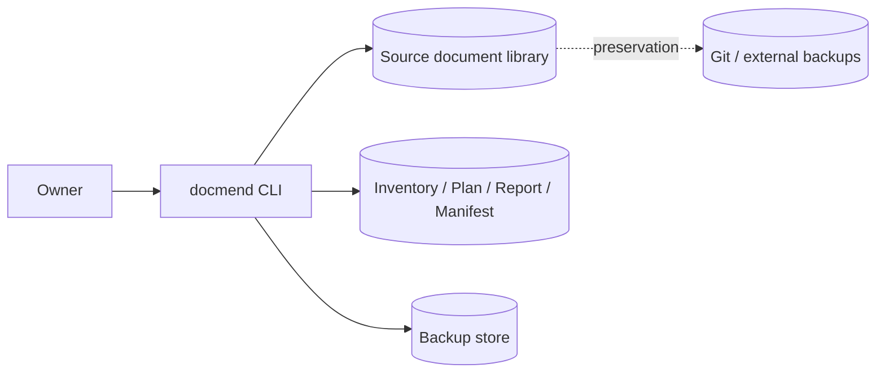
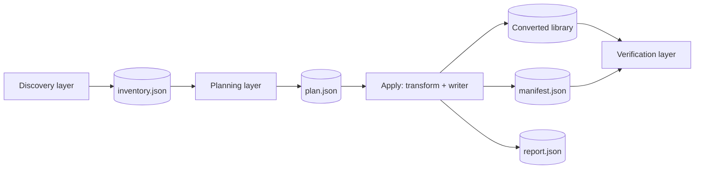
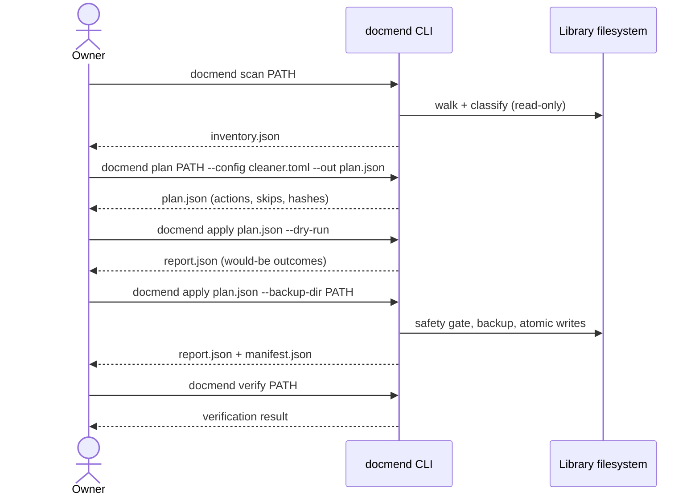
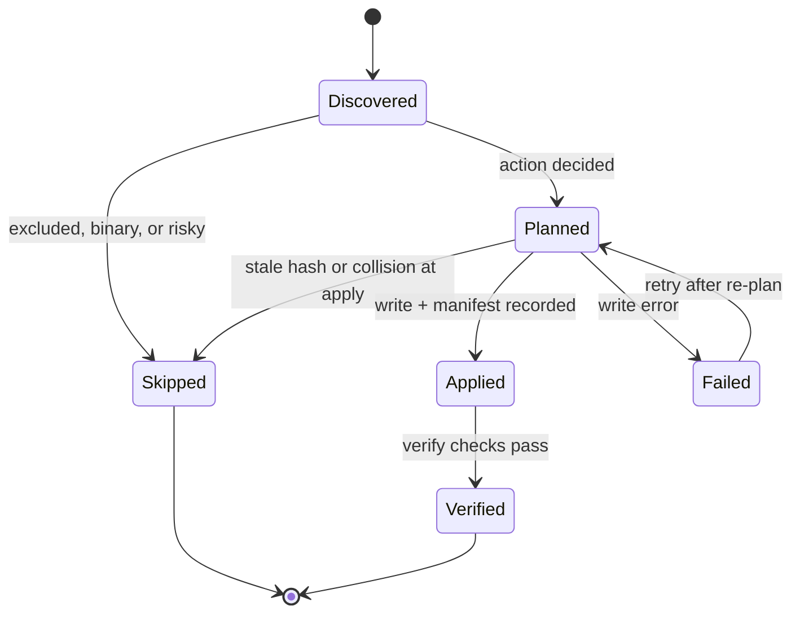

# `docmend` — Specification (Full)

---

## Revision History

| Version | Date | Author | Change |
| --- | --- | --- | --- |
| 0.1 | `2026-07-05` | `coding-agent` | Initial draft, migrated from the pre-standard `docmend-spec-draft` |
| 0.2 | `2026-07-05` | `coding-agent` | Incorporated `docs/research/` findings: frontmatter validation gotchas (C-006, FR-016, DR-005, §9), OQ-008 storage-scale caveat, OQ-011 added, §18.6 backup-tooling example |
| 0.3 | `2026-07-05` | `coding-agent` | Reconciled §21 with `docs/open-questions.md`: added OQ-012..OQ-014 (defined in open-questions but missing from §21) and OQ-015..OQ-020 from the gap analysis (`docs/gap-analysis.md`, 22 new `docs/research/` reports) |
| 0.4 | `2026-07-05` | `coding-agent` | Added OQ-021 (`pydantic` v2 internal models) and OQ-022 (frontmatter YAML codec) from `docs/research/python-library-research.md`; §8.6 dependency-policy rewrite pending OQ-017/018/019/021/022 |

**Spec lifecycle:** This document is **living until `approved`**, then **change-controlled**: post-approval edits require a new revision row and, for scope-affecting changes, re-approval by the owner. Implementation deviations are recorded in the [Deviations Log](#deviations-log), not silently patched into requirements. When replaced, set `status: superseded` and `superseded_by:` in the frontmatter.

---

- [Revision History](#revision-history)
- [1. Purpose \& Background](#1-purpose--background)
- [2. Scope](#2-scope) - [2.1 In Scope](#21-in-scope) - [2.2 Out of Scope (Non-Goals — never)](#22-out-of-scope-non-goals--never) - [2.3 Won't Have in v1 (deferred — not never)](#23-wont-have-in-v1-deferred--not-never) - [2.4 Boundaries](#24-boundaries)
- [3. Context](#3-context) - [3.1 Current State](#31-current-state) - [3.2 Target State](#32-target-state) - [3.3 Assumptions](#33-assumptions) - [3.4 Constraints](#34-constraints)
- [4. Goals](#4-goals)
- [5. Stakeholders and Users](#5-stakeholders-and-users)
- [6. Glossary](#6-glossary)
- [7. Requirements](#7-requirements) - [7.1 Functional Requirements](#71-functional-requirements) - [7.2 Non-Functional Requirements](#72-non-functional-requirements) - [7.3 Interface Requirements](#73-interface-requirements) - [7.4 Data Requirements](#74-data-requirements)
- [8. Architecture and Design](#8-architecture-and-design) - [8.1 Architecture Summary](#81-architecture-summary) - [8.2 Architecture Views](#82-architecture-views) - [8.2.1 Context View](#821-context-view) - [8.2.2 Container / Deployment View](#822-container--deployment-view) - [8.2.3 Component View](#823-component-view) - [8.3 Design Decisions](#83-design-decisions) - [8.4 Solution Alternatives Considered](#84-solution-alternatives-considered) - [8.5 Design Constraints](#85-design-constraints) - [8.6 Dependency Policy](#86-dependency-policy)
- [9. Data Model](#9-data-model)
- [10. Behavior and Workflows](#10-behavior-and-workflows) - [10.1 Primary Workflow](#101-primary-workflow) - [10.2 Alternate Workflows](#102-alternate-workflows) - [10.3 Edge Cases](#103-edge-cases) - [10.4 State Transitions](#104-state-transitions)
- [11. UI Pages / API Endpoints](#11-ui-pages--api-endpoints)
- [12. Error Handling and Recovery](#12-error-handling-and-recovery) - [12.1 Expected Failures](#121-expected-failures) - [12.2 Retry and Idempotency](#122-retry-and-idempotency) - [12.3 Rollback / Recovery](#123-rollback--recovery)
- [13. Security and Privacy](#13-security-and-privacy) - [13.1 Authentication](#131-authentication) - [13.2 Authorization](#132-authorization) - [13.3 Secrets](#133-secrets) - [13.4 Sensitive Data](#134-sensitive-data) - [13.5 Threats and Mitigations](#135-threats-and-mitigations) - [13.6 Hardening Checklist](#136-hardening-checklist)
- [14. Capacity and Scale Assumptions](#14-capacity-and-scale-assumptions)
- [15. Risks](#15-risks)
- [16. Compliance, Licensing, and Data Rights](#16-compliance-licensing-and-data-rights)
- [17. Testing and Acceptance](#17-testing-and-acceptance) - [17.1 Definition of Done](#171-definition-of-done) - [17.2 Test Strategy](#172-test-strategy) - [17.3 Requirement-to-Test Traceability](#173-requirement-to-test-traceability)
- [18. Deployment and Operations](#18-deployment-and-operations) - [18.1 Runtime Environment](#181-runtime-environment) - [18.2 Configuration](#182-configuration) - [18.3 Deployment Flow](#183-deployment-flow) - [18.4 Rollout Controls](#184-rollout-controls) - [18.5 Observability](#185-observability) - [18.6 Backup and Disaster Recovery](#186-backup-and-disaster-recovery) - [18.7 Documentation Deliverables](#187-documentation-deliverables)
- [19. Implementation Plan](#19-implementation-plan) - [Waves](#waves) - [MS-0 — Foundation](#ms-0--foundation) - [MS-1 — Core workflow](#ms-1--core-workflow) - [MS-2 — Domain logic](#ms-2--domain-logic) - [MS-3 — User and admin experience](#ms-3--user-and-admin-experience) - [MS-4 — Automation / notifications / external actions](#ms-4--automation--notifications--external-actions) - [MS-5 — Hardening and production readiness](#ms-5--hardening-and-production-readiness) - [Milestone Summary](#milestone-summary)
- [20. Success Evaluation](#20-success-evaluation)
- [21. Open Questions and Decisions](#21-open-questions-and-decisions)
- [Deviations Log](#deviations-log)
- [References](#references) - [Standards](#standards) - [Project References](#project-references)
- [Appendix A: ID Conventions](#appendix-a-id-conventions)
- [Appendix B: Agent Implementation Contract](#appendix-b-agent-implementation-contract) - [B.1 Implementation Rules](#b1-implementation-rules) - [B.2 Prohibited Behaviors](#b2-prohibited-behaviors) - [B.3 Required Completion Report (verification gate)](#b3-required-completion-report-verification-gate) - [B.4 Session Handoff](#b4-session-handoff)
- [Appendix C: Optional Modules](#appendix-c-optional-modules) - [C.1 External Data Integration](#c1-external-data-integration) - [C.2 Scheduled Work, Throttling, and Circuit Breaker](#c2-scheduled-work-throttling-and-circuit-breaker) - [C.3 Identity / Entity Resolution](#c3-identity--entity-resolution) - [C.4 Scoring / Ranking / Decision Logic](#c4-scoring--ranking--decision-logic) - [C.5 Relational Schema Examples](#c5-relational-schema-examples)
- [Appendix D: Tailoring Guide](#appendix-d-tailoring-guide)

---

## 1. Purpose & Background

`docmend` is a Python CLI tool for managing and maintaining large libraries of text-based documents. It helps its user clean up, modernize, and convert poorly formatted text and HTML documents into well-structured Markdown files.

The owner has a large personal library (more than 100,000 files) of poorly formatted `.txt` and HTML (`.html`, `.htm`, and similar) documents that need to be modernized and converted to Markdown (`.md`). Many documents date back to the 1990s and earlier, and years of handling and editing have left them in notable states of disrepair:

- Poor and broken formatting: inconsistent headings, spacing, and indentation.
- A mix of encodings (UTF-8, ISO-8859-1, Windows-1252, and others), character sets (ASCII, Latin-1), and end-of-line conventions (LF, CRLF, CR) that need to be normalized to UTF-8 and LF.
- No file naming convention or structure; many files carry non-descriptive names (`doc1.txt`, `file2.html`) that should eventually be renamed to something meaningful.
- Wide variation in line and paragraph breaking, inconsistent and missing whitespace (words run together, paragraphs no longer separate), and tab/indentation inconsistencies.
- Poor spelling, grammar, and punctuation.
- Files that appear corrupted or broken and need repair or reconstruction.
- Garbled and garbage text, stray HTML tags, and other "ASCII pollution."
- Many duplicates and near-duplicates that existing tools fail to detect because of noise and drift in the text.

No existing single tool handles this combination safely at this scale, and the file volume makes complete manual review impossible — which is why safety mechanisms (backups, dry-run, resumability, detailed logging) are core requirements rather than conveniences.

After successful implementation, the library is a normalized corpus: UTF-8, LF-terminated, Pandoc-flavored Markdown with strict, schema-validated YAML frontmatter, produced by a pipeline whose every mutation is planned, reviewable, reversible, and logged. The first release deliberately optimizes for the **safe migration substrate** (mechanical, conservative transformations with full auditability); semantic cleanup (meaningful renames, reconstruction, spelling/grammar repair, deduplication) builds on that substrate later and must remain possible, but is not required for the first working version.

The tooling is not limited to strictly producing the target library: it should remain generally useful for cleaning up and modernizing text and HTML documents in a variety of ways.

> This project provides a safe, resumable, auditable document-normalization pipeline so that the owner can convert a >100k-file legacy text/HTML library into clean, well-structured Markdown without risking silent data loss or requiring manual review of individual results.

---

## 2. Scope

### 2.1 In Scope

- Scanning files without modifying them, producing a structured inventory.
- Producing a reviewable, machine-readable plan of intended changes.
- Applying only conservative, mechanical transformations: extension rename (`.txt` → `.md`), encoding normalization to UTF-8 (without BOM), newline normalization to LF, trailing-whitespace trimming, final-newline enforcement, and blank-line collapsing.
- Skipping ambiguous or risky files, with the reason reported.
- Writing reports and manifests for every run.
- Dry-run, backup, resume, and verify flows.

### 2.2 Out of Scope (Non-Goals — never)

Things this system is **intentionally never** going to do. The reason column prevents relitigating the exclusion later.

| ID | Non-Goal | Reason |
| --- | --- | --- |
| NG-001 | Hosting, serving, or providing a reading/browsing interface for the library. | docmend produces artifacts (Markdown files, reports, manifests) that other tools consume; search and reading surfaces are separate systems. |
| NG-002 | Rendering final publication formats (HTML, EPUB, DOCX, PDF) itself. | The canonical stored artifact is Markdown; frontmatter preserves enough standard Pandoc metadata that `pandoc` performs those exports downstream (see D-001). |
| NG-003 | Editing or "improving" document meaning — summarizing, rewriting, or abridging body content. | The tool repairs form (encoding, whitespace, structure, spelling), never authorial content; content changes would be unreviewable at this scale. |

The first-version non-goal boundary is settled — see RQ-001 (NG-001–NG-003 stand).

### 2.3 Won't Have in v1 (deferred — not never)

Things that are goals eventually but **excluded from this release** to control scope. Distinct from Non-Goals: these have a revisit trigger.

| ID | Deferred Capability | Why Deferred | Revisit When |
| --- | --- | --- | --- |
| WH-001 | Meaningful (semantic) file renaming based on document content. | Requires title inference and a settled naming policy (RQ-002); v1 renames extensions only. | Safe migration substrate (MS-0–MS-5) is proven on the real library. |
| WH-002 | Spelling, grammar, and punctuation correction. | Semantic cleanup; risks altering content without review. | Substrate proven; review workflow for semantic edits designed. |
| WH-003 | Broken-paragraph and corrupted-document reconstruction. | Requires heuristics with uncertain failure modes; unsafe before skip-and-report is proven. | Substrate proven; weird-document test corpus (§17.2) mature. |
| WH-004 | HTML-to-Markdown structural conversion quality (beyond mechanical normalization). | Structural conversion is a different problem from extension renaming (see FR-010). | Substrate proven; conversion fidelity test fixtures exist. |
| WH-005 | Duplicate/near-duplicate detection and consolidation. | Noisy, drifted text defeats existing tools; needs the entity-resolution ladder in C.3. | Normalized corpus exists (normalization materially improves matching). |
| WH-006 | Frontmatter semantic enrichment (inferred titles, authors, summaries, classifications). | Depends on inference/external assistance; mechanical metadata comes first (see §9). | Frontmatter schema (DR-005) stable and validated in production use. |
| WH-007 | Search/index integration. | Downstream consumer concern; frontmatter is designed to feed it, but integration is separate. | Corpus conversion is substantially complete. |

### 2.4 Boundaries

| Boundary | Description |
| --- | --- |
| System owns | The conversion pipeline; the inventory, plan, report, and manifest artifacts; generated backups; the frontmatter schema for converted documents. |
| System depends on | The source document library on a local filesystem; the user's chosen preservation strategy (Git, external backups, or tool-written backups); Python 3.14 runtime. |
| System does not own | The library's storage/hosting (including any self-hosted Git service), downstream search or reading tools, and Pandoc export pipelines. |

---

## 3. Context

### 3.1 Current State

The library is a directory tree of more than 100,000 `.txt` and HTML files accumulated over decades, exhibiting every condition listed in §1: mixed encodings and newline styles, broken formatting, garbage text, corruption, non-descriptive names, and undetected near-duplicates. There is no inventory, no metadata, and no naming convention. Existing duplicate-detection tools fail because of noise and drift in the text. No conversion tooling exists yet: this repository currently contains only a build/tooling scaffold (`pyproject.toml`, CI, `src/docmend/` skeleton) and a version smoke test — no conversion logic and no CLI entry point.

### 3.2 Target State

A normalized corpus in which every in-scope document is UTF-8 (no BOM), LF-terminated, Pandoc-flavored Markdown — CommonMark-ish body, strict schema-validated YAML frontmatter (§9) — with every mutation traceable through plan, report, and manifest artifacts, and every original recoverable. Files the tool could not confidently process are skipped and reported, not guessed at.

### 3.3 Assumptions

| ID | Assumption | Impact if False |
| --- | --- | --- |
| A-001 | The source library resides on a local POSIX filesystem accessible to the tool. | Discovery and atomic-write design (§8) would need remote/object-storage adapters; out of scope for v1. |
| A-002 | At least one preservation strategy (library in Git, external backups, tool-written backups, or reversible manifest) can be enabled before any apply run. | The apply safety gate (FR-005) would block all writes; the tool remains scan/plan-only until one is provided. |
| A-003 | Encoding detection yields usable confidence for the large majority of files; the low-confidence remainder is small enough to skip and report. | The skip pile would dominate; detection strategy or thresholds (§18.2) would need rework before conversion could proceed. |
| A-004 | The library (GBs of text) is processable on a single machine; no distributed processing is required. | Batch/parallel design (NFR-001) would need a work-distribution layer; resumability (FR-013) becomes even more critical. |

### 3.4 Constraints

| ID | Constraint | Source |
| --- | --- | --- |
| C-001 | Python 3.14+ with the repository's locked tooling stack: uv, Ruff, BasedPyright (strict), pytest + coverage, pip-audit. | Repository Python Tooling SSOT standard (`AGENTS.md`). |
| C-002 | This repository is public: no real library documents, real library paths, or personal/identifying content in code, fixtures, or docs — synthetic or public-domain test fixtures only. | Repository sensitive-data policy (`AGENTS.md`). |
| C-003 | The file volume precludes manual review of results; safety must be mechanical (backups, dry-run, gates, reports), never "check it by hand." | Library scale (§1); owner requirement. |
| C-004 | Generated documents must remain Pandoc-compatible: one YAML metadata block, first in the file, `---` delimited. | Pandoc CommonMark-family reader requirements (see References). |
| C-005 | The product frontmatter schema is governed by this spec alone — never validated or reformatted by the repository's markdownlint/Prettier tooling. | ADR 0001 (Markdown Frontmatter Standard deliberately not adopted). |
| C-006 | Generated frontmatter scalar values are plain data, never authored Markdown formatting — Pandoc parses YAML metadata leaf scalars as Markdown even for CommonMark-family readers, so unconstrained formatting in fields like `description` would blur metadata and body semantics. | `docs/research/managing-pandoc-markdown-and-strict-yaml-frontmatter.md`. |

---

## 4. Goals

Goals are outcomes; requirements (§7) are behaviors. A goal should be traceable to the requirements that achieve it.

| ID | Goal | Success Signal | Achieved By |
| --- | --- | --- | --- |
| G-001 | Convert the legacy library into normalized UTF-8/LF Pandoc Markdown. | Every in-scope file is either converted or explicitly skipped with a recorded reason. | FR-001, FR-002, FR-003, FR-007, FR-008, FR-009, FR-010 |
| G-002 | Zero irreversible loss of original content. | Every mutation is preceded by a satisfied preservation strategy and recorded in a reversible manifest. | FR-005, FR-006, NFR-002, DR-004 |
| G-003 | Unattended batch operation at library scale. | A full-library run survives interruption and resumes without redoing or corrupting completed work. | FR-013, NFR-001, NFR-002, NFR-003 |
| G-004 | Machine-validated document metadata. | Generated frontmatter validates against the canonical schema during plan, apply, and verify. | FR-016, DR-005 |
| G-005 | Trustworthy automation: the tool never silently guesses on ambiguous input. | Risky files (low-confidence encoding, apparent binary, collisions) are skipped and reported, never rewritten. | FR-011, FR-015, NFR-004, ERR-002 |

---

## 5. Stakeholders and Users

Solo, single-user project: the owner is simultaneously the end user, operator, and approver; implementation is by a coding agent under Appendix B. A stakeholder matrix would repeat one name in every row, so per the template's tailoring guidance this section records that fact and nothing more.

---

## 6. Glossary

Define every domain term an implementer could misread. Ambiguous terminology is a top source of requirement misinterpretation — by coding agents especially.

| Term | Definition | Notes / Not to be confused with |
| --- | --- | --- |
| Safe migration substrate | The v1 capability set: inventory, planning, backups, reversible writes, encoding/newline normalization, mechanical renames, reporting, resume, verification. | Semantic cleanup — the later, interpretation-dependent work (WH-001–WH-006). |
| Inventory | The structured, machine-readable output of `scan`: per-file records plus scan configuration and aggregates (DR-001). | The plan — an inventory records what exists; a plan records what would change. |
| Plan | The reviewable artifact produced by `plan`: intended per-file actions, skip decisions, and the source hashes they were based on (DR-002). | The apply report, which records what actually happened. |
| Preservation strategy | Any of: library under Git, external backups, tool-written backups, or a reversible rename/write manifest. At least one must hold before apply (FR-005). | A dry run, which writes nothing and therefore needs no preservation. |
| Manifest | The reversible operation record written during apply: original path, target path, backup path, before/after hashes (DR-004). | The apply report (summary/outcomes); the manifest exists specifically to make operations undoable. |
| Extension rename | Changing a file's suffix (`.txt` → `.md`) without touching its content structure. | Structural conversion — actually transforming document structure into Markdown. These are different problems (FR-010). |
| Mechanical metadata | Frontmatter fields generated deterministically from the source file or conversion process; regenerated by the tool, never hand-edited. | Semantic metadata — fields requiring interpretation, heuristics, review, or external assistance (§9). |
| Controlled vocabulary | A closed, documented value set for a frontmatter field (`genre`, `status`, `story_type`, `rating`, `lang`). | Freeform `tags`, which are deliberately open-ended. |
| Skip-and-report | The mandated behavior for risky files: leave the file untouched and record the reason, rather than guess and rewrite (FR-015). | Failure — a skip is a successful, deliberate outcome. |
| Canonical document | The designated surviving representative of a duplicate/near-duplicate cluster (deferred, WH-005). | — |
| Idempotent apply | Re-running the same operation produces the same result: applying to an already-converted corpus changes nothing (FR-017). | — |

---

## 7. Requirements

> **Quality rule:** Each requirement is one testable statement with a stable ID, a rationale, an acceptance criterion, and a priority. Priorities: **Must** (release-blocking), **Should** (important, briefly deferrable), **Could** (nice-to-have, must not delay release). Anything "Won't" belongs in §2.3, not here.

### 7.1 Functional Requirements

| ID | Requirement | Rationale | Acceptance Criteria | Priority |
| --- | --- | --- | --- | --- |
| FR-001 | The system shall scan a directory tree and produce a structured inventory (DR-001) without modifying any file. | Discovery must be provably read-only before anything else is trusted. | Scan a synthetic corpus; assert inventory contents and that no file mtime/hash changed. | Must |
| FR-002 | The system shall produce a machine-readable plan (DR-002) from an inventory and configuration, recording per-file actions, skip decisions, and the source hashes used. | The plan is where dangerous cases are caught before any file is touched. | Plan over a corpus containing each §10.3 edge case; assert expected actions and skips with reasons. | Must |
| FR-003 | The system shall apply only actions recorded in a valid plan, and shall refuse a plan whose recorded source hashes no longer match the files. | Prevents acting on stale decisions after the library has changed. | Modify a file after planning; apply skips it, reports the hash mismatch (ERR-002), and exits non-zero. | Must |
| FR-004 | The system shall support `--dry-run`, and apply shall default to dry-run unless the user explicitly opts into writes. | Previewing changes must be the default posture for bulk destructive edits. | Apply without the opt-in flag writes nothing; report shows would-be outcomes; corpus hashes unchanged. | Must |
| FR-005 | The system shall gate every writing apply run behind a preservation check whose required strength scales with the operation's risk: a content-changing rewrite shall refuse to proceed unless a byte-preserving strategy is active (library in Git, external backups declared, or tool-written backups enabled), while a low-risk single-file operation may proceed under an explicit operator opt-in that accepts reduced or no rollback. A reversible manifest is always recorded but does not by itself satisfy preservation for a content rewrite. | Original-data preservation is non-negotiable at a scale that precludes manual review (§1); but docmend is a general-purpose processing tool (RQ-010) that must not force heavyweight backup setup onto quick, low-risk, single-file work, and the manifest records how to undo a change, not the original bytes (RQ-005/RQ-007). | A content-rewrite apply with no byte-preserving strategy exits non-zero with an explanatory message and writes nothing; a single-file run with the explicit low-risk opt-in proceeds and records a manifest entry; a manifest-only configuration does not satisfy preservation for a content rewrite. | Must |
| FR-006 | The system shall, when backups are enabled, copy each original to the configured backup location and verify that backup (fsync, re-read, re-hash, and compare to the plan's recorded source hash) before mutating the original, and shall always record a reversible manifest entry (DR-004) for every mutation. | Rename/write operations are painful to undo without a manifest; verifying the backup before touching the original closes the window where a silently corrupted or short backup would leave no recoverable copy (RQ-005). | After an apply run, every changed file has a manifest entry with before/after hashes and a verified backup reference; a backup whose re-hash does not match the plan's source hash aborts the mutation (ERR-004) before the original is touched; restoring from manifest+backups reproduces the original corpus. | Must |
| FR-007 | The system shall detect source encodings, convert file content to UTF-8 without BOM, and skip files whose detection confidence falls below the configured threshold (default 0.80). | Encoding detection is imperfect (UTF-8/Windows-1252/ISO-8859-1 ambiguity); low-confidence files must never be silently "fixed." | Fixtures in UTF-8, UTF-8-BOM, Windows-1252, and ISO-8859-1 convert correctly; an ambiguous fixture below threshold is skipped with reason. | Must |
| FR-008 | The system shall normalize all line endings (CRLF, CR, mixed) to LF. | Target corpus is LF-only (D-002). | Fixtures with CRLF, CR, and mixed endings all produce LF-only output. | Must |
| FR-009 | The system shall support the mechanical whitespace transformations: trim trailing whitespace, ensure exactly one final newline, and collapse runs of blank lines beyond a configured maximum (default 3). | Core mechanical cleanup that is safe without interpretation. | Property/fixture tests per transformation; each is individually configurable (§18.2). | Must |
| FR-010 | The system shall treat extension rename (`.txt` → `.md`) and structural conversion to Markdown as distinct operations, and shall never claim structural conversion when only renaming. | Renaming a file to `.md` does not make it Markdown; conflating the two misrepresents the corpus. | Rename actions are typed distinctly from conversion actions in plan and report artifacts. | Must |
| FR-011 | The system shall detect target-path collisions and resolve them per the configured policy: `skip` (default), `fail`, or `overwrite`. | `foo.txt` → `foo.md` where `foo.md` exists must be an explicit decision, not an accident. | Collision fixture under each policy yields skip-with-reason, non-zero abort, or manifest-recorded overwrite respectively. | Must |
| FR-012 | The system shall support include/exclude filters over paths (glob patterns) applied consistently at scan, plan, and apply. | Processing must be scopeable (subsets, excluding `.git/`, archives, binaries by pattern). | Filter fixtures confirm identical selection behavior across all three commands. | Must |
| FR-013 | The system shall resume an interrupted apply run without redoing completed work and without corrupting partially processed files. | Batch operations over 100k+ files will be interrupted; losing progress is unacceptable. | Kill an apply run mid-batch; re-invoking completes the remainder; final corpus and manifest are identical to an uninterrupted run. | Must |
| FR-014 | The system shall provide a `verify` command that checks converted output: UTF-8 decodability, LF-only endings, frontmatter schema validity (where present), and manifest/hash consistency. | Verification is the only substitute for manual review at this scale. | Verify passes on a correctly converted corpus; each seeded defect class (bad encoding, CRLF, invalid frontmatter, hash mismatch) is individually caught. | Must |
| FR-015 | The system shall skip and report — never guess and rewrite — files that are risky: apparent binary content, NUL bytes, decode-only-with-replacement-characters, or low detection confidence. | Conservatism is the core safety posture for corrupted/ambiguous input (G-005). | Each risky-file class in the weird-document corpus (§17.2) is skipped with a classified reason; none is modified. | Must |
| FR-016 | The system shall, for runs that emit frontmatter, validate the generated frontmatter against the canonical schema (DR-005) during plan, apply, and verify, rejecting duplicate frontmatter keys at YAML-parse time (before schema validation runs) and asserting (not merely annotating) `format`-typed fields such as dates. Frontmatter emission is an optional feature (RQ-008); a run that emits none has no frontmatter to validate, which is legal. | Bad metadata must not quietly poison the corpus or downstream indexes; a permissive YAML parser silently collapses duplicate keys before schema validation ever sees them, and JSON Schema `format` is annotation-only by default — both are real, documented gaps that would otherwise let invalid metadata through undetected. | When frontmatter is emitted, an output with schema-violating frontmatter fails validation at each of the three stages in tests, a fixture with duplicate frontmatter keys is rejected at parse time, and a fixture with a malformed `format`-typed value (e.g. an invalid date string) is rejected, proving format assertion is enabled; a run configured to emit no frontmatter completes without a frontmatter-validation step. | Must |
| FR-017 | The system shall be idempotent: applying the same plan (or re-planning and applying over already-converted output) shall produce zero further changes. | Re-runs are inevitable in batch workflows; they must be safe. | Second apply over a converted corpus reports zero mutations; corpus hashes unchanged. | Must |
| FR-018 | The system shall emit a machine-readable report (DR-003) for every plan and apply run, including per-file outcomes, errors, skip reasons, and summary counts. | Reports are the review surface replacing per-file manual inspection. | Report schema assertions in tests; counts reconcile with corpus state after the run. | Must |

### 7.2 Non-Functional Requirements

Quality attributes: performance, reliability, maintainability, usability, observability, portability, compatibility, scalability.

| ID | Category | Requirement | Measurement / Acceptance Criteria | Priority |
| --- | --- | --- | --- | --- |
| NFR-001 | Scalability | The system shall process libraries of at least 100,000 files with bounded memory (streaming per-file processing, no whole-corpus in-memory structures) and shall support parallel and batch operation. | A synthetic 100k-file corpus completes scan/plan/apply with memory usage independent of corpus size; concrete numeric throughput targets are deferred (RQ-009), leaving only these structural criteria binding in v1. | Must |
| NFR-002 | Reliability | The system shall write atomically (temp file + fsync + `os.replace` in the same directory) so that no file is ever left in a partially written state. | Kill-during-write test: every file is either the intact original or the complete output; never a fragment. | Must |
| NFR-003 | Observability | The system shall log per-file processing detail and per-run summaries (changes made, errors, skips, statistics) sufficient to diagnose issues mid-batch without re-running. | Log assertions in integration tests; every non-default outcome carries a reason and file path. | Must |
| NFR-004 | Safety | The system shall be conservative by default: every destructive capability is opt-in (dry-run default, backups gate, `skip` collision default, confidence threshold). | Config-default audit test: out-of-the-box invocation of apply cannot mutate anything. | Must |
| NFR-005 | Testability | Transformations shall be pure functions (text in, text out) with filesystem effects isolated in the writer layer (§8). | Transform unit tests run with no filesystem access; writer tests are the only ones touching disk. | Must |

### 7.3 Interface Requirements

APIs, CLIs, UIs, files, databases, queues, protocols, external systems, hardware.

| ID | Interface | Requirement | Contract / Format | Acceptance Criteria |
| --- | --- | --- | --- | --- |
| IR-001 | CLI | The system shall expose `docmend scan PATH` producing an inventory. | `docmend scan PATH [--report FILE]` | Command exists, exits 0 on success, writes DR-001 artifact. |
| IR-002 | CLI | The system shall expose `docmend plan` consuming a path/inventory and config, producing a plan file. | `docmend plan PATH --config cleaner.toml --out plan.json` | Command produces DR-002 artifact; exits non-zero on config errors. |
| IR-003 | CLI | The system shall expose `docmend apply` consuming a plan file, honoring dry-run and backup options. | `docmend apply plan.json [--dry-run] [--backup-dir PATH]` | Behaviors per FR-003–FR-006; exits non-zero when the safety gate refuses. |
| IR-004 | CLI | The system shall expose `docmend verify PATH` running the FR-014 checks. | `docmend verify PATH` | Exit 0 iff all checks pass; findings enumerated in output/report. |
| IR-005 | CLI | The system shall support the global flags `--help`/`-h`, `--dry-run`/`-n`, `--verbose`/`-v`, and `--quiet`/`-q`. | Standard CLI conventions; `--quiet` limits output to errors and critical messages. | Flag behavior covered by CLI tests. |
| IR-006 | Config file | The system shall read configuration from a TOML file covering paths, rename, encoding, newline, whitespace, and write settings. | TOML; reference table in §18.2; parsed with stdlib `tomllib`. | Unknown keys rejected with a clear error; defaults per §18.2 when file omitted. |
| IR-007 | Artifacts | The system shall read and write its durable artifacts (inventory, plan, report, manifest) as JSON. | JSON; shapes per §9 (exact schemas tracked in RQ-004). | Artifacts round-trip (write → read → identical model) in tests. |

Selection and transformation options (e.g. `--include`/`--exclude` patterns, `--rename-txt-to-md`, `--detect-encoding`, `--normalize-newlines lf`, `--trim-trailing-whitespace`, `--ensure-final-newline`, `--collapse-blank-lines 3`, `--fail-on-low-confidence-encoding`, `--backup-dir PATH`, `--report FILE`) mirror the configuration surface in §18.2; the config file is authoritative and flags override it.

### 7.4 Data Requirements

| ID | Data Entity | Requirement | Validation Rules | Ownership |
| --- | --- | --- | --- | --- |
| DR-001 | Inventory | The system shall persist scan results: source root, scan configuration, timestamp, per-file records (path, size, suffix, newline style, detected encoding, UTF-8 status), skipped files with reasons, aggregate counts. | JSON schema (RQ-004); counts must reconcile with per-file records. | docmend |
| DR-002 | Plan | The system shall persist plans: inventory reference, config snapshot, planned actions, skip decisions, risk/conflict decisions, and source hashes validating that inputs have not changed. | JSON schema (RQ-004); every planned action carries the source hash it was decided on. | docmend |
| DR-003 | Apply report | The system shall persist apply results: plan reference, dry-run flag, start/completion timestamps, per-file outcomes, before/after hashes, errors, skips, summary counts. | JSON schema (RQ-004); summary counts must equal per-file outcome totals. | docmend |
| DR-004 | Backup/rename manifest | The system shall persist a reversible operation record per mutation: original path, target path, backup path (if any), before/after hashes, operation type, result status, error details. | JSON schema (RQ-004); sufficient to mechanically restore the pre-apply state. | docmend |
| DR-005 | Frontmatter schema | The system shall maintain a canonical, versioned frontmatter schema in the repository (e.g. `schemas/frontmatter.schema.json`) and validate generated frontmatter against it (FR-016). | JSON Schema; required fields, generated fields, and structure per §9; schema version in `docmend.schema_version`; duplicate YAML keys rejected at the parser (not left to schema validation, which only sees already-collapsed input); JSON Schema `format` assertions (e.g. `date`, `date-time`) explicitly enabled in the validator rather than left as Draft 2020-12's annotation-only default. | docmend |

Retention: artifacts and backups are retained until the user explicitly purges them; the tool never deletes its own manifests or backups (see §18.6).

---

## 8. Architecture and Design

### 8.1 Architecture Summary

docmend is a layered, single-process pipeline in which each layer has one responsibility and only the last one is dangerous:

1. **Discovery** walks directories and classifies candidate files without modifying anything — collecting path, size, suffix, newline style, detected encoding, and apparent content type into the inventory, while ignoring binaries and configured excludes (`.git/`, `node_modules/`, archives, images, PDFs).
2. **Planning** decides what _would_ happen, given the inventory and configuration: rename, rewrite encoding, rewrite newlines, normalize whitespace, or skip (binary, unknown encoding, conflicting target path). This is where dangerous cases are caught before any file is touched — collisions, files that appear binary despite a `.txt` suffix, low-confidence encodings, decode-only-with-replacement, NUL bytes, or output that would be empty or drastically smaller than input.
3. **Transform** is a set of small, pure, individually testable functions (text in, text out) — e.g. newline normalization is a two-replace one-liner. Filesystem writes are handled elsewhere (NFR-005).
4. **Writer** is the isolated dangerous layer: atomic replace (read original → transform in memory → write temp file in the same directory → fsync → `os.replace` → fsync parent directory where practical), permission preservation where reasonable, optional backups, refuse-to-overwrite unless allowed, UTF-8/LF-only output, before/after hash recording, and machine-readable reporting. Atomic replace over in-place mutation is deliberate: overkill for casual use, correct for bulk destructive edits (D-004).
5. **Verification** independently checks outcomes against the artifacts (FR-014).

The three decisions that most shaped this design: the explicit plan-file workflow separating decision from execution (D-006), atomic-replace writing (D-004), and the mechanical/semantic metadata split (D-007).

### 8.2 Architecture Views

#### 8.2.1 Context View



#### 8.2.2 Container / Deployment View

Single local process; the "containers" are pipeline layers and on-disk artifact stores.



#### 8.2.3 Component View

| Component | Responsibility | Interfaces | Notes |
| --- | --- | --- | --- |
| CLI shell | Argument/config parsing, command dispatch, exit codes, output verbosity. | CLI (IR-001–IR-005), TOML config (IR-006). | Thin; no domain logic. |
| Discovery | Directory walking, file classification, metadata collection. | Filesystem (read-only); emits inventory (DR-001). | Must be provably read-only (FR-001). |
| Planning | Per-file action/skip decisions from inventory + config; risk detection. | Consumes DR-001; emits DR-002. | All danger detection happens here, before any write. |
| Transform | Pure text transformations (encoding decode, newline, whitespace). | In-memory text only. | No filesystem access (NFR-005); each transform individually configurable. |
| Writer | Atomic writes, backups, manifest recording, overwrite refusal. | Filesystem (write); emits DR-003, DR-004. | The only component that mutates the library; gated by FR-005. |
| Verifier | Post-hoc checks of encoding, newlines, frontmatter validity, hash/manifest consistency. | Filesystem (read-only); consumes DR-003/DR-004. | Independent of the writer's own bookkeeping so it can catch writer bugs. |

Guidance: keep domain logic separate from CLI glue; make the encoding-detection dependency replaceable behind an interface; document any intentionally accepted coupling.

### 8.3 Design Decisions

| ID | Decision | Rationale | Alternatives Considered | ADR |
| --- | --- | --- | --- | --- |
| D-001 | Output is Pandoc-flavored Markdown: CommonMark-ish body, strict YAML frontmatter. Body boring and portable; frontmatter rich and machine-validated. | CommonMark is the stable baseline for readable Markdown; Pandoc explicitly supports YAML metadata blocks and onward conversion to HTML, EPUB, DOCX, PDF (see References). | Plain CommonMark (no standard metadata story); reStructuredText/AsciiDoc (weaker ecosystem fit for a Markdown target library). | — |
| D-002 | Normalize everything to UTF-8 (no BOM) and LF, regardless of source encoding or newline style. | One canonical encoding/EOL removes a whole class of downstream ambiguity. | Preserve source encodings (perpetuates the mess); UTF-8 with BOM (breaks tooling expectations). | — |
| D-003 | Layered pipeline with strict separation: discovery / planning / transform / writer / verification. | Isolates the dangerous layer (writer); makes transforms pure and testable; lets planning catch danger before writes. | Monolithic convert-in-place script (untestable, unauditable at this scale). | — |
| D-004 | Atomic replace for all writes: temp file in same directory, fsync, `os.replace`, fsync parent where practical. | No partial-write states under crash/interruption; prerequisite for safe resume. | In-place mutation (corruptible mid-write); write-then-rename without fsync (loses durability guarantees). | — |
| D-005 | Configuration is TOML, read with stdlib `tomllib`. | Fits Python projects; easy for agents to edit; read-only stdlib parsing needs no dependency. | YAML (heavier, ambiguity-prone for config); JSON (no comments); INI (poor nesting). | — |
| D-006 | Explicit plan-file workflow: `plan` emits a reviewable artifact that `apply` executes and re-validates against source hashes. | Separates decision from execution; the plan is the human/agent review surface and the stale-input guard (FR-003). | Direct scan-and-apply (no review point, no stale-input protection). | — |
| D-007 | Frontmatter separates mechanical from semantic metadata: Pandoc-recognized fields at the root, docmend-owned data under namespaced objects (`docmend`, `source`, `output`). | Mechanical fields are regenerable and trustworthy; semantic fields carry known/inferred/unknown status so low-confidence inference never masquerades as user-confirmed truth. | Flat schema (mixes regenerable and hand-curated data); fully namespaced (breaks Pandoc export compatibility). | — |
| D-008 | The repository's Markdown Frontmatter Standard is deliberately not adopted; the product frontmatter contract is governed by this spec alone. | The canonical repo-doc schema conflicts with docmend's Pandoc-oriented frontmatter contract. | Adopting the standard and excluding product output (still risks tooling conflation). | `adr-0001-no-markdown-frontmatter-standard` |
| D-009 | Policy seams for design-for-pluggable genericity: naming policy, preservation strategy, controlled-vocabulary source, and frontmatter emission are each isolated behind an interface; v1 ships exactly one minimal default per seam and no swap-config machinery. | docmend must stay generally useful (§1, RQ-010) without building plugin configuration in v1; seams make later config-driven policies a non-breaking addition, while build-minimal keeps v1 focused on correctness and safety first. | Hardcode each policy (cheap now, breaking change to generalize later); build full pluggable config in v1 (scope creep competing with correctness-first). | — |

### 8.4 Solution Alternatives Considered

Solution-level alternatives (buy vs. build, existing tool X, prior architecture Y) — distinct from the per-decision alternatives above. One row each prevents relitigating.

| Alternative | Why Rejected |
| --- | --- |
| Pandoc alone (batch `pandoc` invocations over the library) | Pandoc converts formats; it does not inventory, plan, gate, back up, resume, detect risky files, or repair the library's degradation classes. |
| Existing cleanup/dedup tools | Duplicates/near-duplicates in this library defeat existing detectors due to text noise and drift; no existing tool covers the safety substrate either. |
| Manual cleanup | More than 100k files; complete manual review is impossible (C-003). |
| Do nothing (leave library as-is) | The library keeps degrading and stays unsearchable, unportable, and partially unreadable (mixed encodings, corruption). |

### 8.5 Design Constraints

Constraints the implementer must not violate:

- Transforms are pure functions; only the writer layer touches the filesystem for mutation (NFR-005).
- The writer refuses to overwrite unless explicitly allowed and writes UTF-8/LF only.
- Low-confidence or risky files are never silently "fixed" — skip and report (FR-015).
- Output paths must stay inside the intended output root (§13.5).
- Dry-run is the default; every destructive capability is opt-in (NFR-004).
- Artifacts (DR-001–DR-004) are written for every run; a run that leaves no audit trail is a defect.

### 8.6 Dependency Policy

| Dependency | Allowed? | Reason |
| --- | --- | --- |
| `typer` | Yes | CLI framework (IR-001–IR-005). |
| `charset-normalizer` | Yes | Encoding detection (FR-007). |
| `pathspec` | Yes | Glob-style include/exclude rules (FR-012). |
| `rich` | Yes | Human-readable console reporting alongside plain JSON artifacts. |
| `tomllib` (stdlib) | Yes | Read-only TOML config parsing on Python 3.14+ (D-005). |
| JSON Schema validator (e.g. `jsonschema`) | Conditional | Needed for FR-016/DR-005 when frontmatter validation lands; confirm choice via OQ- process. |
| LLM / OCR / cloud services | No (v1) | No external services in v1; any later integration reads credentials from environment variables only (repo policy) and requires an approved OQ-. |

> Agents: introducing a dependency not listed here requires an OQ- entry and owner approval — see Appendix B.

---

## 9. Data Model

docmend has no database; its persistent data model is (a) the four JSON artifacts and (b) the frontmatter embedded in converted documents. Exact JSON Schemas are pinned before implementation (RQ-004); the binding shapes are outlined in DR-001–DR-004. For each artifact: the natural key is the run (timestamp + source root) plus per-file source path; provenance requirements are the recorded source hashes and config snapshots that let any historical result be reproduced and explained; retention is indefinite until user purge (§18.6).

The frontmatter contract is the durable heart of the data model. Generated frontmatter is valid YAML, bounded by `---` at top and `---` at the end of the block (Pandoc also accepts `...`; docmend prefers `---`), and required to be the first content in the file (C-004). YAML scalars are quoted where needed — especially titles or descriptions containing colons, backslashes, blank lines, or block-level formatting — using literal block scalars for multi-paragraph values.

Schema strategy:

- Frontmatter emission is **optional** (RQ-008): a run may emit none. When emitted, v1 produces at most a **minimal skeleton** — the required mechanical fields plus a placeholder `title` — for processed-document tracking; richer or inferred semantic metadata is deferred to later versions. The null-heavy worked example below is the eventual target shape, not the v1 minimal output; it is rewritten once OQ-013 settles the required/null/omitted detail.
- Store the canonical schema in the repository, e.g. `schemas/frontmatter.schema.json` (DR-005).
- Validate generated frontmatter during `plan`, `apply`, and `verify` (FR-016).
- Reject duplicate frontmatter keys at YAML parse time, before schema validation — a permissive parser silently collapses duplicates, and schema validation only ever sees the already-collapsed result (C-006).
- Treat frontmatter scalar values as plain data, never authored Markdown — Pandoc parses YAML metadata leaf scalars as Markdown even for CommonMark-family readers, so unconstrained formatting in fields like `description` would blur metadata and body semantics (C-006).
- Keep Pandoc-recognized export metadata at the root: `title`, `author`, `date`, `lang`, `keywords`, `subject`, `description`, `abstract`.
- Keep docmend-owned mechanical metadata under namespaced objects: `docmend`, `source`, `output`.
- Keep personal-library taxonomy under predictable controlled root fields (`genre`, `status`, `story_type`, `rating`, `tags`); the controlled vocabularies are **supplied externally per corpus** and validated against an injected set rather than a taxonomy hardcoded in this public repo — the owner's real vocabulary is confidential (a vocabulary leaks clues about the content), so only a generic example set ships here (OQ-007, RQ-010).
- Represent missing semantic values as `null` only when the field is schema-required; otherwise omit unknown optional fields.
- Record whether automatically produced semantic values are `known`, `inferred`, or `unknown`; never silently overwrite user-reviewed metadata with a lower-confidence generated value (D-007).

**Mechanical fields** (deterministically generated; regenerated by the tool, never hand-edited): `docmend.id` (stable document ID surviving renames and rewrites — never depend on filename alone), `docmend.schema_version`, `docmend.generated_at`, `docmend.conversion_version`, `source.original_path`, `source.original_extension`, `source.hash`, `source.size_bytes`, `source.detected_encoding` (name + confidence), `source.newline_style`, `output.hash`, `output.word_count`, `output.chapter_count`, `output.markdown_format` (expected value `pandoc`), `output.generated_by`.

**Semantic fields** (require interpretation, heuristics, review, or external assistance; may begin unknown/inferred/low-confidence): `title` (required; may be inferred from filename or first heading when nothing better exists), `author` (`list[str]`; Pandoc supports richer structured author objects, but those need custom export templates to render — keep any richer contributor data, if ever needed, in a separate internal namespace rather than the canonical `author` field), `date` (prefer ISO 8601-compatible values), `lang` (BCP 47), `keywords`, `subject`, `description`, `abstract`, `tags`, the controlled-vocabulary fields `genre` / `status` / `story_type` / `rating`, and `deduplication` (cluster ID, canonical flag, match confidence — populated by WH-005 work later).

Initial required fields: `title`, `docmend.id`, `docmend.schema_version`, `source.original_path`, `source.hash`, `output.hash`.

Example shape:

```yaml
---
title: 'Example title: quoted because it contains a colon'
author: null
date: null
lang: en
keywords: []
subject: null
description: null
tags: []
genre: unknown
status: unknown
story_type: unknown
rating: unrated
deduplication:
  cluster_id: null
  canonical: null
  confidence: null
docmend:
  id: 'dmnd_0000000000000000'
  schema_version: '0.1'
  generated_at: '2026-07-05T00:00:00Z'
  conversion_version: 'docmend 0.1.0'
source:
  original_path: 'synthetic/example.txt'
  original_extension: '.txt'
  hash: 'sha256:...'
  size_bytes: 1234
  detected_encoding:
    name: windows-1252
    confidence: 0.97
  newline_style: CRLF
output:
  hash: 'sha256:...'
  markdown_format: pandoc
  word_count: 200
  chapter_count: 0
  generated_by: 'docmend 0.1.0'
---
```

Future extension fields are safe by construction: unknown optional fields are omitted rather than reserved, and `docmend.schema_version` gates interpretation.

---

## 10. Behavior and Workflows

### 10.1 Primary Workflow



Steps:

1. Scan the library read-only into an inventory.
2. Produce a plan from the inventory and configuration; review it (or its summary).
3. Dry-run the plan and review the would-be outcomes.
4. Apply for real, with the safety gate satisfied; backups and manifest are written.
5. Verify the converted output against the artifacts.

Expected result:

> Every in-scope file is converted to UTF-8/LF (and renamed/frontmattered per plan) or skipped with a recorded reason; every mutation is reversible via manifest and backups; verify exits 0.

### 10.2 Alternate Workflows

| ID | Trigger | Behavior | Expected Result |
| --- | --- | --- | --- |
| AW-001 | Apply run interrupted (crash, kill, power loss). | Re-invoking apply resumes from recorded progress; completed files are not redone (FR-013). | Final corpus and manifest identical to an uninterrupted run. |
| AW-002 | Planned target path already exists at apply time. | Resolve per configured collision policy: `skip` (default), `fail`, or `overwrite` (FR-011). | Skip with reason, non-zero abort, or manifest-recorded overwrite respectively. |
| AW-003 | Encoding detection confidence below threshold. | Skip and report (default); `--fail-on-low-confidence-encoding` aborts the run instead (FR-007, FR-015). | File untouched; reason recorded; exit code reflects the chosen policy. |
| AW-004 | Source file changed between plan and apply (hash mismatch). | Skip that file, record ERR-002, continue the batch, exit non-zero at completion (FR-003). | Stale decisions are never executed; the user re-plans for the skipped files. |

### 10.3 Edge Cases

| ID | Edge Case | Expected Behavior |
| --- | --- | --- |
| EC-001 | `foo.txt` should become `foo.md`, but `foo.md` already exists. | Collision policy applies (AW-002); never an accidental overwrite. |
| EC-002 | File appears binary despite a `.txt` extension. | Skip and report as risky (FR-015). |
| EC-003 | File decodes only with replacement characters. | Skip and report; replacement-character output is silent corruption. |
| EC-004 | File contains NUL bytes. | Skip and report as risky (FR-015). |
| EC-005 | Generated output would be empty or drastically smaller than the input. | Planning flags it; apply skips it as risky rather than writing suspicious output. |
| EC-006 | Mixed newline styles within a single file. | All variants normalized to LF (FR-008); original style recorded as `mixed` in `source.newline_style`. |
| EC-007 | UTF-8 with BOM. | Decoded correctly; BOM stripped on write (FR-007). |
| EC-008 | Symbolic links inside the source tree. | Not followed for mutation by default; recorded in the inventory (exact policy folded into RQ-004 artifact design). |

### 10.4 State Transitions

Per-file lifecycle across a run:



| State | Meaning | Entry Condition | Exit Condition |
| --- | --- | --- | --- |
| Discovered | File recorded in the inventory. | Matched include filters during scan. | Plan decision made. |
| Planned | An action (or explicit skip) is recorded in the plan. | Planning layer decision. | Apply executes, skips, or fails it. |
| Skipped | File deliberately left untouched, with a recorded reason. | Exclusion, risk classification, collision, stale hash. | Terminal for the run; may re-enter via a new plan. |
| Applied | Mutation completed; manifest entry written. | Successful atomic write. | Verification. |
| Failed | Write attempted and failed; original intact. | Writer error (ERR-003). | Retried under a subsequent plan/apply. |
| Verified | Output confirmed against artifacts. | Verify checks pass (FR-014). | Terminal. |

---

## 11. UI Pages / API Endpoints

Not applicable — docmend is a headless CLI with no UI pages and no HTTP API; the complete CLI surface is specified in §7.3 and the CLI-usability milestone in §19 (MS-3).

---

## 12. Error Handling and Recovery

### 12.1 Expected Failures

| ID | Failure Mode | User/System Behavior | Logging / Observability | Recovery |
| --- | --- | --- | --- | --- |
| ERR-001 | Batch interrupted mid-apply (crash, kill, power loss). | No partially written files exist (NFR-002); progress to date is recorded. | Report/journal reflects completed work; interruption evident in artifacts. | Re-invoke apply; resume completes the remainder (FR-013, AW-001). |
| ERR-002 | Source file hash no longer matches the plan. | File skipped; batch continues; run exits non-zero. | Mismatch logged with path, planned hash, and observed hash. | Re-scan/re-plan the affected files (AW-004). |
| ERR-003 | Write failure (permissions, disk full, I/O error). | Temp file cleaned up; original untouched; file marked Failed. | Error class, path, and OS error logged; counted in report summary. | Fix the environmental cause; retry via subsequent apply. |
| ERR-004 | Backup copy fails while backups are enabled. | The mutation is aborted **before** touching the original; file marked Failed. | Backup failure logged with cause. | Fix backup destination; retry. |
| ERR-005 | File unreadable at apply time (deleted, permission change). | File skipped with reason; batch continues. | Logged with path and OS error. | Re-plan once the file is accessible again. |
| ERR-006 | Plan file invalid, corrupted, or produced by an incompatible version. | Apply refuses to start (part of the safety gate, FR-005 family). | Validation findings printed; non-zero exit. | Regenerate the plan with the current tool version. |

### 12.2 Retry and Idempotency

- Retried operations: none automatically in v1 — failed files are surfaced in the report and retried by re-running plan/apply, keeping behavior predictable in bulk runs. Failures are still classified **transient** (I/O, permissions — retry by re-run) vs. **permanent/content** (binary, NUL bytes, low confidence — will skip again by design).
- Non-retried operations: risky-file skips (FR-015) are deliberate outcomes, not failures; they recur until the input or configuration changes.
- Idempotency key / deduplication strategy: per-file source hash. Re-applying over converted output produces zero changes (FR-017); resume uses recorded per-file completion to avoid redoing work (FR-013).

### 12.3 Rollback / Recovery

Every mutation is recorded in the reversible manifest (DR-004) with before/after hashes and any backup path. Recovery from a bad apply run is mechanical: restore each manifest entry's original from its backup (or from Git/external backups when those strategies are in use), then re-verify. Because writes are atomic (NFR-002), the only inconsistent state possible after a crash is "some files converted, some not" — which the manifest and report make explicit, and which resume (FR-013) or restore resolves. The manifest is written incrementally during the run, never only at the end, so a crash cannot orphan completed mutations.

---

## 13. Security and Privacy

### 13.1 Authentication

Not applicable — docmend is a local, single-user CLI running with the invoking user's identity; it exposes no service surface and performs no network access in v1.

### 13.2 Authorization

| Actor / Role | Allowed Actions | Denied Actions |
| --- | --- | --- |
| Invoking user | Scan, plan, apply, verify within the configured source/output roots and backup dir. | Writes outside the intended roots — the tool enforces path containment regardless of user permissions. |

### 13.3 Secrets

None in v1 — the tool is fully offline. If external services are integrated later (LLM APIs, OCR, cloud storage), credentials are read from environment variables only, documented in a `.env.example`, never hardcoded and never committed (repository policy; see also §8.6).

### 13.4 Sensitive Data

| Data | Classification | Storage | Transmission | Retention |
| --- | --- | --- | --- | --- |
| Source library content (letters, journals, financial records, other personal documents) | confidential | User's local filesystem only. | None — no network access. | Owned by the user; originals preserved per FR-006. |
| Artifacts (inventory, plan, report, manifest) — contain real library paths and hashes | confidential | Alongside the library / user-chosen locations. | None. | Until user purge; never committed to this public repo. |
| Test fixtures in this repository | public | Repository. | Public repo. | Synthetic or public-domain content only (C-002). |

### 13.5 Threats and Mitigations

| Threat | Impact | Mitigation |
| --- | --- | --- |
| Path escape: crafted paths/symlinks cause writes outside the intended root. | Files outside the library mutated or overwritten. | Output-path containment check in the safety gate (§8.5); symlinks not followed for mutation (EC-008). |
| Private content leakage via artifacts or logs shared/committed publicly. | Personal data exposure. | Artifacts stay local (13.4); repo policy forbids real documents/paths in fixtures or docs (C-002); logs record paths and hashes, not document content, at default verbosity. |
| Malformed/hostile input files crash or hang the pipeline. | Batch abort; potential resource exhaustion. | Risky-file classification and skip-and-report (FR-015); weird-document test corpus (§17.2). |

### 13.6 Hardening Checklist

Confirm each item is addressed above or mark N/A with a reason:

- [ ] Cookie/session settings — N/A: no web surface.
- [ ] CSRF/CORS policy — N/A: no web surface.
- [ ] Webhook/API signature validation — N/A: no network interfaces.
- [ ] Sensitive-data redaction in logs — logs carry paths and hashes, not document content, at default verbosity (13.5).
- [ ] CI/CD secret handling — no secrets exist in v1 (13.3); repo CI carries none for this tool.
- [ ] Network exposure — N/A: no listening services, no outbound network in v1.
- [ ] Identity-header trust rules — N/A: no auth proxy.
- [ ] Run as non-root; least-privilege filesystem access — runs as the invoking user; requires no elevation; writes confined to configured roots (13.2).

---

## 14. Capacity and Scale Assumptions

The numbers that drive design choices. If a choice in §9 depends on volume, the expected volume belongs here.

| Dimension | v1 Expectation | Growth Assumption | Design Consequence |
| --- | --- | --- | --- |
| Data volume | More than 100,000 files; multiple GiB of text. | Low — the library is a mostly static backlog. | Streaming per-file processing; bounded memory (NFR-001); no whole-corpus in-memory model. |
| Request rate | Manually invoked batch runs; full-library runs are the peak. | Occasional incremental runs after initial pass. | Resumability (FR-013) matters more than throughput; idempotent re-runs (FR-017). |
| Concurrency | Single user; optional parallel workers within one process. | None. | Parallelism is an internal optimization; no cross-process locking needed. |

---

## 15. Risks

General project risks — schedule, technical, dependency, provider. Security threats live in §13.5.

| ID | Risk | Likelihood | Impact | Mitigation | Owner |
| --- | --- | --- | --- | --- | --- |
| R-001 | Encoding misdetection silently corrupts content at scale. | Med | High | Confidence threshold + skip-and-report (FR-007, FR-015); never decode with replacement characters (EC-003). | implementer |
| R-002 | A defect in the writer/manifest path makes some mutation irreversible. | Low | High | Safety gate (FR-005), incremental manifest (12.3), atomic writes (NFR-002), restore drill in §18.6. | implementer |
| R-003 | Scope creep into semantic cleanup before the substrate is proven. | Med | Med | Hard v1 boundary (§2.3); milestone order binding on the implementer (Appendix B). | owner |
| R-004 | Later deduplication work consolidates near-duplicates wrongly, destroying unique documents. | Med | High | Deferred to WH-005 with the C.3 ladder: confidence scores, review path, provenance — never auto-delete. | owner |
| R-005 | Performance is inadequate at library scale (runs take days or exhaust memory). | Med | Med | NFR-001 bounded-memory design; 100k-file synthetic corpus test; resume makes long runs survivable. | implementer |
| R-006 | The unknown variety of document anomalies exceeds the tested classes and causes bad conversions. | High | Med | Conservative default posture (NFR-004); weird-document corpus grown continuously (§17.2); verify as backstop. | implementer |

---

## 16. Compliance, Licensing, and Data Rights

- [x] Third-party API terms of service — N/A in v1: fully offline, no external APIs.
- [x] Ingested data rights — the library is the owner's personal document collection.
- [ ] OSS license compatibility of dependencies checked — do at MS-0 when dependencies are added (§8.6).
- [x] PII/regulatory regimes identified: none apply — personal data processed locally by its owner; handling defined in §13.4.
- [x] Export/retention obligations — none external; retention policy recorded in §7.4 and §18.6.

---

## 17. Testing and Acceptance

### 17.1 Definition of Done

- [ ] All **Must** requirements implemented; acceptance criteria pass.
- [ ] Automated tests cover required behavior, error cases, and edge cases.
- [ ] Traceability matrix (§17.3) complete — every Must/Should requirement maps to a passing verification.
- [ ] Documentation deliverables (§18.7) produced.
- [ ] Security-sensitive behavior reviewed; hardening checklist (§13.6) resolved.
- [ ] Deviations Log reviewed and accepted by owner.
- [ ] No known blocking defects.

### 17.2 Test Strategy

| Layer | Scope | Required Coverage | Required? |
| --- | --- | --- | --- |
| Unit / domain | Pure transforms (encoding, newlines, whitespace), planning decisions, risk classification. | Critical branches and edge cases; property-based tests where cheap. | Yes |
| Integration / adapter | Encoding detection, filesystem discovery, writer atomicity, backup/manifest recording. | Success, failure (ERR-001–ERR-006), and interruption paths. | Yes |
| Snapshot / contract | Artifact shapes (DR-001–DR-004), frontmatter schema validation, converted-output fixtures. | Diffs reviewed intentionally; schema round-trips. | Yes |
| Database | N/A — no database; artifact round-trip covered under snapshot/contract. | — | No |
| End-to-end | Full CLI journey: scan → plan → apply --dry-run → apply → verify on a synthetic corpus. | Happy path plus at least one failure path (gate refusal, hash mismatch) and one interruption/resume path. | Yes |
| Security | Path containment, symlink handling, log content (no document bodies at default verbosity). | Critical misuse cases from §13.5. | Yes |
| Operations | Backup-and-restore drill from manifest; resume after kill; report/manifest consistency. | The §18.6 restore test, automated. | Yes |
| Regression | The **weird-document corpus**: every anomaly class encountered (§10.3 plus real-world finds). | Each prior bug or anomaly class pinned by a fixture; corpus grows for the life of the project (extensive testing against weird documents is a headline requirement). | Yes |

### 17.3 Requirement-to-Test Traceability

The implementer fills this in as the completion evidence ([Appendix B.3](#b3-required-completion-report-verification-gate)). Implementation has not started; all rows are Not Started.

| Requirement ID | Test / Verification Method | Status |
| --- | --- | --- |
| FR-001 | Inventory integration test; corpus-unchanged hash assertion. | Not Started |
| FR-002 | Planning tests over the §10.3 edge-case corpus. | Not Started |
| FR-003 | Stale-hash apply test. | Not Started |
| FR-004 | Dry-run default and no-write assertions. | Not Started |
| FR-005 | Safety-gate refusal tests per missing strategy. | Not Started |
| FR-006 | Backup + manifest recording and full-restore drill. | Not Started |
| FR-007 | Encoding fixture matrix incl. below-threshold skip. | Not Started |
| FR-008 | Newline fixture matrix (CRLF/CR/mixed). | Not Started |
| FR-009 | Whitespace transform unit/property tests. | Not Started |
| FR-010 | Action-typing assertions in plan/report artifacts. | Not Started |
| FR-011 | Collision policy tests (skip/fail/overwrite). | Not Started |
| FR-012 | Filter consistency tests across scan/plan/apply. | Not Started |
| FR-013 | Kill-and-resume end-to-end test. | Not Started |
| FR-014 | Verify command seeded-defect tests. | Not Started |
| FR-015 | Risky-file skip tests over the weird-document corpus. | Not Started |
| FR-016 | Frontmatter schema validation tests at plan/apply/verify. | Not Started |
| FR-017 | Double-apply idempotency test. | Not Started |
| FR-018 | Report schema and count-reconciliation tests. | Not Started |
| NFR-001 | 100k-file synthetic corpus run; memory bound assertion. | Not Started |
| NFR-002 | Kill-during-write atomicity test. | Not Started |
| NFR-003 | Log content assertions in integration tests. | Not Started |
| NFR-004 | Config-default audit test (no mutation out of the box). | Not Started |
| NFR-005 | Transform purity check (no filesystem access in transform tests). | Not Started |

---

## 18. Deployment and Operations

### 18.1 Runtime Environment

| Item              | Value                                                          |
| ----------------- | -------------------------------------------------------------- |
| Runtime           | Python 3.14+ (repo `.python-version`), managed with uv.        |
| OS / Platform     | Linux workstation (POSIX filesystem semantics assumed, A-001). |
| Datastore         | None — JSON artifacts on the filesystem (§9).                  |
| External services | None in v1 (§8.6).                                             |
| Scheduling        | Manual invocation; long runs survive interruption via resume.  |
| Hosting           | User's local machine.                                          |

Runtime services: none — docmend is a batch CLI, not a long-running service; there are no processes to supervise or health-check.

### 18.2 Configuration

Configuration is a TOML file (D-005, IR-006); flags override file values.

| Setting | Required? | Default | Description |
| --- | --- | --- | --- |
| `paths.include` | No | `["**/*.txt", "**/*.md"]` | Glob patterns selecting files to process. |
| `paths.exclude` | No | `.git/`, `.venv/`, `node_modules/`, binary/media patterns | Glob patterns excluded from processing. |
| `rename.txt_to_md` | No | `true` | Enable the `.txt` → `.md` extension rename action. |
| `rename.on_collision` | No | `"skip"` | Collision policy: `skip`, `fail`, or `overwrite` (FR-011). |
| `encoding.target` | No | `"utf-8"` | Output encoding (always written without BOM). |
| `encoding.detect` | No | `true` | Enable source-encoding detection. |
| `encoding.fail_below_confidence` | No | `0.80` | Confidence threshold below which files are skipped (FR-007). |
| `newlines.target` | No | `"lf"` | Output newline style. |
| `whitespace.trim_trailing` | No | `true` | Trim trailing whitespace per line. |
| `whitespace.ensure_final_newline` | No | `true` | Ensure exactly one final newline. |
| `whitespace.collapse_blank_lines` | No | `3` | Maximum consecutive blank lines retained. |
| `whitespace.normalize_tabs` | No | `false` | Tab normalization (off by default — riskier). |
| `write.dry_run_default` | No | `true` | Apply defaults to dry-run (FR-004, NFR-004). |
| `write.backup_dir` | No | unset | Backup destination; enables the tool-backup preservation strategy. |
| `write.atomic` | No | `true` | Atomic replace writes (NFR-002). |

Environment matrix: not applicable — a single local environment; there is no dev/staging/prod split for a local CLI.

### 18.3 Deployment Flow

docmend is a locally installed CLI, not a deployed service:

1. Trigger: a tagged release on `main` (pre-1.0: direct installs from the repo).
2. CI checks: the repository verification gate — Ruff format/lint, BasedPyright strict, pytest + coverage, pip-audit — plus Markdown lint.
3. Build: `uv build` produces the wheel/sdist.
4. Install/upgrade: `uv tool install` (or `uvx`) from the release artifact or repo.
5. No migrations, no service restart, no smoke-test environment — the artifact tests (§17.2) are the release gate.
6. Rollback: install the previous release tag; artifacts and manifests are version-stamped (`docmend.conversion_version`) so mixed-version output remains attributable.

### 18.4 Rollout Controls

Risk-managed exposure, distinct from deploy mechanics — here, "rollout" means exposure of the **library** to the tool:

- Kill switches: dry-run is the default posture (FR-004); the apply safety gate (FR-005) blocks writes structurally; `--fail-on-low-confidence-encoding` hardens a run further.
- Staged rollout: run scan/plan/apply on a small include-filtered subset (FR-012) of the library first; widen the filters as confidence grows. The plan artifact is the promotion review.
- Reversibility: every applied change is restorable from manifest + backups (12.3); restore is drilled per §18.6 before the first real-library run.

### 18.5 Observability

For a batch CLI the observability surface is logs, reports, and exit codes rather than service telemetry:

- Structured per-file logs with a per-run correlation (run ID recorded in artifacts).
- Every run — scan, plan, apply, verify — emits a machine-readable artifact recording start/finish, per-file outcomes and reasons, and summary counts (FR-018); these are the "job records."
- Exit codes distinguish success, findings (e.g. verify failures, skipped-with-errors), and refusals (safety gate).
- Health endpoints, metrics services, and alerting are not applicable — there is no resident process; the alert equivalent is a non-zero exit and its report, reviewed by the operator (the owner).

### 18.6 Backup and Disaster Recovery

The system's durable data is the **library itself** plus docmend's artifacts.

**RPO (max acceptable data loss):** zero for original content — no original may be unrecoverable after any docmend operation. · **RTO (max acceptable restore time):** one re-run — a single mechanical restore pass from manifest + backups (12.3).

| Asset | Backup Method | Frequency | Retention | Restore Test Cadence |
| --- | --- | --- | --- | --- |
| Original documents | Preservation strategy required by the FR-005 gate for content rewrites (byte-preserving: library in Git, external backups, and/or tool-written backups), risk-scaled down to an explicit no-backup opt-in for low-risk single-file work. docmend is **preservation-agnostic** — the concrete backend is the user's choice (RQ-007); Borg/restic/S3 serve as async replication targets, not the inline durability barrier. | Before every mutating run | Until user purge | Automated restore drill in the test suite (§17.2); manual drill before the first real-library apply. |
| docmend artifacts (plans, reports, manifests) | Written alongside the run; covered by the user's normal backup regime. | Every run | Until user purge | Consistency checked by `verify` (FR-014). |

Encryption and off-site policy for the user's backups are owned by the user's backup regime, not by docmend. Disaster scenarios covered: bad apply run, tool defect, interrupted batch. Explicitly not covered in v1: disk failure or loss of the whole machine (that is the user's general backup problem — the tool only guarantees it never makes an original unrecoverable _by its own actions_).

### 18.7 Documentation Deliverables

Checklist tied to the DoD:

- [ ] README / user-facing usage docs updated (commands, config reference, safety model).
- [ ] Runbooks: restore-from-manifest procedure; resume-after-interruption procedure.
- [ ] Configuration reference (§18.2) matches shipped defaults.
- [ ] Handoff/state docs updated per repo convention (`docs/handoff.md`).

---

## 19. Implementation Plan

Break the work into ordered milestones with observable exit criteria. Get the safe migration substrate right first; do not start with advanced Markdown restructuring.

### Waves

Not used — this project ships as a single coherent milestone ladder (MS-0 through MS-5 below); the "later phases" beyond it are already captured as deferred capabilities in §2.3.

### MS-0 — Foundation

1. Package skeleton, CLI entry point (`docmend`), and dependency management (largely present: pyproject, CI, `src/docmend/` skeleton).
2. TOML configuration loading with the §18.2 defaults and unknown-key rejection.
3. Logging framework and run-ID/artifact conventions.
4. Dependency licenses checked (§16).
5. CI verification gate green (already wired).

### MS-1 — Core workflow

1. Discovery layer: directory walk, classification, inventory artifact (FR-001, DR-001).
2. First end-to-end thread: `scan` produces a valid inventory on a synthetic corpus.
3. Include/exclude filtering (FR-012).
4. Tests for success and common failure cases.

### MS-2 — Domain logic

1. Planning layer: per-file decisions, risk classification, plan artifact (FR-002, FR-015, DR-002).
2. Pure transforms: encoding decode/encode, newline normalization, whitespace transforms (FR-007–FR-009).
3. Edge-case and threshold tests over the initial weird-document corpus (§10.3).
4. Decision provenance recorded in the plan (C.4).

### MS-3 — User and admin experience

For a CLI, the "experience" is the command surface and its artifacts:

1. Writer layer with atomic writes, backups, manifest, collision policy, safety gate (FR-003–FR-006, FR-011, NFR-002).
2. `apply` with dry-run default; `--verbose`/`--quiet` behavior; readable report summaries (FR-004, FR-018, IR-005).
3. Restore-from-manifest drill automated (§18.6).

### MS-4 — Automation / notifications / external actions

Scheduled/notification automation is not applicable to a manually invoked CLI. This milestone instead lands the unattended-batch capabilities:

1. Resume/continuation model (FR-013; design decision recorded via RQ-003).
2. `verify` command (FR-014).
3. Idempotency guarantees (FR-017); duplicate-run and stale-plan tests (FR-003).

### MS-5 — Hardening and production readiness

1. Scale test: 100k-file synthetic corpus; bounded-memory assertion (NFR-001); parallelism if needed to make full-library runs practical.
2. Weird-document corpus expanded from first real-library scan findings (read-only) — grow the regression suite before the first real apply.
3. Frontmatter schema + validation wiring (FR-016, DR-005) to the extent v1 emits frontmatter (RQ-008).
4. Documentation deliverables (§18.7); open blockers closed or explicitly accepted.
5. First real-library run: staged rollout per §18.4 (scan → plan review → filtered subset apply → widen).

### Milestone Summary

| Milestone | Deliverable | Exit Criteria |
| --- | --- | --- |
| MS-0 Foundation | Installable CLI skeleton with config + logging | CI gate green; `docmend --help` works; config loads with defaults. |
| MS-1 Core workflow | `scan` end-to-end | Valid inventory from a synthetic corpus; provably read-only; filters work. |
| MS-2 Domain logic | `plan` + pure transforms | Correct decisions over the edge-case corpus; transforms pass unit/property tests. |
| MS-3 CLI experience | `apply` with full safety machinery | Gate refusals, backups, manifest, collisions, dry-run default all tested; restore drill passes. |
| MS-4 Unattended operation | Resume, `verify`, idempotency | Kill-and-resume test passes; verify catches each seeded defect class; double-apply is a no-op. |
| MS-5 Production readiness | Scale-tested, documented tool; first library run | 100k-corpus run within memory bounds; docs complete; staged real-library rollout underway. |

---

## 20. Success Evaluation

Post-launch evaluation targets, defined **before** implementation. Measured after MS-5.

| Area | Target | Measurement |
| --- | --- | --- |
| Functional correctness | All Must requirements satisfied on the real library, not just fixtures. | §17.3 matrix complete and passing; verify exits 0 over converted portions of the library. |
| Reliability | Zero unexplained content loss: every changed file has a manifest entry and a recoverable original. | Manifest/report reconciliation; restore drill results. |
| Performance | A full-library batch is practical: completes across sessions via resume without operator babysitting. | Run records from the real-library rollout; concrete numeric throughput targets deferred (RQ-009). |
| Cost control | Not applicable in v1 — no paid services (§8.6). | — |
| Operational usability | Skips and failures are reviewable from reports alone — no per-file manual inspection needed. | Owner triages the real-library skip pile using reports only; gaps become new requirements. |

---

## 21. Open Questions and Decisions

Questions may proceed on a recorded **current assumption** unless marked blocking. Blocking questions halt the affected work until answered ([Appendix B.1](#b1-implementation-rules)). These rows carry forward every unresolved placeholder from the pre-standard draft — nothing was silently dropped in migration.

| ID | Question | Current Assumption | Blocking? | Owner | Needed By | Status |
| --- | --- | --- | --- | --- | --- | --- |
| OQ-001 | What is the exact first-version boundary and the complete explicit non-goals list? (Draft's Phase-1 and non-goals sections were placeholders.) | v1 = the §2.1 capability set with the seven mechanical transformations; NG-001–NG-003 stand; anything semantic is §2.3. | Yes | owner | MS-1 | Resolved (RQ-001) |
| OQ-002 | Naming policy: when is a filename changed mechanically vs. meaningfully; how are collisions resolved; how are stable IDs and old→new mappings preserved across renames? | v1 renames extensions only (FR-010); collisions per FR-011; `docmend.id` + manifest carry identity and path history. | No | owner | MS-2 | Resolved (RQ-002) |
| OQ-003 | Resume model: plan-file-based, apply-journal, per-file result records, or a combination? How are partial writes detected and failed files retried, and how does resume interact with backups/manifests? | Apply journal + per-file manifest records; atomic writes make partial writes impossible (NFR-002); failed files retried by re-plan. | No | implementer | MS-4 | Resolved (RQ-003) |
| OQ-004 | Exact JSON Schemas for inventory, plan, apply report, and manifest (including symlink policy, EC-008). | Shapes as outlined in DR-001–DR-004; schemas pinned in-repo before MS-1 code freezes them. | Yes | implementer | MS-1 | Resolved (RQ-004) — ADR candidate |
| OQ-005 | Exact apply safety-gate check list. | The candidate set: valid plan; compatible tool version; source hashes match; preservation strategy satisfied; explicit collision/overwrite policy; low-confidence files skipped or explicitly allowed; dry-run default; output-path containment. | Yes | owner | MS-3 | Resolved (RQ-005) — ADR candidate |
| OQ-006 | Exact `verify` semantics — which checks are in scope for v1? | The FR-014 set: UTF-8 decodability, LF endings, frontmatter validity where present, manifest/hash consistency, skipped-file accounting, artifact internal consistency. | No | owner | MS-4 | Resolved (RQ-006) |
| OQ-007 | Controlled vocabulary definitions for `genre`, `status`, `story_type`, `rating`, `lang`. | Vocabularies are user-defined, per-corpus, and supplied externally (not hardcoded in this public repo — the vocabulary itself leaks clues about confidential content); the schema validates against an injected set. Open sub-decision: config surface + whether v1 ships any default set. | No | owner | Frontmatter emission (RQ-008) | Open |
| OQ-008 | Library version control: self-hosted Git (Gitea/Gogs/Forgejo) vs. external backups only vs. a heavier object-storage/versioning stack (lakeFS + MinIO + PostgreSQL, per `docs/research/self-hosted-corpus-storage-options.md`)? Public Git hosting is unsuitable for GBs of personal text. | Any single FR-005 preservation strategy suffices for v1; the storage decision is independent of tool implementation. **Scale caveat:** the research's lakeFS/MinIO/PostgreSQL/OpenSearch recommendation was sized for 1M+ documents / 50+ GB — an order of magnitude above this project's stated scale (§1, §14: >100k files, multiple GiB) — so a self-hosted Git forge (Gitea/Forgejo) or plain tool-written backups likely suffice without adopting that heavier stack. | No | owner | First real-library apply | Resolved (RQ-007) |
| OQ-009 | Is frontmatter _emission_ in v1 scope, or does v1 only pin the schema (DR-005) while emission lands with structural conversion (WH-004)? | Frontmatter is optional; v1 emits at most a minimal validatable skeleton for processed-doc tracking; richer emission deferred. | No | owner | MS-5 | Resolved (RQ-008) |
| OQ-010 | Concrete performance targets: acceptable full-library wall-clock, throughput, memory ceiling, parallelism defaults. | Numeric targets deferred until the tool is proven correct/safe on real data; v1 keeps only NFR-001's structural criteria (bounded memory, resumable). | No | owner | Deferred | Resolved (RQ-009) |
| OQ-011 | Should root frontmatter later include optional EPUB-export metadata fields (`identifier`, `rights`, `creator`, `cover-image`), and how would they relate to the existing `docmend.id`? | Not needed for v1 — frontmatter emission is optional and minimal per RQ-008. `docmend.id` remains the sole stable internal identifier regardless; Pandoc's `identifier` is an EPUB-facing publication field, never a substitute for it (`docs/research/managing-pandoc-markdown-and-strict-yaml-frontmatter.md`). | No | owner | WH-004 | Open |
| OQ-012 | In-place mutation vs. a separate output root for v1 writes, and alignment of path containment, config, manifest paths, backups, collision, and rollback (§8.5, §13.2, §18.2). | v1 mutates in place with atomic replace, backups, manifest, and path-containment; no separate output root unless a later export/structural phase needs it. | Yes | owner | Before write-path implementation | Open |
| OQ-013 | Frontmatter schema detail: required vs. optional fields, `null` vs. omitted for unknowns, and how `known`/`inferred`/`unknown` status is represented (§9). | Required mechanical fields always present and non-null; omit unknown optional fields rather than emit `null`; status via a consistent wrapper; gated by RQ-008. | No | owner | Frontmatter schema work (gated by RQ-008) | Open |
| OQ-014 | Exact CLI flag and config that opts into real writes when `apply` defaults to dry-run (FR-004, IR-003, §18.2). | `docmend apply plan.json --write` opts in; `--write`/`--dry-run` mutually exclusive; config alone never enables writes. | No | owner | MS-3 | Open |
| OQ-015 | Encoding detector, decode-confidence signal, and dual skip thresholds for FR-007. | `charset-normalizer` only; confidence = 1.0 - chaos; keep the 0.80 threshold; add an independent non-ASCII-byte-count skip floor (`docs/research/encoding-detection-benchmark.md`). | Yes | owner | MS-2 | Open |
| OQ-016 | CPU-bound concurrency primitive and default worker count for the Python 3.14 target (NFR-001, §14). | `ProcessPoolExecutor` + `forkserver`, default `workers='auto'`, sequential-until-profiled; not free-threaded or asyncio in v1 (`docs/research/python-314-concurrency-model.md`). | No | implementer | MS-3 | Open |
| OQ-017 | Structured logging library, wire format, destination, field schema, and `--verbose`/`--quiet` level mapping (§8.6, NFR-003, §18.5). | `structlog` via stdlib handlers; per-run JSON Lines keyed on run-ID plus Rich console; console verbosity decoupled from a DEBUG-floored file sink (`docs/research/structured-logging-library.md`). | No | owner | MS-0 | Open |
| OQ-018 | JSON Schema validator library for Draft 2020-12 with format assertions at scale (§8.6, FR-016, DR-005). | `jsonschema>=4.26` with the `format-nongpl` extra and an explicit `Draft202012Validator`/`FormatChecker`, one reused validator per schema (`docs/research/json-schema-validator-library.md`). | Yes | owner | MS-1 | Open |
| OQ-019 | Approve `Hypothesis` as a dev-only test dependency for §17.2 property tests (§8.6, NFR-005). | Adopt in `[dependency-groups].dev` with a CI settings profile; split §8.6 into Runtime vs. Dev/Test (`docs/research/property-based-testing-hypothesis.md`). | No | owner | MS-1 | Open |
| OQ-020 | Are docmend's domain-specific parts (the §9 taxonomy and semantic fields) config-driven/pluggable or purpose-built, and is §1's "generally useful" ambition operationalized as a requirement or dropped? | Either add a genericity requirement (config-driven vocabularies with a taxonomy-agnostic substrate) design-for-pluggable / build-minimal: v1 isolates naming, preservation, vocabulary, and frontmatter policies behind seams but ships one minimal default each; §1 genericity kept as an architectural principle (D-009). | No | owner | MS-1 | Resolved (RQ-010) |
| OQ-021 | Internal data-model library: adopt `pydantic` v2 for config/inventory/plan/report/manifest models, or use stdlib dataclasses/typed dicts? (Appendix B.2 requires an OQ before adoption; §8.6.) | Adopt `pydantic` v2 (>= 2.12 for 3.14) with strict models (`extra='forbid'`); keep the hand-authored JSON Schemas (RQ-004) as the durable external contract (`docs/research/python-library-research.md`). | No | owner | MS-1 | Open |
| OQ-022 | Frontmatter YAML codec: `ruamel.yaml` vs `PyYAML` for parsing/emitting product frontmatter (§8.6, §9). | `ruamel.yaml` behind a `FrontmatterCodec` (duplicate-key rejection, controlled emission), `PyYAML` + custom loader as fallback; override the timestamp constructor so date scalars stay strings (`docs/research/safe-yaml-loading.md`); timing gated by RQ-008. | No | owner | Frontmatter validation (gated by RQ-008) | Open |
| OQ-023 | Content-exposure boundary and default posture for deferred WH-002 (semantic-correction) / WH-005 (fuzzy-duplicate) review artifacts, given NG-001's no-reading-UI non-goal and §13.4 confidential content. | Review artifacts stay "headless" when issue-bounded, decision-sufficient, non-navigable, and opt-in for text: WH-005 metadata-only; WH-002 durable metadata ledger with text only in an opt-in local-only ephemeral sidecar or external-diff handoff; pessimistic-skip/exception-only posture; text-bearing artifacts private and never version-controlled (`docs/research/docmend-deferred-review-artifacts-for-confidential-corpora.md`). | No | owner | WH-002 / WH-005 design (deferred) | Open |

---

## Deviations Log

Maintained by the **implementer** during the build ([Appendix B](#appendix-b-agent-implementation-contract)). Any divergence from this spec is recorded here — never silently patched into requirements text. None yet: implementation has not started.

| ID  | Spec Reference | Deviation | Reason | Approved? |
| --- | -------------- | --------- | ------ | --------- |

---

## References

### Standards

- ISO/IEC/IEEE 29148:2018 — Requirements engineering.
- IEEE 1016-2009 — Software Design Description.
- ISO/IEC/IEEE 42010:2022 — Architecture description.
- OpenAPI Specification — HTTP API contracts.
- (IEEE 830-1998 — historical only; superseded by 29148.)

### Project References

Official sources behind the Markdown/frontmatter decisions (D-001, D-007, §9):

- [Pandoc User's Guide: YAML metadata block](https://pandoc.org/MANUAL.html#extension-yaml_metadata_block) — YAML metadata blocks are valid YAML objects delimited by `---` and `---`/`...`; standalone Markdown output writes metadata as one top block; CommonMark-family readers require a beginning-of-file metadata block.
- [Pandoc User's Guide: Metadata blocks](https://pandoc.org/demo/example33/8.10-metadata-blocks.html) — metadata can nest lists and objects; YAML escaping rules apply to fields with colons, backslashes, blank lines, or block formatting.
- [Pandoc User's Guide: Metadata variables](https://pandoc.org/demo/example33/6.2-variables.html) — `title`, `author`, `date`, `lang`, `keywords`, `subject`, `description` and related fields flow into HTML, EPUB, DOCX, PDF, ODT output metadata.
- [Pandoc User's Guide: EPUB metadata](https://pandoc.org/demo/example33/11.1-epub-metadata.html) — EPUB metadata via YAML in a Markdown document or `--metadata-file`.
- [Pandoc demos: conversion examples](https://pandoc.org/demos.html) — official HTML/PDF/EPUB/DOCX/Markdown conversion paths, including HTML-to-Markdown.
- [CommonMark](https://commonmark.org/) — the unambiguous Markdown baseline and why interoperability needs one.
- `docs/decisions/adr-0001-no-markdown-frontmatter-standard.md` — why the repo's frontmatter tooling never touches the product frontmatter (D-008).
- `docs/research/self-hosted-corpus-storage-options.md` — self-hosted Git and object-storage options research backing RQ-007 (OQ-008).
- `docs/research/managing-pandoc-markdown-and-strict-yaml-frontmatter.md` — Pandoc/CommonMark/YAML validation research backing C-006, FR-016, DR-005, §9, and OQ-011.

---

## Appendix A: ID Conventions

Stable IDs allow requirements to be referenced from commits, tests, issues, ADRs, and review comments — and let an implementer's completion claims be mechanically checked.

| Prefix | Meaning                     | Defined In     |
| ------ | --------------------------- | -------------- |
| `G-`   | Goal                        | §4             |
| `NG-`  | Non-goal (never)            | §2.2           |
| `WH-`  | Won't have in v1 (deferred) | §2.3           |
| `A-`   | Assumption                  | §3.3           |
| `C-`   | Constraint                  | §3.4           |
| `FR-`  | Functional requirement      | §7.1           |
| `NFR-` | Non-functional requirement  | §7.2           |
| `IR-`  | Interface requirement       | §7.3           |
| `DR-`  | Data requirement            | §7.4           |
| `D-`   | Design decision             | §8.3           |
| `AW-`  | Alternate workflow          | §10.2          |
| `EC-`  | Edge case                   | §10.3          |
| `ERR-` | Error-handling requirement  | §12.1          |
| `R-`   | Risk                        | §15            |
| `MS-`  | Milestone                   | §19            |
| `OQ-`  | Open question               | §21            |
| `DEV-` | Deviation                   | Deviations Log |

Priority values (`Must/Should/Could`) are column values, not ID prefixes — IDs never change when priorities do.

---

## Appendix B: Agent Implementation Contract

Binding when this spec is implemented by a coding agent. (Applies equally well to human contractors.)

### B.1 Implementation Rules

The implementer shall:

- Read this entire specification before making changes; per session thereafter, re-read at minimum §7 (Requirements), §21 (Open Questions), and the Deviations Log — Background and References may be read once.
- Preserve all explicit non-goals, won't-haves, constraints, and design constraints.
- Treat **Must** requirements as mandatory and **blocking** open questions as hard stops for the affected work.
- On encountering underspecified behavior: file an `OQ-` row **with a proposed default assumption** and proceed on it only if non-blocking — never guess silently.
- On any divergence from the spec: record a `DEV-` row (spec reference, what, why) rather than adapting silently.
- Add or update tests for every implemented requirement; keep §17.3 (traceability) current.
- Follow the milestone order in §19; do not build later milestones on unproven earlier ones.
- Prefer small, reviewable changes; avoid broad refactors unless the spec requires them.
- Document any discovered mismatch between the spec and existing code as a `DEV-` or `OQ-` row.

### B.2 Prohibited Behaviors

The implementer shall not:

- Invent requirements not present in this spec.
- Remove existing behavior unless explicitly required.
- Introduce external services or dependencies outside §8.6 without an approved `OQ-`.
- Store secrets in source control or print them in CI logs.
- Ignore failing tests unrelated to the change without documenting them.
- Treat examples (including Appendix C) as exhaustive or normative unless explicitly stated.
- Mark a requirement complete without a verification entry in §17.3.

### B.3 Required Completion Report (verification gate)

At completion, provide:

- Summary of changes and files changed.
- **Requirements implemented, each mapped to the test or command that proves it** — i.e., the completed §17.3 matrix. Claims without verification entries are not accepted.
- Tests added or changed.
- Deviations (`DEV-` rows) and their approval status.
- Known limitations and remaining open questions.
- Documentation deliverables completed (§18.7).

### B.4 Session Handoff

For multi-session implementations: record current milestone, in-progress requirement IDs, and unresolved `OQ-`/`DEV-` items in the repository's session-state/handoff documents at the end of each session, per the repo's documentation convention (`docs/handoff.md`). The spec records _what and why_; handoff docs record _where work stands_.

---

## Appendix C: Optional Modules

### C.1 External Data Integration

Not applicable in v1 — docmend is fully offline (§8.6). Revisit if LLM/OCR/cloud integrations are approved later; any such integration follows the environment-variable-only credential rule (13.3).

### C.2 Scheduled Work, Throttling, and Circuit Breaker

Not applicable — no scheduled jobs, polling, or rate-limited providers; docmend is manually invoked (§18.1).

### C.3 Identity / Entity Resolution

Applies to the deferred duplicate/near-duplicate consolidation work (WH-005) — recorded now so the substrate preserves what that work will need. Progressive ladder — stop at the first rung that meets the need:

1. Normalize text first (encoding, newlines, whitespace) — the v1 substrate itself materially improves match quality.
2. Match exact content hashes (`source.hash` / `output.hash`) for true duplicates.
3. Deterministic near-duplicate rules for high-confidence cases.
4. Fuzzy/probabilistic matching **only** with confidence scores and a review path — this library's noise and drift defeat naive matchers (§1).
5. Route ambiguous clusters to manual review; never auto-delete (R-004).
6. Store cluster ID, canonical-document flag, and match confidence in the `deduplication` frontmatter block (§9) — provenance, not just the final verdict.

### C.4 Scoring / Ranking / Decision Logic

docmend's automated per-file decisions (convert / rename / skip / risk-classify) must be trustworthy at a scale where no one re-checks them. The C.4 provenance rule therefore applies to the planning layer:

| Input | Source | Required? | Validation / Fallback |
| --- | --- | --- | --- |
| Detected encoding + confidence | `charset-normalizer` over file content | Yes | Below `encoding.fail_below_confidence` → skip (FR-007). |
| Content classification | Extension + content sniff (binary, NUL, size) | Yes | Ambiguous → risky → skip-and-report (FR-015). |
| Target-path availability | Filesystem state at plan and apply time | Yes | Collision → policy (FR-011); stale hash → skip (FR-003). |

**Every automated decision stores:** the input facts used (hashes, detected encoding, confidence, classification), tool/detector version (`docmend.conversion_version`), the thresholds in force (config snapshot in the plan, DR-002), and a machine-readable reason for every skip or risk flag (FR-018). This is what makes the plan reviewable and the outcome auditable.

### C.5 Relational Schema Examples

Not applicable — no relational datastore; the artifact and frontmatter data model is defined in §9.

---

## Appendix D: Tailoring Guide

This spec uses the **Full** profile: docmend owns durable data (the library and its artifacts), performs bulk automated decisions the owner must trust unreviewed, and §18.6 Backup/DR is central to its purpose. Sections that do not apply (§5 Stakeholders, §11 UI/API, C.1/C.2/C.5) are retained with one-line reasons per the tailoring rules.

| Profile | Template File | Use For |
| --- | --- | --- |
| **Light** | `spec-light-template.md` | Scripts, small tools, single-session agent tasks |
| **Standard** | `spec-standard-template.md` | Typical features and services |
| **Full** | `spec-full-template.md` (this profile) | Multi-service systems, data platforms, anything with durable data, external integrations, or multiple stakeholders |

Rules of thumb:

- Owns durable data → §18.6 Backup/DR is required regardless of profile.
- Talks to external paid/rate-limited APIs → C.1 + C.2 + cost rows in §20.
- Makes automated decisions users must trust → C.4's provenance list is required.
- Implemented by a coding agent → Appendix B is required regardless of profile (it is the cheapest section and the highest-leverage one).
